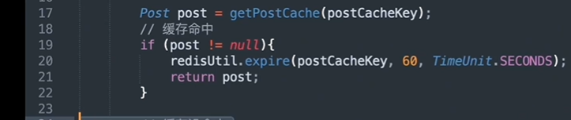
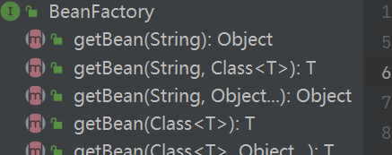
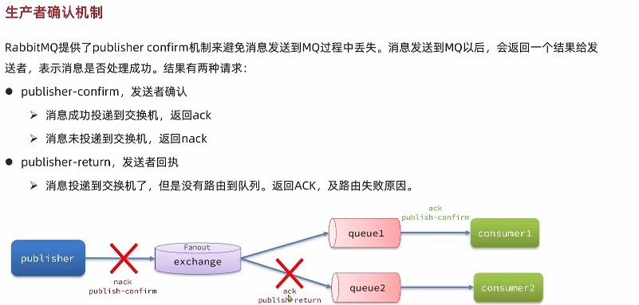

## java 基础

[读尽天下源码，心中自然无码 (doocs.github.io)](https://doocs.github.io/source-code-hunter/#/)

[SpringBoot 如何在日志中增加 trace id 用于链路追踪-阿里云开发者社区 (aliyun.com)](https://developer.aliyun.com/article/822487)

### 1.请你说说 Java 的特点和优点,为什么要选择 Java？

1. 一次编译，到处运行，即`平台无关性`；是纯`面向对象`的语言。
2. JAVA 语言的优点有：内置的类库简化了开发人员的设计工作；具有较好的安全性和健壮性；开发人员`不需要`对`内存`的使用进行`管理`。
3. 选择 JAVA 的原因是：使用范围很广，安卓操作系统的应用软件目前大部分还是使用 JAVA 语言编写。

### 2.请你说说 Java 基本数据类型和引用类型

1. 提供 8 种基本数据类型：byte(8), short(16), int(32), long(64), float(32), double(64), char(16), boolean，这些基本数据类型有对应的封装类；这基本数据类型在声明之后就会立刻在`栈`上被分配内存空间
2. 其他类型都是引用类型：类，接口，数组，String 等，这些变量在声明时**不会被分配内存空间**，只是存储了一个**内存地址**。

> 区别

1. 存储方式
   1. 基本数据类型的局部变量存放在 Java 虚拟机栈中的局部变量表中
   2. 基本数据类型的成员变量（未被 `static` 修饰 ）存放在 Java 虚拟机的堆中。
   3. 包装类型属于对象类型，我们知道几乎所有对象实例都存在于堆中。
2. 默认值
   1. 成员变量包装类型不赋值就是 `null`
   2. 而基本类型有默认值且不是 `null`。

> 缓存机制

下面我们来看一个问题：下面的代码的输出结果是 `true` 还是 `false` 呢？

```java
Integer i1 = 40;
Integer i2 = new Integer(40);
System.out.println(i1==i2);
```

`Integer i1=40` 这一行代码会发生装箱，也就是说这行代码等价于 `Integer i1=Integer.valueOf(40)` 。因此，`i1` 直接使用的是缓存中的对象。而`Integer i2 = new Integer(40)` 会直接创建新的对象。

因此，答案是 `false` 。你答对了吗？

### 3.请你说一下抽象类和接口的区别

相同点：

1. 两者都`不能实例化`；
2. 可以拥有`抽象方法`。接口 void 默认就是 abstract 的
3. 都有 default 方法，直接写实现，接口也行

区别：

1. abstract class,interface；
2. 属性上，抽象类可以有静态变量、常量和成员变量，接口只能有常量`public static final`；
3. 抽象方法可以有构造方法，接口不可以有构造方法。
4. 抽象方法在业务编程上更像一个模板，有自己的功能，同时也可以有优化补充的多种形式，而接口更像是一种规范和要求，实现就要按照要求来进行。

### 4.请你说一下 final 关键字

1. final 可以修饰类，方法，变量。
2. final 修饰类，该类不可被继承。
3. final 修饰方法，该方法不能被重写。
4. final 修饰变量，如果是基本变量则值不能再改变，如果是引用变量则引用地址不能改变，但值可以改变。

### 5.说说 static 修饰符的用法

1. `static修饰变量`：属于静态变量也叫类变量，直属于类对象而不是实例，可以通过类名访问，它一般会在类加载过程中被初始化。生命周期贯穿整个程序。存储在方法区中。
2. `static修饰方法`：即静态方法，一个类中的静态方法不能访问该类的实例变量，只能访问静态变量。同时还存在一个静态初始化块，他在类加载过程中被调用用于对该类中的静态变量进行操作。
3. `static修饰类`：即静态内部类，他只能以内部类的形式存在，可通过外部类的类名调用。它是他也只能访问到外部的的静态成员。

### 6.请你说说 String 类

1. String 类被 final 修饰，所以不能被继承。
2. 创建 String 对象时可以使用字符串直接量，如 String str="1abc", 另一种 String str = new String("1abc")
3. 前者使用常量池来管理，后者先判断常量池中是否已存在此字符串，不存在就也在常量池创建，再在堆内存创建一个新的对象，因此后者开销更大

### 7.String、StringBuffer、Stringbuilder 有什么区别

`StringBuilder` 与 `StringBuffer` 都继承自 `AbstractStringBuilder` 类，在 `AbstractStringBuilder` 中也是使用 byte 数组保存字符串，不过没有使用 `final` 和 `private` 关键字修饰，最关键的是这个 `AbstractStringBuilder` 类还提供了很多修改字符串的方法比如 `append` 方法。

1. `String`是`final`不可变字符序列，从它创建到销毁前，都不可变。
2. `StringBuilder`是可变字符序列，但`不是线程安全`的。
3. `StringBuffer`是可变字符序列，与 StringBuilder 功能相似，区别是它是`线程安全`的。
4. 相比 String，StringBuilder 有 append()方法，即追加字符串。最后 toString()转换成 String

> string

不可变的原因：

1. final class
2. private final char value [ ]
3. 

### 8.请你说说==与 equals()的区别

1. == 比较基本数据类型时，比较的是两个数值是否相等； 比较引用类型是，比较的是对象的内存地址是否相等。
2. equals() 没有重写时，Object 默认以==来实现，即比较两个对象的内存地址是否相等； 重写以后，按照对象的内容进行比较

### 9.请你说说 hashCode()和 equals()的区别,为什么重写 equals()就要重写 hashcode()

1. hashCode()：获取哈希码,equals()：比较两个对象是否相等。
2. 二者两个约定：如果两个对象相等,它们必须有相同的哈希码；若两个对象的哈希码相同,他们却不一定相等。也就是说,equals()比较两个对象相等时 hashCode()一定相等,hashCode()相等的两个对象 equqls()不一定相等。
3. 加分回答：由于 hashCode()与 equals()具有联动关系,equals()重写时,hashCode()进行重写,使得这两个方法始终满足相关的约定。

### 10.请你说说 Java 的异常处理机制

`java异常提醒`：

 Throwable = Exception + Error

 Exception = Checked Exception + Unchecked Exception (extend RuntimeException)

1. `容错性`和`健壮性`,程序运行出现状况时,系统会生成一个`Exception对象`来通知程序

2. 由`try`、`catch`、`finally`三部分组成。

   try 块用于包裹业务代码,catch 块用于捕获并处理某个类型的异常,finally 块则用于回收资源。

   `finally` 最终执行

### 11.说说你对面向对象的理解

1. 面向对象三大基本特征：`封装`、`继承`、`多态`。
2. `封装`：将对象的状态信息隐藏在对象内部,不允许外部程序直接访问对象内部信息,让外部程序通过该类提供的方法来实现对内部信息的操作和访问,提高了代码的可维护性；
3. `继承`：实现代码复用的重要手段,通过 extends 实现类的继承,实现继承的类被称为子类,被继承的类称为父类；
4. `多态`的实现离不开继承,在设计程序时,我们可以将参数的类型定义为父类型。在调用程序时根据实际情况,传入该父类型的某个子类型的实例,这样就实现了多态。

### 12.请介绍一下访问修饰符

1. Java 中的访问修饰符有四种，分别为 `private`,`default`,`protected`,`public`。
2. `private`：类中被 private 修饰的只能在被`当前类`内部访问
3. `default`：类中被 default 修饰的只能在`当前类`和`当前类所在包`的其他类访问。
4. `protected`：类中被 protected 修饰的可以被`当前类`和`当前类所在的包`的其他类以及`子类`访问。
5. `public`：类中被 public 修饰的能被`当前项目`下的所有类访问。

### 13.序列化

如果我们需要`持久化 Java 对象`比如将 Java 对象保存在文件中，或者在`网络传输 Java 对象`，这些场景都需要用到序列化。

**序列化**：将数据结构或对象转换成二进制字节流的过程

**反序列化**：将在序列化过程中所生成的二进制字节流转换成数据结构或者对象的过程

> 为什么需要序列化

因为我们单方面的只把对象转成字节数组还不行，因为没有规则的字节数组我们是没办法把对象的本来面目还原回来的，所以我们必须在把对象转成字节数组的时候就制定一种规则**（序列化）**，那么我们从 IO 流里面读出数据的时候再以这种规则把对象还原回来**（反序列化）。**

如果我们要把一栋房子从一个地方运输到另一个地方去，**序列化**就是我把房子拆成一个个的砖块放到车子里，然后留下一张房子原来结构的图纸，**反序列化**就是我们把房子运输到了目的地以后，根据图纸把一块块砖头还原成房子原来面目的过程

### 14.请说说你对反射的了解

1. 反射就是在程序运行期间动态的获取对象的属性和方法的功能叫做反射。它能够在程序运行期间，对于任意一个类，都能知道它所有的方法和属性，对于任意一个对象，都能知道他的属性和方法。
2. 反射的优缺点：
   1. 优点：运行期间能够动态的获取类，提高代码的灵活性。
   2. 缺点：性能比直接的 Java 代码要慢很多。 应用场景：spring 的 xml 配置模式，以及动态代理模式都用到了反射

### 15.设计模式

#### 代理

思想:

 我们使用`代理对象`来代替对真实对象(real object)的访问，这样就可以在`不修改`原目标对象的前提下，提供`额外`的功能`操作`，扩展目标对象的功能。

主要作用：

 扩展目标对象的功能，比如说在目标对象的`某个方法执行前后`(AOP?)你可以增加一些自定义的操作

JDK 动态代理 vs CGLIB

1. `JDK` 面向`接口`，要有实现类

   ```java
   public class JdkProxyFactory {
       public static Object getProxy(Object target) {
           return Proxy.newProxyInstance(
                   target.getClass().getClassLoader(), // 目标类的类加载器
                   target.getClass().getInterfaces(),  // 代理需要实现的接口，可指定多个
                   new DebugInvocationHandler(target)   // 代理对象对应的自定义 InvocationHandler
           );
       }
   }

   SmsService smsService = (SmsService) JdkProxyFactory.getProxy(new SmsServiceImpl());
   smsService.send("java");
   ```

2. `CGLib` 通过字节码底层`继承`要代理类来实现

   ```xml
   <dependency>
     <groupId>cglib</groupId>
     <artifactId>cglib</artifactId>
     <version>3.3.0</version>
   </dependency>
   ```

   ```java
   package github.javaguide.dynamicProxy.cglibDynamicProxy;
   
   public class AliSmsService {
       public String send(String message) {
           System.out.println("send message:" + message);
           return message;
       }
   }
   
   public class DebugMethodInterceptor implements MethodInterceptor {
       @Override
       public Object intercept(Object o, Method method, Object[] args, MethodProxy methodProxy) throws Throwable {
           //调用方法之前，我们可以添加自己的操作
           System.out.println("before method " + method.getName());
           Object object = methodProxy.invokeSuper(o, args);
           //调用方法之后，我们同样可以添加自己的操作
           System.out.println("after method " + method.getName());
           return object;
       }
   
   }
   
   public static Object getProxy(Class<?> clazz) {
       // 创建动态代理增强类
       Enhancer enhancer = new Enhancer();
       // 设置类加载器
       enhancer.setClassLoader(clazz.getClassLoader());
       // 设置被代理类
       enhancer.setSuperclass(clazz);
       // 设置方法拦截器
       enhancer.setCallback(new DebugMethodInterceptor());
       // 创建代理类
       return enhancer.create();
   }
   ```

> springBoot 与 spring 中的动态代理

如果代理对象`有接口`，就用 `JDK 动态代理`

如果代理对象`没有接口`，那么就直接是 `CGlib` 动态代理

---

从 `Spring Boot2.0` 开始，如果用户什么都没有配置，那么`默认`情况下使用的是 `CGlib` 代理

**@Transactional 是 cglib 动态代理**

---

[^tips]: 如果我们想用 JDK 来代理，那么只需要在 application.properties 中添加如下配置即可：

```go
spring.aop.proxy-target-class=false
```

---

==获取原对象==

```java
AopProxyUtils.getSingletonTarget(cglib_class);
```

#### 策略模式

解决大量的 if-else

#### 模板方法

```java
package 模板方法模式_TemplateMethodPattern;

public class Main {
    public static void main(String[] args) {
        Cooking cooking=new CookingFood();
        cooking.cook();
    }
}
abstract class Cooking{
    protected abstract void step1();

    protected abstract void step2();

    public void cook(){
        System.out.println("做饭开始");
        step1();
        step2();
        System.out.println("做饭结束");
    }

}
class CookingFood extends Cooking{

    @Override
    protected void step1() {
        System.out.println("步骤1");
    }

    @Override
    protected void step2() {
        System.out.println("步骤2");
    }
}
```

#### 设计原则

[设计模式之----依赖倒置（Dependency inversion principle）的理解-CSDN博客](https://blog.csdn.net/ws9029/article/details/116307766)

> 开闭原则

对于扩展类开放，对修改类封闭

```java
public interface UserDAO{
    public void insert();
}

// 原先
public class UserDAOImpl implements UserDAO{
    public void insert(){
        JDBC实现
    }
}

// 现在需切换实现，新建实现类
public class UserDAOJdniImpl implements UserDAO{
    public void insert(){
        JDNI实现
    }
}

```

> 单一职责原则

如果需要开发的一个功能需求不是一次性的，且随着业务发展的不断变化而变化，那当一个class类负责超过两个及以上的职责时，就在需求的不断迭代、实现类持续扩张的情况下，就会出现难以维护、不好扩展、测试难度大和上线风险高等问题

`错误用法`


`正确用法`


> 里氏替换原则

简单来说，子类可以扩展父类的功能，但不能改变父类的功能 

继承时除了添加新的方法且完成新增功能外，尽量不要重写父类的方法。


共同功能抽象出抽象类


==总结==

子类可以扩展父类的功能，通过添加新的方法和属性。

子类可以重写父类的方法，但是必须保持与父类方法一致的行为。

`原则`：子类对象必须能过无缝替换父类对象，而不会破坏系统的正确性

> 迪米特法则 & 最少知道原则


例如学生、教师、校长三个类

校长现在想知道某个老师下的班级的总分，平均成绩啥的

成绩应当由教师类实现


==总结==

减少对象之间的直接依赖关系，通过封装和间接交互来降低耦合性。


> 接口隔离原则

不要在一个接口里定义太多的方法，做拆分

> 依赖倒置原则

[依赖倒置原则](https://so.csdn.net/so/search?q=依赖倒置原则&spm=1001.2101.3001.7020)的原始定义为：`上层模块不应该依赖下层模块，两者都应该依赖其抽象；抽象不应该依赖细节，细节应该依赖抽象，其核心思想是：要面向接口编程，不要面向实现编程。`

`本质是面向接口编程`


比如 serviceImpl 调用 dao 的实现类，当 dao 改变时会影响业务

应该做一层抽象


```ts
//Person.ts
export interface Person {
    goSchool();
}
//Driveable.ts
export interface Driveable {
    drive();
}
//Bike.ts
export class Bike implements Driveable{
    public drive(){
        console.log("bike drive")
    }
}
//Bus.ts
export class Bus implements Driveable{
    public drive(){
        console.log("bus drive")
    }
}
//xiaoMing.ts
export class xiaoMing implements Person {
    private drive;
    constructor(drive: Driveable) {
        this.drive = drive;
    }
    public goSchool() {
        this.drive.drive();
    }
}
//外层调用
let xiaoM = new xiaoMing(new Bus());
xiaoM.goSchool();
```


### 16.注解与反射


```java
//作用范围:项目运行,在运行期间可通过该注解Sys获取
@Retention(RetentionPolicy.RUNTIME)
//注解的位置
@Target({ElementType.METHOD,ElementType.TYPE})
public @interface SystemLog {

    String businessName();

}
```

### 17. 重载与重写

> 重载

重载就是同一个类中多个同名方法根据不同的传参来执行不同的逻辑处理

> 重写

**方法的重写要遵循“两同两小一大”**：

- “两同”即方法名相同、形参列表相同；
- “两小”指的是子类**方法返回值**类型应比父类方法返回值类型更小或相等，子类方法声明**抛出的异常类**应比父类方法声明抛出的异常类更小或相等；
- “一大”指的是子类方法的**访问权限**应比父类方法的访问权限更大或相等。

⭐️ 关于 **重写的返回值类型** 这里需要额外多说明一下，上面的表述不太清晰准确：如果方法的返回类型是 void 和基本数据类型，则返回值重写时不可修改。但是如果方法的返回值是引用类型，重写时是可以返回该引用类型的子类的。

### 18.多态
> 定义 

 `多态`的实现离不开继承,在设计程序时,我们可以将参数的类型定义为父类型。在调用程序时根据实际情况,传入该父类型的某个子类型的实例,这样就实现了多态。

> 执行顺序

1. 父类静态代码块
2. 子类静态代码块 （能使用父类的static 变量，可覆盖父类）
3. 父类代码块
4. 父类无参构造器
5. 子类代码块
6. 子类有参构造器（子类无论是什么构造器，都是调用父类的空参构造器`需要存在`）
7. name 等于 this.name  = B 类自己的属性 ，没有的时候 = 父类的
	

## java 集合

### 概述


### 1.ArrayList 与 LinkedList 区别

1. **是否保证线程安全**：都不保证线程安全
2. **底层数据结构**：`ArrayList`底层使用的是`Object数组`；`LinkedList`底层使用的是`双向链表`

> 为什么线程不安全

element[size++] = e

size 会多线程间不可见

> 线程安全的集合

有三种方式:

1. vector 在add方法上加上synchronized锁

2. Collections的静态方法synchronizedList(List< T> list) 转换成一个线程安全的list

3. [CopyOnWriteArrayList](https://so.csdn.net/so/search?q=copyonwritearraylist&spm=1001.2101.3001.7020)写时复制的思想
	1. `得益于读写不冲突，以及读不加锁，在读多写少的情况下，推荐使用CopyOnWriteArrayList方式`
	2. 每当对列表进行修改（例如添加、删除或更改元素）时，都会创建列表的一个新副本，这个新副本会替换旧的列表，而对旧列表的所有读取操作仍然可以继续。

> 优缺点

ArryayList：

​	1.  查找元素快，不需要一点其他元素，但是在修改的时候需要大量移动，比较耗时。

​	2. 扩容比较耗时

LinkedList：

1. 快熟插入元素和删除元素，
2. 查询效率慢，占有空间大
3. 


### 2.Comparable 和 Comparator 的区别

实现`Comparable`接口要重写这个类的 compareTo 方法

`Comparator `类似于 c 中 qsort 里的`排序规则`

### 3.HashMap 和 Hashtable 的区别

1. **线程是否安全**：`HashMap` 是非线程安全的，`Hashtable` 是线程安全的
2. **对 Null key 和 Null value 的支持：**`HashMap` 可以存储 null 的 key 和 value，但 null 作为键只能有一个，null 作为值可以有多个；Hashtable 不允许有 null 键和 null 值，否则会抛出 `NullPointerException`。

### 4.HashMap 的底层实现

 当`链表长度大于`阈值（默认为`8`）（将链表转换成红黑树前会判断，如果当前数组的`长度小于 64`，那么会选择先进行`数组扩容`，而不是转换为红黑树，线性探测法）时，将链表转化为`红黑树`，以减少搜索时间。


> 请你说说 HashMap 底层原理

1. 在 1.8 之前，HashMap 的底层是数组加链表，在 1.8 之后是数组+链表+红黑树；
2. 它的 put 流程是：基于哈希算法来确定元素位置，当我们向集合存入数据时，他会计算传入的 key 的哈希值，并利用哈希值取绝对值再根据集合长度取余来确定元素的位置，如果这个位置已经存在其他元素了，就会发生哈希碰撞，则 hashmap 就会通过链表将这些元素组织起来，如果链表的长度达到 8 时，就会转化为红黑树，从而提高查询速度。
3. 扩容机制：HashMap 中数组的默认初始容量为 16，当达到默认负载因子 0.75 时，会以 2 的指数倍进行扩容。 Hashmap 时非线程安全的，在多线程环境下回产生循环死链，因此在多线程环境下建议使用 ConcurrentHashMap
4. 假如构造器传入cap = 7 ，map内的容量会是2的倍数 8

> 为什么使用红黑树

红黑树是一种自平衡的二叉搜索树，O(log n) 比链表O(n)要快

> 不用AVL树的原因

 AVL : 每个结点 null or | left - right | <= 0

红黑树保证最长路径不超过最短路径的二倍，因而近似平衡（最短路径就是全黑节点，最长路径就是一个红节点一个黑节点，当从根节点到叶子节点的路径上黑色节点相同时，最长路径刚好是最短路径的两倍

> 总结

HashMap 使用红黑树而不是 AVL 树的主要原因是红黑树在旋转操作的频率、内存使用和插入删除的复杂性上更为优化，更适合 HashMap 的实际使用场景。红黑树能够在保证平衡的同时，减少不必要的旋转操作，从而提高整体性能。

### 5.ConcurrentHashMap

**底层数据结构**：Node 数组 + 链表 / 红黑树

链表升级为红黑树的规则：当链表长度大于 8，并且数组的长度大于 64 时，链表就会升级为红黑树的结构。

> 怎么保证线程安全

并发控制使用 `synchronized` 和 CAS 来操作

1. 添加元素时首先会判断容器是否为空
   1. 如果为空则使用 volatile 加 CAS 来初始化。
   2. 如果容器不为空则根据存储的元素计算该位置是否为空
      1. 如果为空则利用 CAS 设置该节点；
      2. 如果不为空则使用 synchronize 加锁，遍历桶中的数据，替换或新增节点到桶中，最后再判断是否需要转为红黑树，这样就能保证并发访问时的线程安全了

> ConcurrentHashMap 在 JDK1.8 中为什么要使用内置锁 Synchronized 来替换 ReentractLock 重入锁？

Synchronized 在 java 1.8 之后有做性能的优化

### 6.ArrayList 扩容机制 和 源码分析

> 扩容机制

**构建**：

1. **无参**：初始的是一个空数组。对数组进行添加时，才分配容量为 10
2. **有参**：用户自己指定容量

**扩容**：

 ArrayList 每次扩容之后容量都会变为原来的 1.5 倍左右，若addAll()之后容量大于1.5倍 （原大小9 ，1.5倍为13，实际为15），则按照实际大小来

> 源码

```java
public class ArrayList<E> extends AbstractList<E>
        implements List<E>, RandomAccess, Cloneable, java.io.Serializable
{
    /**
     * 列表元素集合数组
     * 如果新建ArrayList对象时没有指定大小，那么会将EMPTY_ELEMENTDATA赋值给elementData，
     * 并在第一次添加元素时，将列表容量设置为DEFAULT_CAPACITY 
     */
    transient Object[] elementData; 

    /**
     * 列表大小，elementData中存储的元素个数
     */
    private int size;
}
```

**构造器**

空参

```java
// DEFAULTCAPACITY_EMPTY_ELEMENTDATA
public ArrayList() {
        this.elementData = DEFAULTCAPACITY_EMPTY_ELEMENTDATA;
}
```
指定容量

```java
public ArrayList(int initialCapacity) {
    if (initialCapacity > 0) {
        this.elementData = new Object[initialCapacity];
    } else if (initialCapacity == 0) {
        // EMPTY_ELEMENTDATA = {}
        this.elementData = EMPTY_ELEMENTDATA;
    } else {
        throw new IllegalArgumentException("Illegal Capacity: "+
                                           initialCapacity);
    }
}
```

添加操作

```java
public boolean add(E e) {
    /**
     * 添加一个元素时，做了如下两步操作
     * 1.判断列表的capacity容量是否足够，是否需要扩容
     * 2.真正将元素放在列表的元素数组里面
     */
    
    // size+1 表示添加后预计的大小
    // 1. 假如创建ArrayList时空参，在初次添加元素时，返回默认分配容量10和 预计容量的最大值
    // 2. 
    ensureCapacityInternal(size + 1);
    // 多线程会导致elementData[size]会被其他线程覆盖
    elementData[size++] = e;
    return true;
}

// add() addAll()
private void ensureCapacityInternal(int minCapacity) {
    ensureExplicitCapacity(calculateCapacity(elementData, minCapacity));
}

private static int calculateCapacity(Object[] elementData, int minCapacity) {
    if (elementData == DEFAULTCAPACITY_EMPTY_ELEMENTDATA) {
        return Math.max(DEFAULT_CAPACITY, minCapacity);
    }
    return minCapacity;
}
```


## 数据结构

### 快排

Olgn，在极端情况下，比如降序的数组去升序，就变了 n\*n ，不稳定

## java IO

### 概述

`InputStream`/`Reader`: 所有的输入流的基类，前者是字节输入流，后者是字符输入流。

`OutputStream`/`Writer`: 所有输出流的基类，前者是字节输出流，后者是字符输出流。

### IO 模型

```python
if(read后不立即返回)：
	阻塞
else:
    非阻塞

if(准备好数据，要读取数据):
    同步阻塞
else:
    异步不阻塞callback()
```

### BIO 同步阻塞模型

同步阻塞 IO 模型中，应用程序发起 read 调用后，会一直阻塞，直到内核把数据拷贝到用户空间。


### NIO 同步非阻塞 IO

例如：

​	创建了一个服务器端的 `ServerSocketChannel` 并绑定到 8080 端口。通过不断循环接受客户端的连接，读取客户端发送的数据，并向客户端发送响应。


### NIO 多路复用模型

多路复用模型中，线程首先发起 select 调用，询问内核数据是否准备就绪，等内核把数据准备好了，用户线程再发起 read 调用。read 调用的过程（数据从内核空间 -> 用户空间）还是阻塞的。


### AIO 异步 IO 模型

异步 IO 是基于事件和回调机制实现的，也就是应用操作之后会直接返回，不会堵塞在那里，当后台处理完成，操作系统会通知相应的线程进行后续的操作。


### 底层

> select

执行原理：
1. 将当前进程的所有文件描述符fd，一次性的从用户态拷贝到内核态
2. 在内核中快速的无差别遍历每个fd，判断有否数据已就绪
3. 将所有的fd状态，从内核态拷贝到用户态，并返回已就绪的fd的个数
4. 在用户态遍历判断具体哪个fd已就绪，然后进行相应的事件处理

不足：
1. 文件描述符表fd为bitmap，且有长度为1024的限制
2. O(n) 时间复杂度
3. 拷贝，开销大

## JUC

### 线程池

[Java线程池实现原理及其在美团业务中的实践 - 美团技术团队 (meituan.com)](https://tech.meituan.com/2020/04/02/java-pooling-pratice-in-meituan.html)


顶级父类

```java
public interface Executor {

    void execute(Runnable command);
}
```

优点：

1. 提高线程的利用率
2. 提高程序的响应速度
3. 便于统一管理线程对象
4. 可以控制最大的并发数

#### 流程

1. 预先创建一定数量的线程对象到池子中，corePoolSize = 10
2. 任务取线程
   1. 有空闲，继续 （cur < corePoolSize）
   2. 没有空闲，则加入等待队列，等待空余线程
      1. 等待队列也满了，创建新的线程对象，扩充池子，最大到 maximumPoolSize
3. 非核心线程空闲时间超过指定参数会销毁

#### demo

```java
public class Main {
    public static void main(String[] args) {
        ThreadPoolExecutor poolExecutor = new ThreadPoolExecutor(
                1,//核心线程数
                2,//最大线程数
                1,//空闲时间
                TimeUnit.SECONDS,//时间单位
                new ArrayBlockingQueue<>(10),//等待队列
                Executors.defaultThreadFactory(),//线程工厂
                new ThreadPoolExecutor.AbortPolicy()//拒绝策略
        );
        MyThread[] works = new MyThread[100];


        for (MyThread work : works) {
            work = new MyThread();
            poolExecutor.execute(work);
        }

    }
}
@Slf4j
record MyThread() implements Runnable {
    @Override
    public void run() {
        double random = Math.random();
        log.info(String.valueOf(random));
    }
}
```

#### 拒绝策略

1. AbortPolicy：丢弃任务并抛出异常
2. DiscardPolicy：丢弃任务但不抛出异常
3. CallerRunPolicy：由调用线程（main）处理任务
4. DiscardOldPolicy：抛弃队列最前面的任务，然后重新提交被拒绝的任务

### 1. 请你说说多线程

1. 线程是程序执行的最小单元，一个进程可以拥有多个线程
2. 各个线程之间共享程序的内存空间（代码段、数据段和堆空间）和系统分配的资源（CPU，I/O，打开的文件），但是各个线程拥有自己的栈空间
3. 多线程优点：减少程序响应时间；提高 CPU 利用率；创建和切换开销小；数据共享效率高；简化程序结构

### 2.说说线程的创建方式

创建线程有 3 种方式：

1. 继承 Thread 类，重写 run()方法；
2. 实现 Runnable 接口，并实现该接口的 run()方法；
3. 实现 Callable 接口，重写 call()方法。
4. 前两种方式线程执行完后都没有返回值，最后一种带返回值；一般推荐实现 Runnable 接口的方式。

### 3.说说你对 ThreadLocal 的理解

1. ThreadLocal 是线程变量，不同线程的数据相互隔离
2. 内部使用了一个 ThreadLoadMap 来存储信息，key 是当前线程，而 value 是我们需要传输的数据，我们可以在线程执行的过程中通过 get/set，操作 map 中的数据
3. 不过需要注意的是在使用线程池的时候，线程执行完毕不会被销毁，而是进入线程池中等待，这个时候我们需要手动释放一下 map 中的数据，以免造成内存浪费。

单线程中


多线程


finally 清理 threadLocal，因为有线程池，不会销毁线程

以当前线程为 key ，value 为 map

### 4. sleep()与 wait()区别

对于 sleep()方法，我们首先要知道该方法是属于 Thread 类中的。而 wait()方法，则是属于 Object 类中的。

`sleep()`方法可以使线程进入`WAITING`状态，而且不会占用 CPU 资源，也不会释放锁，直到过了规定的时间后再执行后续代码，休眠期间如果被中断，会抛出异常，并会清空中断状态标记。

> 1.相同点

①.都可以使线程堵塞

②.都可以响应中断

> 2.不同点

①.wait()、notify()方法必须写在同步方法中，是为了防止死锁和永久等待，使线程更安全，而 sleep()方法不需要有这个限制。

②.wait()方法调用后会释放锁；sleep()方法调用后不会释放锁。

③.sleep()方法必须要指定时间参数；wait()方法可以指定时间参数。

④.两个方法所属类不同，sleep()方法属于 Thread 类；wait()属于 Object 类中，放在 Object 类中是因为 Java 中每个类都可以是一把锁。

### 5.为什么要用多线程，介绍下线程池

线程池是运用场景最多的并发框架，几乎所有需要一步或者并发执行任务的程序都可以使用线程池。使用线程池一般有以下三个好处：

① 降低资源的消耗，通过重复利用已经创建的线程降低线程创建和销毁造成的消耗。

② 提高相应速度，当任务到达的时候，任务可以不需要等到线程创建就能立刻执行。

③ 提高线程的可管理性，线程是稀缺资源，使用线程池可以统一的分配、调优和监控。

### 6.java 线程池的工作过程


### 7.synchronized 和 ReentrantLock 有什么区别？

synchronized 可用来修饰普通方法、静态方法和代码块，而 ReentrantLock 只能用在代码块上

synchronized 在底层是根据对象的 monitor 来互斥的，wait list

synchronized 会自动加锁和释放锁，不可相应中断

而 ReentrantLock 需要手动加锁和释放锁，可相应中断，默认`非公平锁`、`独占锁`、`可重入`、`自旋addWaiter`

ReentrantLock 是 java.util.concurrent 包下提供的一套互斥锁，有公平锁，非公平锁

> synchronized

### 8.线程池的工作队列选取

1. LinkedBlockingDeque（链表同步阻塞队列）
2. ArrayBlockingQueue（数组同步阻塞队列）
3. SynchronousQueue（同步阻塞队列）

前两个会有阻塞队列

后一个如同没有阻塞队列，没有阻塞效果

### 9.volite 的使用

1. 可以保证在多线程环境下共享变量的可见性
2. 通过增加内存屏障防止多个指令之间的重排，防止的 jvm、cpu 层面的指令排序

---

volatile 的底层实现原理是内存屏障，Memory Barrier（Memory Fence）

对 volatile 变量的写指令后会加入写屏障

对 volatile 变量的读指令前会加入读屏障


> 必看，原理

1. **可见性**
   - 写操作后插入屏障强制将本地缓存刷新到主内存。
   - 读操作前插入屏障强制从主内存（或其他 CPU 缓存）加载最新值。
   - 依赖 **缓存一致性协议（如 MESI）** 保证其他 CPU 核心的缓存行失效。
2. **禁止重排序**
   - 编译器在生成字节码时插入屏障指令，限制编译期和运行期的指令重排序。
   - CPU 根据屏障指令限制流水线乱序执行

缓存失效（Invalidation）的具体过程

当线程 A 修改 `volatile` 变量 `i` 时，会触发以下操作：

1. **写屏障强制刷新到主内存**：线程 A 的本地缓存修改后的值（例如 `i=2`）会立即写入主内存。
2. **发送失效信号（Invalidation Signal）**：通过总线（或其他互联方式），通知其他所有 CPU 核心的缓存，标记该变量对应的缓存行为 `Invalid` 状态。
3. **其他核心的后续读取**：如果其他核心（如线程 B）后续需要读取 `i`，发现自己的缓存行状态为 `Invalid`，必须重新从主内存（或持有最新数据的其他缓存）加载最新值。


### 10.什么是线程安全与不安全

> 什么是线程安全

 线程安全是指在多线程环境下，程序可以始终执行正确的行为，符合预期的逻辑。比如我们刚刚的程序，共两个线程，每个线程对 count 变量累加 1000 次，预期的逻辑是 count 被累加了 2000 次，而代码执行的结果却不是 2000，所以它是线程不安全的。

> 为什么会造成线程不安全

多线程的情况下步骤为读、改、写

在并发时，线程 1 修改了 count+=1，修改对于线程 2 来说是`不可见的`，此时时间片到了

线程 2 执行，此时读到的 count 是旧值

---

导致线程不安全的原因

主要有三点：

- 不满足`原子性`：一个或者多个操作在 CPU 执行的过程中被中断
- 不满足`可见性`：一个线程对共享变量的修改，另外一个线程不能立刻看到==volatile 关键字、锁来保证可见性==
- 不满足`有序性`：程序执行的顺序没有按照代码的先后顺序执行

---

### 11.讲一下 CAS

CAS 的全称是 Compare-and-Swap，也就是比较并交换，是并发编程中一种常用的算法。它包含了三个参数：V，A，B。
其中，V 表示要读写的内存位置，A 表示旧的预期值，B 表示新值

Java 中提供了一系列应用 CAS 操作的类，这些类位于 java.util.concurrent.atomic 包下，其中最常用的就是**AtomicInteger**，该类可以看做是实现了 CAS 操作的 Integer，所以，下面我们就通过学习该类的案例来一窥全貌 CAS 的妙用。

```java
 public AtomicInteger i = new AtomicInteger(0);

    public static void main(String[] args) {
        CasMain casMain = new CasMain();
        casMain.i.compareAndSet(0, 1);
        System.out.println("i = " + casMain.i); // 1
    }
```


### 12.AQS

是阻塞式锁和相关的同步器工具的框架


> ReentrantLock


Aync 的实现分为公平锁和非公平锁


> AQS

1. volatile int state：代表锁的状态，0 表示没加锁，1 已被加锁，>1 表示被同一线程多次加锁

   1. final int getState：
   2. final void setState：
   3. final boolean compareAndSetState：

2. Node 结点，表示获取不到的锁的线程

   组成链表，名为同步队列

   

==入队==


==回复==

被唤醒后，不是直接拿到锁，而是再次通过 cas 去尝试获取锁


当一个线程调用 lock()方法后

1. 尝试获取锁，如果获取失败的话，后续还有再次尝试获取锁的机会 tryAquire()
2. 还是获取失败的话，通过 for 死循环

> 面试背诵版

[如何轻松的通过ReentrantLock掌握AQS的核心原理-阿星不是程序员-阿星不是程序员-哔哩哔哩视频](https://www.bilibili.com/list/265605735?tid=0&sort_field=pubtime&spm_id_from=333.999.0.0&oid=113417704703410&bvid=BV1nHS1YFEUi)


### 13.线程池的提交方法有哪几个

[execute与submit的区别 ](https://www.cnblogs.com/jxxblogs/p/11882381.html)

>  execute和submit的区别

- **execute只能提交Runnable**类型的任务，无返回值。**submit**既可以提交**Runnable**类型的任务，也可以提交**Callable**类型的任务，会有一个类型为Future的返回值，但当任务类型为Runnable时，返回值为null。
- execute在执行任务时，如果遇到异常会直接抛出，而submit不会直接抛出，只有在使用Future的get方法获取返回值时，才会抛出异常。


### 14. 见 juc.md补充

### 15. synchronized原理

> 锁升级


## JVM

### 组成架构

**Java虚拟机**一般是由多个模块一起组成的，主要可分为**类加载子系统**、**执行引擎子系统**、**运行时数据区**、**垃圾回收子系统**以及**本地接口和本地方法库**。在Java程序启动/执行过程中，这些模块各司其职，相互配合，组成了整个Java的执行平台 - JVM。

#### 类加载子系统

类加载子系统是用于加载编译后`class`文件的，但它只负责将符合格式要求的`class`字节码信息加载进内存，而只要符合格式规范的`class`文件都能被加载，至于加载进入的`class`文件到底是否能执行就并不是它负责的了，这是执行引擎子系统的范围之内的责任。

而类加载子系统中，核心知识点分为**类加载器**、**双亲委派模型**、**类加载过程**三大块。

#### 执行引擎子系统

执行引擎子系统担任着JVM的“翻译官”角色，它负责将加载进内存的`class`字节码指令**“翻译”成机器语言**交由硬件执行。而字节码可以通过解释器和即使编译器两种途径转换为机械指令。`HotSpot`虚拟机中，采用的便是解释器+即使编译器混合执行的工作模式。

#### 运行时数据区

运行时数据区是整个JVM中的重点，开发者编写的所有代码最终都会被加载在这里之后再开始执行。同时，Java为何能够避免像C那样，需要手动管理内存的原因之一也在于这块区域。

Java运行时数据区主要可分为**PC程序计数器**、**本地方法栈**、**虚拟机栈**、**元数据空间(方法区)**以及**堆空间**五大区域，这也是后续分析时的核心内容。

#### 垃圾回收子系统

​		GC模块的主要任务就是帮助Java程序管理内存，对于垃圾对象的清除、存活对象的管理以及内存碎片的回收等工作，都交由GC系统负责。

​		JVM的GC机制里面重点知识点分为三块：**垃圾回收器**、**垃圾回收算法**、**GC调优**。

#### 本地接口和本地方法库

​		本地方法接口的作用主要是为了融合不同的编程语言为Java所用，它的初衷是融合C/C++程序。因为在Java诞生时，正是C语言横行的时候，要想立足就必须要有一个能够调用C代码的模块，于是就专门在内存中开辟了一块区域处理标记为native的方法。

​		它在执行时，而本地方法接口的作用则是将本地方法栈中登记的被调用的本地方法，在执行引擎处理时，将C编写的native方法从本地方法库中加载出来。

 		简而言之，本地方法接口就是一个Java调用非Java代码的接口，这个非Java代码一般泛指C语言所编写的本地方法库中的函数。


### 内存结构


```properties
本地方法栈:调用c++ native方法

程序计数器:同计组PC。注意：程序计数器是唯一一个不会出现 OutOfMemoryError 的内存区域，它的生命周期随着线程的创建而创建，随着线程的结束而死亡。

方法区(元空间):classLoader，元数据

栈:临时变量，对于引用类型存储的是对象的地址->堆

堆:对象
```

==本地方法栈+PC+栈==

是线程私有的

==堆+方法区+直接内存==

全局共享

#### 程序计数器

记住下一条 jvm 指令 的执行地址

特征：

1. 线程私有

#### 栈

> 定义

栈帧：每个方法运行所需的内存空间

参数，局部变量，返回地址

>

上面是栈底

顺序是

1. main
2. func1


栈由一个个栈帧组成，而每个栈帧中都拥有：局部变量表、操作数栈、动态链接、方法返回地址。和数据结构上的栈类似，两者都是先进后出的数据结构，只支持出栈和入栈两种操作。


1. ==局部变量表== 主要存放了编译期可知的各种数据类型（boolean、byte、char、short、int、float、long、

   double）、对象引用（reference 类型，它不同于对象本身，可能是一个指向对象起始地址的引用指针，也

   可能是指向一个代表对象的句柄或其他与此对象相关的位置）

2. ==操作数栈== 主要作为方法调用的中转站使用，用于存放方法执行过程中产生的中间计算结果。另外，计算过程中产生的临时变量也会放在操作数栈中。

3. ==动态链接== 主要服务一个方法需要调用其他方法的场景。Class 文件的常量池里保存有大量的符号引用比如方法引用的符号引用。当一个方法要调用其他方法，需要将常量池中指向方法的符号引用转化为其在内存地址中的直接引用。动态链接的作用就是为了将符号引用转换为调用方法的直接引用，这个过程也被称为 **动态连接** 。

简单总结一下程序运行中栈可能会出现两种错误：

- **`StackOverFlowError`：** 若栈的内存大小不允许动态扩展，那么当线程请求栈的深度超过当前 Java 虚拟机栈的最大深度的时候，就抛出 `StackOverFlowError` 错误。
- **`OutOfMemoryError`：** 如果栈的内存大小可以动态扩展， 如果虚拟机在动态扩展栈时无法申请到足够的内存空间，则抛出`OutOfMemoryError`异常。

>

p.name="iming"

这块讲错了，这个 string 不是 new 出来的，应该字符串常量池

先去字符串常量池去找，没有则创建，p.name 的引用指向常量池

func1 方法是存在栈中的，调用方法叫进栈，也就是压栈，方法里面的局部变量和对象引用都是在栈里面的，当在方法执行返回这个栈帧就弹出去了，也叫出栈或者弹栈


函数 func1 运行完之后，对于的栈帧进行清除，堆还在，要通过==gc==回收

> 栈的内存分配


> 栈内存溢出

1. 栈帧过多
   1. 方法递归调用

#### 堆


**JDK 8 版本之后 PermGen(永久代) 已被 Metaspace(元空间) 取代，元空间使用的是本地内存。** （我会在方法区这部分内容详细介绍到）。

内存溢出触发 full gc

```bash
-Xmx8m
```

> 排查

jps 进程

jmap -dump:format=b,live(存活对象)，file=/usr/1.bin Yourpid 堆内存快照

#### 方法区

##### 概览


##### 什么是方法区

方法区属于是 JVM 运行时数据区域的一块逻辑区域，是各个线程共享的内存区域。

当虚拟机要使用一个类时，它需要读取并解析 Class 文件获取相关信息，再将信息存入到方法区。方法区会存储已被虚拟机加载的 `类信息`、`字段信息`、`方法信息`、`构造器`、`常量`、`静态变量`、`即时编译器编译后的代码缓存`等数据。

---

==JDK1.7 字符串常量池和静态变量从永久代移动了 Java 堆中==

根据变化情况，推出字符串常量池在堆的 old 区，字符串在 Young 的 Eden 区产生，调用 intern()就是先看 old 区有没有，如果没有将这个对象存入 old 区中，而字符串之所以通过==比较会返回 true 可能是 jvm 底层做的一件事情，移动了对象，再次查找对象时会找到移动后的那个对象(gc 也会导致对象的移动，会将 Eden 区的对象移动到 S0 或 S1，甚至可能移动到 Old 区。因此 gc 导致的移动至少 jvm 是肯定要做处理的，至于怎么处理的则需要继续深入才能探究，故推断 intern()方法的作用就是将字符串移动到常量池中)


---

**方法区和永久代以及元空间是什么关系呢？** 方法区和永久代以及元空间的关系很像 Java 中接口和类的关系，类实现了接口，这里的类就可以看作是永久代和元空间，接口可以看作是方法区，也就是说永久代以及元空间是 HotSpot 虚拟机对虚拟机规范中方法区的两种实现方式。并且，永久代是 JDK 1.8 之前的方法区实现，JDK 1.8 及以后方法区的实现变成了元空间。


##### 内存溢出


##### 运行时常量池 jdk1.6

定义


```bash
javap -v String.class //详细查看反编译信息
```

1. 基本信息

   

2. 常量池

   

3. 类方法定义

   

代码会变成一次虚拟机指令

getstatic 表示找到 System.out

ldc 表示找到那个字符串


表示到常量池找


常量池是给指令提供一些常量符号

##### 字符串常量池


> s4 = s1 + s2 ;


> s4 = "a" + "b" ;


没有使用 StringBuilder 是因为在编译期间进行了优化


> intern


此时字符串常量池中只有，“ab”仅仅是 s 指向的 new String("ab")

```python
["a","b"]
```


只要调用 String 对象的 intern()，都会去找到字符串常量池，然后判断 String 对象的字符串内容是否已经存在常量池中，不存在，则创建新的引用并指向堆区已有对象地址（JDK7 之后），存在则直接返回。

```java
public class StringA {
    public static void main(String[] args) {
        String x = "ab";//["ab"]
        String s = new String("a") + new String("b");//["a","b"]
        String s2 = s.intern();//["ab","a","b"] 这里因为已经有了ab所以没有改变s的指向，返回的是ab的地址

        System.out.println(s2 == x);//true
        System.out.println(s == x);//false

    }
}
```

这里的 intern

```java
public class StringA {
    public static void main(String[] args) {
        String s = new String("a") + new String("b");
        String s2 = s.intern();

        System.out.println(s2 == "ab");//true
        System.out.println(s == "ab");//true

    }
}
```

#### gc

##### 怎么判断一个对象是否要 gc

> 可达性分析算法

判断标准：GCRoot

肯定不能当做垃圾被回收的对象，称作根对象

扫描堆，查看是否被根对象直接或间接引用，是则不能被回收

- java 虚拟机中的垃圾回收器采用可达性分析算法来探索所有存活的对象
- 扫描堆中的对象，看是否能够沿着 GC Root 对象为起点的引用链找到该对象，找不到，表示可以回收
- 哪些对象可以作为 GC Root

1. 

2. 

3. 正在加锁的对象

   

4. 活动线程，正在使用的栈帧的数据（局部变量对象）

   ```java
   List list = new ArrayList();
   ```

   list=null 时就不是 GC Root 了，可以回收

   

##### 四种引用


1. 强引用：实线 new Object（），只有当 gc root 释放了引用，才能被回收
2. 软引用：B gc 断开。内存不够可回收
3. 弱引用：B gc 断开。立刻回收

##### 垃圾回收器

> 总结


1. 标记存活对象，清理未标记对象

   1. 缺点：会有内存碎片

2. 标记存活对象，整理未标记对象到一块

   1. 缺点：代价大，要前移

3. 复制，内存一分为二

   1. 
   2. 标记存活对象，标记的 cp 到 2 区，1 区不变
      1. 避免了内存碎片
      2. 缺点：两倍内存

4. 实际方案：

   1. 

   2. 内存划分为两个区，young 年轻代，old 老年代

      1. yong 再划分为 Eden，From Survivor，To Survivor，比例 8：1：1，垃圾收集器是`ParNew（代表复制算法）`

         - 我们在 new 对象时，产生在 Eden 区
         - 快满时触发 young 区的 gc，打标记，复制不需要删除的到 From Survivor
         - 两块 S 区是交替工作的，例如 cp 到`s0`区，删除的是`s1`、`Eden`，等下次`E区`满了的时候 cp 到`s1`，此时删除`s0`、`Eden`

      2. old 就一块，垃圾收集器是`CMS（代表标记清理算法）`

         1. 每次 young gc 对象的年龄+1，当 age=15，不复制到 s 区了，直接到 old 区

         2. 还存储一些大对象，例如 1000w 大小 int[]，young 去消耗大，直接复制到 old 区

         3. 快满了，触发 gc，old 的 gc 一般会同时伴随着 young 的 gc，所以叫做 full gc。

            java 程序直接停止运行全力回收

      3. 以上的垃圾收集器在新的 JDK 中废弃，使用 G1

> g1

==并发度：==

`CMS`：CMS 是一种并发垃圾回收器，它在大部分工作时间与应用程序线程并发执行，目的是最小化垃圾收集期间的停顿时间。它通过标记-清除（Mark-Sweep）算法来执行垃圾收集，其中标记阶段和清除阶段与应用程序线程并发执行。
`G1`：G1 也是一种并发垃圾回收器，但它采用了不同的工作方式。G1 使用了分代收集的概念，但它不像传统的分代收集器那样将堆划分为固定大小的年轻代和老年代，而是**将堆划分为多个相等大小的区域**。G1 的并发收集主要体现在其标记阶段，通过并发标记来减少垃圾收集期间的停顿时间。

==内存分配：==

`CMS`：CMS 不会进行全堆的整理，因此在**清除阶段会产生内存碎片**。这可能导致在分配大对象时出现内存不足的情况，从而触发 Full GC。
`G1`：**G1 通过在标记阶段记录每个区域的存活对象信息，以及在垃圾收集阶段将存活对象移动到空闲的区域来避免内存碎片的问题。这使得 G1 能够更好地应对大量分配和回收对象的场景，减少 Full GC 的频率。**

==停顿时间：==

`CMS`：CMS 致力于减少垃圾收集期间的停顿时间，因此适用于对延迟敏感的应用程序。但是，随着应用程序的负载增加，CMS 可能会出现“Concurrent Mode Failure”，**导致 Full GC 停顿时间较长。**
`G1`：G1 也致力于减少垃圾收集期间的停顿时间，但它通过在标记阶段与应用程序线程并发执行来实现这一目标，从而避免了 CMS 中可能出现的“Concurrent Mode Failure”问题。G1 在调优配置良好的情况下通常能够**提供更稳定和可控的停顿时间。**

==可预测性：==

`G1`：G1 的设计目标之一是提供更稳定和可预测的暂停时间，它通过动态确定每次垃圾收集的目标暂停时间来实现这一目标。
`CMS`：CMS 虽然也致力于减少停顿时间，但在面对不可预测的负载和应用程序行为时，其停顿时间可能会不稳定。

> 不同的分类

==串行==


==吞吐量优先==

多线程回收垃圾，一时 cpu 上升，`Parallbe`

==相应时间优先==

#### 类加载器

如果 **JVM** 想要执行这个 **.class** 文件，我们需要将其装进一个 **类加载器** 中，它就像一个搬运工一样，会把所有的 **.class** 文件全部搬进 JVM 里面来。


#### VM 参数

[17*GC*相关参数\_哔哩哔哩\_bilibili](https://www.bilibili.com/video/BV1yE411Z7AP?p=64&spm_id_from=pageDriver&vd_source=a97555db7a704882626ff6b3dff1617c)

### 2.String

new 创建对象实例，实例在堆中

对象引用指向对象实例，对象引用存放在栈内存


### 1.双亲委派机制？为什么用双亲委派机制？

==双亲委派机制==是指当一个类加载器收到一个类加载请求时，该类加载器首先会把请求委派给父类加载器。每个类加载器都是如此，只有在父类加载器在自己的搜索范围内找不到指定类时，子类加载器才会尝试自己去加载。

---

1、当加载一个类时，会先从应用程序类加载器的缓存里查找相应的类，如果能找到就返回对象，如果找不到就执行下面流程；

2、在扩展加载器缓存中查找相应的类，如果能找到就返回对象，如果找不到就继续下面流程；

3、在启动类加载器中查询相应的类，如果找到就返回对象，如果找不到就继续下面流程；

4、在扩展加载器中查找并加载类，如果能找到就返回对象，并将对象加入到缓存中，如果找不到就继续下面流程；

5、在应用程序类加载器中查找并加载类，如果能找到就返回对象，并将对象加入到缓存中，如果找不到就返回 ClassNotFound 异常。

> 为什么要设计这种机制

这种设计有个好处是，如果有人想替换系统级别的类：String.java。篡改它的实现，在这种机制下这些系统的类已经被 Bootstrap classLoader 加载过了（为什么？因为当一个类需要加载的时候，最先去尝试加载的就是 BootstrapClassLoader），所以其他类加载器并没有机会再去加载，从一定程度上防止了危险代码的植入。

---


----

> 为什么要打破？怎么打破

- **为什么打破**：解决父类加载器（Bootstrap ClassLoader）无法加载子类加载器（AppClassLoader）中 SPI 实现的问题。
- **如何打破**：通过线程上下文类加载器（TCCL）实现逆向类加载，父类加载器委托子类加载器加载类


### 3. String

#### 字符串常量池

避免字符串的重复创建

```java
// 在堆中创建字符串对象”ab“
// 将字符串对象”ab“的引用保存在字符串常量池中
String aa = "ab";
// 直接返回字符串常量池中字符串对象”ab“的引用
String bb = "ab";
System.out.println(aa==bb);// true
```

```java
// 在堆中创建字符串对象”Java“
// 将字符串对象”Java“的引用保存在字符串常量池中
String s1 = "Java";
// 直接返回字符串常量池中字符串对象”Java“对应的引用
String s2 = s1.intern();
// 会在堆中在单独创建一个字符串对象
String s3 = new String("Java");
// 直接返回字符串常量池中字符串对象”Java“对应的引用
String s4 = s3.intern();
// s1 和 s2 指向的是堆中的同一个对象
System.out.println(s1 == s2); // true
// s3 和 s4 指向的是堆中不同的对象
System.out.println(s3 == s4); // false
// s1 和 s4 指向的是堆中的同一个对象
System.out.println(s1 == s4); //true
```

#### 实战


### 4.gc

> 面试官问了一个这样的问题，YoungGC 触发时会发生什么?

我回答 E 区和 S0 区存活的对象会复制到 S1 区，然后清理 E 区和 S0 区，下一次 GC 时 E 区和 S1 区存活对象会复制到 S0 区，以此交替（不考虑对象进入老年代）。

> 面试官继续问：E 区和 S0 区的所有存活对象都可以复制到 S1 区吗？S1 区能放下这么多对象吗？E 区和 S0 区清理是整个删除吗？素质三连给我问住了，希望 UP 可以看到帮帮忙回答一下

当前存放存活对象的 S 区如果放不下对象了，会进行分配担保机制，这些多出来的对象会直接进入老年代，类似于如果你不能及时换银行贷款，担保人会替你还贷

> 那担保空间如果不够的话，会触发 FullGC 么

会

### 5.代码运行流程

其实也不用管太多，只需要知道对象实例初始化时会去方法区中找类信息，完成后再到栈那里去运行方法。找方法就在方法表中找。

执行 main 方法的步骤如下:

1. 编译好 App.java 后得到 App.class 后，执行 App.class，系统会启动一个 JVM 进程，从 classpath 路径中找到一个名为 App.class 的二进制文件，将 App 的类信息加载到运行时数据区的方法区内，这个过程叫做 App 类的加载
2. JVM 找到 App 的主程序入口，执行 main 方法
3. 这个 main 中的第一条语句为 Student student = new Student("tellUrDream") ，就是让 JVM 创建一个 Student 对象，但是这个时候方法区中是没有 Student 类的信息的，所以 JVM 马上加载 Student 类，把 Student 类的信息放到方法区中
4. 加载完 Student 类后，JVM 在堆中为一个新的 Student 实例分配内存，然后调用构造函数初始化 Student 实例，这个 Student 实例持有 **指向方法区中的 Student 类的类型信息** 的引用
5. 执行 student.sayName();时，JVM 根据 student 的引用找到 student 对象，然后根据 student 对象持有的引用定位到方法区中 student 类的类型信息的方法表，获得 sayName() 的字节码地址。
6. 执行 sayName()

### 6.类加载周期

类从被加载到虚拟机内存中开始到卸载出内存为止，它的整个生命周期可以简单概括为 7 个阶段：

1. ==加载（Loading）==：找到并加载 class 字节码

2. ==验证（Verification）==：确保该类的字节码文件中所包含的信息是否符合当前虚拟机的要求，不包含有危害虚拟机的信息

3. ==准备（Preparation）==：`为类变量分配内存`，并设置一个初始值。除了被 final 修饰的类变量，该类型会在编译期就已经被分配并确定

4. ==解析（Resolution）==：将常量池中符号`间接引用替换成直接引用`

   1. ==初始化（Initialization）==：为类变量、静态代码块进行真正初始化（赋值操作）

5. ==使用（Using）==

6. ==卸载（Unloading）==

其中，验证、准备和解析这三个阶段可以统称为连接（Linking）

### 7.引用类型

1. ==强引用==：被 GCroot 强引用=Gcroot 对象来说，只要有强引用的存在，它就会一直存在于内存中
2. ==软引用==：如果一个对象只具有软引用，则内存**空间足够**，垃圾回收器就**不会回收**它；如果内存**空间不足**了，就会**回收**这些对象的内存
3. ==弱引用==：**一旦发现**了只具有弱引用的对象，不管当前内存空间足够与否，都会**回收它的空间**
4. ==虚引用==：如果一个对象仅持有虚引用，那么它就和**没有任何引用一样**，在任何时候都可能被垃圾回收器回收

### 8.OOM

OOM 不会结束主线程程序运行


### 9.JVM的生命周期

JVM的生命周期一般会分为启动、运行以及退出这三个阶段：

- 启动：`Bootstrap`加载器创建初始类，对JVM进行初始化并创建一个进程
- 运行：创建进程后的正常执行阶段，平时所说的Java程序实际上就是一个JVM进程
- 退出：进程终止的阶段，主要会分为如下几种情况：
  - ①程序正常执行结束退出
  - ②执行过程中出现错误导致异常终止退出
  - ③操作系统错误导致程序终止退出，如内存不足、系统崩溃等
  - ④程序中使用代码手动退出，如调用`System.exit`或`Runtime.exit/halt`方法等
  - ⑤JNI中加载或卸载虚拟机时退出

JVM的生命周期实际上与普通进程的生命周期一致，因为JVM对于操作系统而言，也仅是一个进程而已，JVM与其他程序的进程都会被“一视同仁”，不会有其他差异。


作者：竹子爱熊猫
链接：https://juejin.cn/post/7057537968923213837
来源：稀土掘金
著作权归作者所有。商业转载请联系作者获得授权，非商业转载请注明出处。


## java8

### 新特性

- **Lambda 表达式** − Lambda 允许把函数作为一个方法的参数（函数作为参数传递到方法中）。
- **方法引用** − 方法引用提供了非常有用的语法，可以直接引用已有 Java 类或对象（实例）的方法或构造器。与 lambda 联合使用，方法引用可以使语言的构造更紧凑简洁，减少冗余代码。
- **默认方法** − 默认方法就是一个在接口里面有了一个实现的方法。
- **Stream API** − 新添加的 Stream API（java.util.stream） 把真正的函数式编程风格引入到 Java 中。
- **Date Time API** − 加强对日期与时间的处理。
- **Optional 类** − Optional 类已经成为 Java 8 类库的一部分，用来解决空指针异常。

### Lambda 表达式

让我们不用关注是什么对象。而是更关注我们对数据进行了什么操作。

> lambda 实现的条件为：1：接口，2：只能有**一个抽象方法**需要实现

```java
@FunctionalInterface
public interface Runnable {

    public abstract void run();

}
```

我们在创建线程并启动时可以使用匿名内部类的写法：

```java
new Thread(new Runnable() {
    @Override
    public void run() {
        System.out.println("你知道吗 我比你想象的 更想在你身边");
    }
}).start();
```

可以使用 Lambda 的格式对其进行修改。修改后如下：

```java
new Thread(()->{
    System.out.println("你知道吗 我比你想象的 更想在你身边");
}).start();
```

### stream 流

Java8 的 Stream 使用的是函数式编程模式，如同它的名字一样，它可以被用来对集合或数组进行链状流式的操作。可以更方便的让我们对集合或数组操作

#### 创建

1. `集合对象.stream()`
2. `Arrays.stream(数组) `
3. `Stream.of`

#### 中间操作

1. ###### filter

    可以对流中的元素进行条件过滤，符合过滤条件的才能继续留在流中。

2. ###### map

    可以把对流中的元素进行计算或转换。

3. ###### distinct

    可以去除流中的重复元素。

4. ###### sorted

    可以对流中的元素进行排序。

5. ###### limit

    可以设置流的最大长度，超出的部分将被抛弃。

6. ###### skip

    跳过流中的前 n 个元素，返回剩下的元素

7. ###### flatMap

    map 只能把一个对象转换成另一个对象来作为流中的元素。而 flatMap 可以把一个对象转换成多个对象作为流中的元素。

#### 终结操作

1. ###### forEach

    对流中的元素进行遍历操作，我们通过传入的参数去指定对遍历到的元素进行什么具体操作

2. ###### count

    可以用来获取当前流中元素的个数。

3. ###### max&min

    可以用来或者流中的最值。

4. ###### collect

    把当前流转换成一个集合。

5. anyMatch

    可以用来判断是否有任意符合匹配条件的元素，结果为 boolean 类型。

6. allMatch

    可以用来判断是否都符合匹配条件，结果为 boolean 类型。如果都符合结果为 true，否则结果为 false

7. noneMatch

 可以判断流中的元素是否都不符合匹配条件。如果都不符合结果为 true，否则结果为 false

8. findAny

    获取流中的任意一个元素。该方法没有办法保证获取的一定是流中的第一个元素。

9. findFirst

    获取流中的第一个元素。

10. reduce 归并

#### 注意事项

- 惰性求值（如果没有终结操作，没有中间操作是不会得到执行的）
- 流是一次性的（一旦一个流对象经过一个终结操作后。这个流就不能再被使用）
- 不会影响原数据（我们在流中可以多数据做很多处理。但是正常情况下是不会影响原来集合中的元素的。这往往也是我们期望的）

### 函数式接口

 **只有一个抽象方法**的接口我们称之为函数接口。

 JDK 的函数式接口都加上了**@FunctionalInterface** 注解进行标识。但是无论是否加上该注解只要接口中只有一个抽象方法，都是函数式接口。

#### Consumer 消费接口

根据其中抽象方法的参数列表和返回值类型知道，我们可以在方法中对传入的参数计算或转换，把结果返回


#### Function 计算转换接口

根据其中抽象方法的参数列表和返回值类型知道，我们可以在方法中对传入的参数计算或转换，把结果返回


#### Predicate 判断接口

根据其中抽象方法的参数列表和返回值类型知道，我们可以在方法中对传入的参数条件判断，返回判断结果


#### Supplier 生产型接口

根据其中抽象方法的参数列表和返回值类型知道，我们可以在方法中创建对象，把创建好的对象返回


> 说说怎么保证线程安全

线程安全问题是指在多线程背景下，线程没有按照我们的预期执行，导致操作共享变量出现异常。在 Java 中有许多同步方案提供给我们使用，从轻到重有三种方式：原子类、volatile 关键字、锁。

1. 原子类是 juc atomic 包下的一系列类，通过 CAS 比较与交换的机制实现线程安全的更新共享变量。通过预期值与内存值的比较来判断是否修改。
2. volatile 关键字是轻量级的同步机制，他实现了变量的可见性、防止指令重排序。保证了【单个变量】读写的线程安全。可见性问题是 JMM 内存模型中定义每个核心存在一个内存副本导致的，核心只操作他们的内存副本，volatile 保证了一旦修改变量则立即刷新到共享内存中，且其他核心的内存副本失效，需要重新读取。
3. 原子类和 volatile 只能保证单个共享变量的线程安全，锁则可以保证临界区内的多个共享变量线程安全。java 中常用的锁有两种：synchronized+juc 包下的 lock 锁。synchronized 锁是互斥锁，可以作用于实例方法、静态方法、代码块，基于对象头和 Monitor 对象，在 1.6 之后引入轻量级锁、偏向锁等优化。lock 锁接口可以通过 lock、unlock 方法锁住一段代码，基于 AQS 实现，其加锁解锁就是操作 AQS 的 state 变量，并且将阻塞队列存在 AQS 的双向队列中。除了锁以外，juc 包下还提供了一些线程同步工具类，如 CountDownLatch、Semaphore 等等，我们还可以使用 ThreadLocal 定义线程局部变量！

> 请你说说 ConcurrentHashMap

ConcurrentHashMap 在 JDK 1.7 时使用的是数据加链表的形式实现的，其中数组分为两类：大数组 Segment 和小数组 HashEntry，而加锁是通过给 Segment 添加 ReentrantLock 锁来实现线程安全的。而 JDK 1.8 中 ConcurrentHashMap 使用的是数组+链表/红黑树的方式实现的，它是通过 `CAS` 或 `synchronized `来实现线程安全的，并且它的锁粒度更小，查询性能也更高

### record

构造器写在类上

```java
record DebugInvocationHandler(Object target) implements InvocationHandler {

    @Override
    public Object invoke(Object proxy, Method method, Object[] args) throws InvocationTargetException, IllegalAccessException {
        //调用方法之前，我们可以添加自己的操作
        System.out.println("before method " + method.getName());
        Object result = method.invoke(target, args);
        //调用方法之后，我们同样可以添加自己的操作
        System.out.println("after method " + method.getName());
        return result;
    }
}
```

## Mysql

### 基础

#### 数据类型


#### 事务

 事务是一组操作的集合，事务会把所有操作作为一个整体一起向系统提交或撤销操作请求，即这些操作要么同时成功，要么同时失败。

> 四大特性 ACID

- `原子性(Atomicity)`：事务是不可分割的最小操作单元，要么全部成功，要么全部失败
- `一致性(Consistency)`：事务完成时，必须使所有数据都保持一致状态
- `隔离性(Isolation)`：数据库系统提供的隔离机制，保证事务在不受外部并发操作影响的独立环境下运行
- `持久性(Durability)`：事务一旦提交或回滚，它对数据库中的数据的改变就是永久的

> 并发事务

| 问题       | 描述                                                                                   |
| ---------- | -------------------------------------------------------------------------------------- |
| 脏读       | 一个事务读到另一个事务还没提交的数据                                                   |
| 不可重复读 | 一个事务先后读取同一条记录，但两次读取的数据不同                                       |
| 幻读       | 一个事务按照条件查询数据时，没有对应的数据行，但是再插入数据时，又发现这行数据已经存在 |

### 进阶篇

#### 体系


从上图可以看出， MySQL 主要由下面几部分构成：

1. `连接器`:身份认证和权限相关(登录 MySQL 的时候)。
2. `查询缓存`：执行查询语句的时候，会先查询缓存（MySQL 8.0 版本后移除，因为这个功能不太实用）。
3. `分析器`： 没有命中缓存的话，SQL 语句就会经过分析器，分析器说白了就是要先看你的 SQL 语句要干嘛，再检查你的 SQL 语句语法是否正确。
4. `优化器`：按照 MySQL 认为最优的方案去执行。
5. `执行器`： 执行语句，然后从存储引擎返回数据。 执行语句之前会先判断是否有权限，如果没有权限的话，就会报错。
6. `插件式存储引擎`：主要负责数据的存储和读取，采用的是插件式架构，支持 InnoDB、MyISAM、Memory 等多种存储引擎。

#### InnDB

 存储引擎就是`存储数据`、建立索引、更新/查询数据等`技术的实现方式`。存储引擎是基于表而不是基于库的，所以存储引擎也可以被称为表引擎。
`默认`存储引擎是`InnoDB`。

> 特点

1. DML 操作遵循 ACID 模型，支持**事务**
2. 行级锁**，提高并发访问性能**
3. **支持**外键约束，保证数据的完整性和正确性

> MyISAM 缺点

MyISAM `不支持` `事务`和`行级锁`，而且最大的缺陷就是崩溃后`无法安全恢复`。

#### 性能分析

> 查看执行频次

查看当前数据库的 INSERT, UPDATE, DELETE, SELECT 访问频次：

1. `SHOW GLOBAL STATUS LIKE 'Com_______';`
2. `SHOW SESSION STATUS LIKE 'Com_______';`

> 慢日志查询

慢查询日志记录了所有执行时间超过指定参数（long_query_time，单位：秒，默认 10 秒）的所有 SQL 语句的日志。
MySQL 的慢查询日志默认没有开启，需要在 MySQL 的配置文件（/etc/my.cnf）中配置如下信息：

```properties
## 开启慢查询日志开关
slow_query_log=1
## 设置慢查询日志的时间为2秒，SQL语句执行时间超过2秒，就会视为慢查询，记录慢查询日志
long_query_time=2
```

更改后记得重启 MySQL 服务，日志文件位置：/var/lib/mysql/localhost-slow.log

查看慢查询日志开关状态：
`show variables like 'slow_query_log';`

> explain

EXPLAIN 或者 DESC 命令获取 MySQL 如何执行 SELECT 语句的信息，包括在 SELECT 语句执行过程中表如何连接和连接的顺序。


各字段的含义

1. `id`：select 查询的序列号，表示查询中执行 select 子句或者操作表的顺序（id 相同，执行顺序从上到下；id 不同，`值越大越先执行

2. `select_type`：select 的类型

   - ==simple==：查询语句中不包含`UNION`或者子查询的查询都算作是`SIMPLE`类型，无论是单表查询还是联合查询这些查询的级别都是 simple

      这里需要说明的一点是，其实子查询严格意义上不是 simple 级别的，但是我这里举得这个例子比较特殊，原理是因为这个 SQL 在 MySQL 的查询优化器上被优化成了连接查询，所以才会出现这种情况。换句话说，这个 SQL 最终执行的内容和上面的这个 SQL 是一种类型。

   - ==primary==：包含复杂的子查询或包含包含 UNION、UNION ALL，最外层标记为该值

   - ==union==

3. `type`：表示连接类型

   - ==system==：表只有一行记录，相当于系统表
   - ==const==：通过索引一次就找到，只匹配一行数据
   - ==eq_ref==：通常发生在联表查询中，关联的条件是某张表的主键或者 unique 唯一非空索引
   - ==ref==：当满足索引的最左原则，同时并不走主键或者 unique 唯一非空索引
   - ==range==：只检索给定范围的行，使用一个索引来选择行。一般使用 between、>、<情况
   - ==index==：只遍历索引树
   - ==ALL==：全表扫描，性能最差
     注：前 5 种情况都是理想情况的索引使用情况。通常优化至少到 range 级别，最好能优化到 ref

4. `possible_key`：可能应用在这张表上的`索引`，一个或多个

5. `Key`：`实际使用的索引`，如果为 NULL，则没有使用索引

6. `Key_len`：表示索引中使用的字节数，该值为索引字段最大可能长度，并非实际使用长度，在不损失精确性的前提下，长度越短越好

7. `rows`：MySQL 认为必须要执行的行数，在 InnoDB 引擎的表中，是一个估计值，可能并不总是准确的

8. `filtered`：表示返回结果的行数占需读取行数的百分比，filtered 的值越大越好

9. `extra`：包含不合适在其他列中显示但十分重要的额外信息，常见的值如下：

   ==using filesort==：

   说明 MySQL 会对数据使用一个外部的索引排序，而不是按照表内的索引顺序进行读取。出现该值，应该优化 SQL

   ==using temporary==：

   使用了临时表保存中间结果，MySQL 在对查询结果排序时使用临时表。常见于排序 order by 和分组查询 group by。出现该值，应该优化 SQL

   ==using index==：

   表示相应的 select 操作使用了覆盖索引，避免了访问表的数据行，效率不错

   ==using where==：

   where 子句用于限制哪一行

   ==using join buffer==：

   使用连接缓存
   ==distinct==：发现第一个匹配后，停止为当前的行组合搜索更多的行
   注意：出现前 2 个值，SQL 语句必须要优化。


#### 索引

索引是帮助 MySQL **高效获取数据**的**数据结构（有序）**。在数据之外，数据库系统还维护着满足特定查找算法的数据结构，这些数据结构以某种方式引用（指向）数据，这样就可以在这些数据结构上实现高级查询算法，这种数据结构就是索引。

> 优缺点：

优点：

- 提高数据检索效率，降低数据库的 IO 成本
- 通过索引列对数据进行排序，降低数据排序的成本，降低 CPU 的消耗

缺点：

- 索引列也是要占用空间的
- 索引大大提高了查询效率，但降低了更新的速度，比如 INSERT、UPDATE、DELETE

> 索引结构

| 索引结构            | 描述                                                                             |
| ------------------- | -------------------------------------------------------------------------------- |
| B+Tree              | 最常见的索引类型，大部分引擎都支持 B+树索引                                      |
| Hash                | 底层数据结构是用哈希表实现，只有精确匹配索引列的查询才有效，不支持范围查询       |
| R-Tree(空间索引)    | 空间索引是 MyISAM 引擎的一个特殊索引类型，主要用于地理空间数据类型，通常使用较少 |
| Full-Text(全文索引) | 是一种通过建立倒排索引，快速匹配文档的方式，类似于 Lucene, Solr, ES              |

##### 为什么用 B+tree

1. 相对于二叉树，层级更少，搜索效率高
2. 对于 B-Tree，无论是叶子节点还是非叶子节点，都会保存数据，这样导致一页中存储的键值减少，指针也跟着减少，要同样保存大量数据，只能增加树的高度，导致性能降低
3. 相对于 Hash 索引，B+Tree 支持范围匹配及排序操作


##### 索引分类

| 分类     | 含义                                                 | 特点                     | 关键字   |
| -------- | ---------------------------------------------------- | ------------------------ | -------- |
| 主键索引 | 针对于表中主键创建的索引                             | 默认自动创建，只能有一个 | PRIMARY  |
| 唯一索引 | 避免同一个表中某数据列中的值重复                     | 可以有多个               | UNIQUE   |
| 常规索引 | 快速定位特定数据                                     | 可以有多个               |          |
| 全文索引 | 全文索引查找的是文本中的关键词，而不是比较索引中的值 | 可以有多个               | FULLTEXT |

在 InnoDB 存储引擎中，根据索引的存储形式，又可以分为以下两种：

| 分类                      | 含义                                                       | 特点                 |
| ------------------------- | ---------------------------------------------------------- | -------------------- |
| 聚集索引(Clustered Index) | 将数据存储与索引放一块，索引结构的叶子节点保存了行数据     | 必须有，而且只有一个 |
| 二级索引(Secondary Index) | 将数据与索引分开存储，索引结构的叶子节点关联的是对应的主键 | 可以存在多个         |

##### 联合索引

例子：假如创建一个（a,b)的联合索引，那么它的索引树是这样的


可以看到 a 的值是有顺序的，1，1，2，2，3，3，而 b 的值是没有顺序的 1，2，1，4，1，2。所以 b = 2 这种查询条件没有办法利用索引，因为联合索引首先是按 a 排序的，b 是无序的。

> **最左匹配原则：**最左优先，以最左边的为起点任何连续的索引都能匹配上。同时遇到范围查询(>、<、between、like)就会停止匹配。
>
> 假如建立联合索引（a,b,c）

**全值匹配查询时**

```mysql
select * from table_name where a = '1' and b = '2' and c = '3'
select * from table_name where b = '2' and a = '1' and c = '3'
select * from table_name where c = '3' and b = '2' and a = '1'
```

用到了索引

where 子句几个搜索条件顺序调换不影响查询结果，因为 Mysql 中有查询优化器，会自动优化查询顺序
[Mysql 最左匹配原则\_最左匹 > 会走索引吗-CSDN 博客](https://blog.csdn.net/sinat_41917109/article/details/88944290)

##### 索引失效情况

1. **在索引列上进行运算操作，索引将失效。**如：`explain select * from tb_user where substring(phone, 10, 2) = '15';`

2. 字符串类型字段使用时，**不加引号**，索引将失效。如：`explain select * from tb_user where phone = 17799990015;`

   此处 phone 的值没有加引号

3. 模糊查询中，如果仅仅是尾部模糊匹配，索引不会是失效；如果是**头部模糊匹配**，索引失效。如：`explain select * from tb_user where profession like '%工程';`，**前后都有 % 也会失效**。

4. 用 or 分割开的条件，如果 or 其中一个条件的列没有索引，那么涉及的索引都不会被用到。

5. 如果 MySQL 评估使用索引比全表更慢，则不使用索引

6. 多个列同时进行范围查找时，只有对索引最左边的那个列进行范围查找才用到B+树索引

   也就是只有a用到索引，在1<a<3的范围内b是无序的，不能用索引，找到1<a<3的记录后，只能根据条件 b > 1继续逐条过滤

---

##### 覆盖索引&回表查询

explain 中 extra 字段含义：

 ==using index== ：使用覆盖索引的时候就会出现

 ==using where==：在查找使用索引的情况下，需要回表去查询所需的数据

 ==using index condition==：查找使用了索引，但是需要回表查询数据

 ==using index & using where==：查找使用了索引，但是需要的数据都在索引列中能找到，所以不需要回表查询数据

聚簇索引：

 将数据存储和索引放到了一块，找到了索引也就找到了数据


#### sql 优化

> 插入

1. 采用批量插入（一次插入的数据不建议超过 1000 条）
2. 手动提交事务
3. 主键顺序插入

大批量插入：
如果一次性需要插入大批量数据，使用 insert 语句插入性能较低，此时可以使用 MySQL 数据库提供的 load 指令插入。

> 主键

主键设计原则：

- 满足业务需求的情况下，尽量降低主键的长度
- 插入数据时，尽量选择顺序插入，选择使用 AUTO_INCREMENT 自增主键
- 尽量不要使用 UUID 做主键或者是其他的自然主键，如身份证号
- 业务操作时，避免对主键的修改

> order by

如果 order by 字段全部使用升序排序或者降序排序，则都会走索引，但是如果一个字段升序排序，另一个字段降序排序，则不会走索引

> 总结


#### 锁

---

##### 概述

 锁是计算机协调多个进程或线程访问某一资源的机制。

1. **全局锁**：锁定数据库中的所有表
2. **表级锁**：每次操作锁住整张表
3. **行级锁**：每次操作锁住对应的行数据

##### 全局锁

 **全局锁**就是对**整个数据库**实例加锁，加锁后处于**只读状态**，后续的 DML 的写语句，DDL 语句，已经更新操作的事务提交语句都将被阻塞。

##### 表级锁

==表共享读锁(read lock)==

- 多个事务同时访问，都能读，不能写

- 写：自己会失败，其他会阻塞

==表独占写锁(write lock)==

- 不允许其他事务访问

==意向锁==

1. 意向共享锁（IS）
2. 意向排他锁（IX）

3. 在使用 InnoDB 引擎的表里对某些记录加上「共享锁」之前，需要先在表级别加上一个「意向共享锁」；
4. 在使用 InnoDB 引擎的表里对某些纪录加上「独占锁」之前，需要先在表级别加上一个「意向独占锁」；

也就是，当执行插入、更新、删除操作，需要先对表加上「意向独占锁」，然后对该记录加独占锁。

所以，`意向锁的目的是为了快速判断表里是否有记录被加锁`。

##### 行级锁

---

行级锁，每次加锁操作锁住对应的行数据。

锁定粒度最小，发生锁冲突概率最低，并发度最高。

**行锁（record lock）**：锁定单个记录的锁，防止其他事务对此进行 update、delete

> 行级锁的类型主要有三类：

1. `Record Lock`，记录锁，也就是仅仅把一条记录锁上；
2. `Gap Lock`，间隙锁，锁定一个范围，但是不包含记录本身；
3. `Next-Key Lock`：Record Lock + Gap Lock 的组合，锁定一个范围，并且锁定记录本身。

### 高级篇

#### 写入数据流程


> 1.为了支持回滚，记录`执行逻辑`到`undo log` 日志文件中

> 2.写入的数据插入或`更新`到`Buffer Pool`

> 3.将“`更新写入信息`”放入内存的另一个区域`Redo Log Buffer`中

> 4.将 Redo Log Buffer 中的信息刷盘到磁盘上的 redo log

策略是在每次事务提交前将“更新写入信息”写到内存 Redo Log Buffer 中，与此同时添加到操作系统的内存中，并立刻进行刷盘

> 5.IO 线程根据不同的策略从内存中把需要更新写入的数据读出来，同时写入磁盘

#### 读取数据流程

底层增删改查都是原子命令

到内存==Buffer pool==中 通过 ==自适应哈希索引==进行查找并进行返回，

InnDB 会根据规则为==热点页==建立==自适应哈希索引 AHI==，

如果 Buffer Pool 中没有找到所需数据对应的==页==，则会通过预读的方式从磁盘加载到 Buffer Pool 中

#### BinLog

功能：

1. 变更历史查询
2. 数据库备份和恢复
3. 主从

#### 事务

> 原子性

==undo log 机制==

在每次进行数据的增删改时，都把对应的 undo log 记录下来

当操作异常时触发【回滚】，反向执行每次操作记录的 undo log

> 隔离性

事务之间不能相互干扰，不能互相查看彼此未提交的数据

方法

==写+写==：锁

==写+读==：MVCC （基于 undo log 版本链 + Read View）

查找规则

> 持久性

redo log

> 一致性

### 1.谈谈你对 SQL 注入的理解

SQL 注入的原理是`将SQL代码伪装到输入参数`中，传递到服务器解析并执行的一种攻击手法。

也就是说，在一些对 SERVER 端发起的请求参数中植入一些 SQL 代码，SERVER 端在执行 SQL 操作时，会拼接对应参数，同时也将一些 SQL 注入攻击的“SQL”拼接起来，导致会执行一些预期之外的操作。

### 2.请你介绍一下数据库的 ACID

- `原子性`

  事务被视为不可分割的最小单元，事务的所有操作要么全部提交成功，要么全部失败回滚。

  回滚可以用回滚日志（Undo Log）来实现，回滚日志记录着事务所执行的修改操作，在回滚时反向执行这些修改操作即可。

- `一致性`

  数据库在事务执行前后都保持一致性状态。在一致性状态下，所有事务对同一个数据的读取结果都是相同的。

- `隔离性`

  一个事务所做的修改在最终提交以前，对其他事务是不可见的。

- `持久性`

  一旦事务提交，则其所做的修改将会永远保存到数据库中。即使系统发生崩溃，事务执行的结果也不能丢失。

  系统发生崩溃可以用重做日志（Redo Log）进行恢复，从而实现持久性。与回滚日志记录数据的逻辑修改不同，重做日志记录的是数据页的物理修改。

事务的 ACID 特性概念简单，但不是很好理解，主要是因为这几个特性不是一种平级关系：

- 只有满足一致性，事务的执行结果才是正确的。
- 在无并发的情况下，事务串行执行，隔离性一定能够满足。此时只要能满足原子性，就一定能满足一致性。
- 在并发的情况下，多个事务并行执行，事务不仅要满足原子性，还需要满足隔离性，才能满足一致性。
- 事务满足持久化是为了能应对系统崩溃的情况。

### 3.索引的优缺点

优点：

- **加快数据查找的速度**
- 为用来排序或者是分组的字段添加索引，可以加快分组和排序的速度
- 加快表与表之间的连接

缺点：

- 建立索引需要**占用物理空间**
- 会降低表的增删改的效率，因为每次对表记录进行增删改，需要进行**动态维护索引**，导致增删改时间变长

### 4. 什么情况下需要建立索引

1. 经常用于查询的字段
2. 经常用于连接的字段建立索引，可以加快连接的速度
3. 经常需要排序的字段建立索引，因为索引已经排好序，可以加快排序查询速度

### 5.索引失效

导致索引失效的情况：

- 对于组合索引，不是使用组合索引最左边的字段，则不会使用索引
- 以%开头的 like 查询如`%abc`，无法使用索引；非%开头的 like 查询如`abc%`，相当于范围查询，会使用索引
- 查询条件中列类型是字符串，没有使用引号，可能会因为类型不同发生隐式转换，使索引失效
- 判断索引列是否不等于某个值时
- 对索引列进行运算
- 查询条件使用`or`连接，也会导致索引失效

### 6.MVCC

MVCC(`Multiversion concurrency control`) 就是同一份数据保留多版本的一种方式，进而实现并发控制。在查询的时候，通过`read view`和版本链找到对应版本的数据。

作用：提升并发性能。对于高并发场景，MVCC 比行级锁开销更小。

> ReadView

Read View 有四个重要的字段：

-  `m_ids `：指的是在创建 Read View 时，当前数据库中「活跃事务」的事务 id 列表，注意是一个列表，“活跃事务”指的就是，启动了但还没提交的事务。
-  `min_trx_id `：指的是在创建 Read View 时，当前数据库中「活跃事务」中事务 id 最小的事务，也就是 m_ids 的最小值。 
- `max_trx_id `：这个并不是 m_ids 的最大值，而是创建 Read View 时当前数据库中应该给下一个事务的 id 值，也就是全局事务中最大的事务 id 值 + 1； 
- `creator_trx_id `：指的是创建该 Read View 的事务的事务 id。

> 聚簇索引 隐藏字段

对于使用 InnoDB 存储引擎的数据库表，它的聚簇索引记录中都包含下面两个隐藏列：

- `trx_id`，当一个事务对某条聚簇索引记录进行改动时（即使未提交	），就会把该事务的事务 id 记录在 trx_id 隐藏列里；
-  `roll_pointer`，每次对某条聚簇索引记录进行改动时，都会把旧版本的记录写入到 undo 日志中，然后这个隐藏列是个指针，指向每一个旧版本记录，于是就可以通过它找到修改前的记录。


一个事务去访问记录的时候，除了自己的更新记录总是可见之外，还有这几种情况：

- 如果记录的 trx_id 值小于 Read View 中的 min_trx_id 值，表示这个版本的记录是在创建 Read View 前已经提交的事务生成的，所以该版本的记录对当前事务可见。 
- 如果记录的 trx_id 值大于等于 Read View 中的 max_trx_id 值，表示这个版本的记录是在创建 Read View 后才启动的事务生成的，所以该版本的记录对当前事务不可见。
-  如果记录的 trx_id 值在 Read View 的 min_trx_id 和 max_trx_id 之间，需要判断 trx_id 是否在 m_ids 列表中： 
  - 如果记录的 trx_id 在 m_ids 列表中，表示生成该版本记录的活跃事务依然活跃着（还没提交事务），所以该版本的记录对当前事务不可见。 
  - 如果记录的 trx_id 不在 m_ids列表中，表示生成该版本记录的活跃事务已经被提交，所以该版本的记录对当前事务可见。 


这种通过「版本链」来控制并发事务访问同一个记录时的行为就叫 MVCC（多版本并发控制）。 

> 可重复读 repeatable read

在一个事务范围内，第一次 select 时更新这个 read_view，以后不会再更新，后续所有的 select 都是复用之前的 read_view。这样可以保证事务范围内每次读取的内容都一样，即可重复读

>读已提交 read comitted

读已提交隔离级别

在每次读取数据时，都会生成一个新的Read View


简单来说就是只能访问到

1. 小于活跃 id 的
2. 在活跃 id 范围内但是 not in 的
3. 自己

### 7.快照读和当前读

表记录有两种读取方式。

- 快照读：读取的是快照版本。普通的`SELECT`就是快照读。通过 mvcc 来进行并发控制的，不用加锁。
- 当前读：读取的是最新版本。`UPDATE、DELETE、INSERT、SELECT … LOCK IN SHARE MODE、SELECT … FOR UPDATE`是当前读。

### 7.大表怎么优化？

某个表有近千万数据，查询比较慢，如何优化？

当 MySQL 单表记录数过大时，数据库的性能会明显下降，一些常见的优化措施如下：

- 限定数据的范围。比如：用户在查询历史信息的时候，可以控制在一个月的时间范围内；
- 读写分离： 经典的数据库拆分方案，主库负责写，从库负责读；
- 通过分库分表的方式进行优化，主要有垂直拆分和水平拆分。

### 8.bin log/redo log/undo log

MySQL 日志主要包括查询日志、慢查询日志、事务日志、错误日志、二进制日志等。其中比较重要的是 `bin log`（二进制日志）和 `redo log`（重做日志）和 `undo log`（回滚日志）。

**bin log**

`bin log`是 MySQL 数据库级别的文件，记录对 MySQL 数据库执行修改的所有操作，不会记录 select 和 show 语句，主要用于恢复数据库和同步数据库。

**redo log**

`redo log`是 innodb 引擎级别，用来记录 innodb 存储引擎的事务日志，不管事务是否提交都会记录下来，用于数据恢复。当数据库发生故障，innoDB 存储引擎会使用`redo log`恢复到发生故障前的时刻，以此来保证数据的完整性。将参数`innodb_flush_log_at_tx_commit`设置为 1，那么在执行 commit 时会将`redo log`同步写到磁盘。

> undo log

除了记录`redo log`外，当进行数据修改时还会记录`undo log`，`undo log`用于数据的撤回操作，它保留了记录修改前的内容。通过`undo log`可以实现事务回滚，并且可以根据`undo log`回溯到某个特定的版本的数据，**实现 MVCC**。


==type==

1. insert

   记录那一行的主键 id

### 9.bin log 和 redo log 有什么区别？

1. `bin log`会记录所有日志记录，包括 InnoDB、MyISAM 等存储引擎的日志；`redo log`只记录 innoDB 自身的事务日志。
2. `bin log`只在事务提交前写入到磁盘，一个事务只写一次；而在事务进行过程，会有`redo log`不断写入磁盘。
3. `bin log`是逻辑日志，记录的是 SQL 语句的原始逻辑；`redo log`是物理日志，记录的是在某个数据页上做了什么修改

### 10.分库分表

数据切分可以分为两种方式：垂直划分和水平划分

> 垂直划分


> 水平划分


**缺点**：

- 分片事务一致性难以解决
- 跨节点`join`性能差，逻辑复杂
- 数据分片在扩容时需要迁移

### 11.乐观锁和悲观锁是什么？

==悲观锁==：假定会发生并发冲突，在查询完数据的时候就把事务锁起来，直到提交事务。实现方式：使用数据库中的锁机制。

==乐观锁==：假设不会发生并发冲突，只在提交操作时检查是否数据是否被修改过。给表增加`version`字段，在修改提交之前检查`version`与原来取到的`version`值是否相等，若相等，表示数据没有被修改，可以更新，否则，数据为脏数据，不能更新。实现方式：乐观锁一般使用版本号机制或`CAS`算法实现。

### 12. SQL 语句慢排查和优化

> 排查

```sql
show variables like ‘slow_query_log’;
```

慢查询日志，long_query_time 的默认值是 10s

> 优化

执行 EXPLAIN 命令

主要 type 字段

ALL 表示全表检索，至少优化到 range（范围查询）

> 请你说说 MySQL 的事务隔离级别

- 事务隔离级别是为了解决`脏读`、`不可重复读`、`幻读`
- `脏读`：一个事务读取了另一个事务未提交的数据
- `不可重复读`：事务 A 两次读取的数据不一致，读第二次之前可能有其他事务修改了这个数据并提交了
- `幻读`：事务 A 两次读取数据库，两次查询结果的条数不同，称为幻读。行数变了即为幻读，数据变了即为不可重复度

---

- MySQL 的事务隔离级别有四种，分别是`读未提交`，`读已提交`，`可重复读`，`可串行化`。
- `读未提交`不能解决脏读，幻读和不可重复读。
- `读已提交`解决了脏读的问题，
- `可重复读`解决了脏读和不可重复读，但是幻读依然存在。
- `可串行化`解决了脏读，幻读，不可重复读，MySQL 默认使用可重复读

> 数据库为什么不用红黑树而用 B+树？

- 索引的数据结构会被存储在磁盘中，每次查询都需要到磁盘中访问
- 对于`红黑树`，树的`高度`可能会非常的高，会进行很多次的磁盘 IO，效率会非常低
- `B+树`的高度一般为 2-4，也就是说在最坏的条件下，也最多进行`2到4次磁盘IO`，这在实际中性能时非常不错的

> MySQL 主从同步是如何实现的？

- 复制（replication）是 MySQL 数据库提供的一种高可用高性能的解决方案,一般用来建立大型的应用。总体来说,replication 的工作原理分为以下 3 个步骤：
  1. `主服务器（master）`把数据更改记录到二进制`日志`（binlog）中。
  2. `从服务器（slave）`把主服务器的二进制`日志复制`到自己的`中继日志`（relay log）中
  3. 从服务器重做中继日志中的日志,把更改应用到自己的数据库上,以达到数据的最终一致性

### 13. MySQL 的数据存放在哪个文件


1. db.opt

    用来存储当前数据库的默认字符集和字符校验规则。

2. t_order.frm

    t_order 的`表结构`会保存在这个文件。在 MySQL 中建立一张表都会生成一个.frm 文件，该文件是用来保存每个表的元数据信息的，主要包含表结构定义。

3. t_order.ibd

    t_order 的`表数据`会保存在这个文件。表数据既可以存在共享表空间文件（文件名：ibdata1）里，也可以存放在独占表空间文件（文件名：表名字.ibd）。这个行为是由参数 innodb_file_per_table 控制的，若设置了参数 innodb_file_per_table 为 1，则会将存储的数据、索引等信息单独存储在一个独占表空间，从 MySQL 5.6.6 版本开始，它的默认值就是 1 了，因此从这个版本之后， MySQL 中每一张表的数据都存放在一个独立的 .ibd 文件。

### 14.表空间结构


#### 1、行（row）

数据库表中的记录都是按行（row）进行存放的，每行记录根据不同的行格式，有不同的存储结构。

后面我们详细介绍 InnoDB 存储引擎的行格式，也是本文重点介绍的内容。

#### 2、页（page）

记录是按照行来存储的，但是数据库的读取并不以「行」为单位，否则一次读取（也就是一次 I/O 操作）只能处理一行数据，效率会非常低。

因此，`InnoDB 的数据是按「页」为单位来读写的`，也就是说，当需要读一条记录的时候，并不是将这个行记录从磁盘读出来，而是以页为单位，将其整体读入内存。

`默认每个页的大小为 16KB`，也就是最多能保证 16KB 的连续存储空间。

页的类型有很多，常见的有数据页、undo 日志页、溢出页等等。数据表中的行记录是用「数据页」来管理的

#### 3、区（extent）

我们知道 InnoDB 存储引擎是用 B+ 树来组织数据的。

B+ 树中每一层都是通过双向链表连接起来的，如果是以页为单位来分配存储空间，那么链表中相邻的两个页之间的物理位置并不是连续的，可能离得非常远，那么磁盘查询时就会有大量的随机 I/O，随机 I/O 是非常慢的。

解决这个问题也很简单，就是让链表中相邻的页的物理位置也相邻，这样就可以使用顺序 I/O 了，那么在范围查询（扫描叶子节点）的时候性能就会很高。

那具体怎么解决呢？

**在表中数据量大的时候，为某个索引分配空间的时候就不再按照页为单位分配了，而是按照区（extent）为单位分配。每个区的大小为 1MB，对于 16KB 的页来说，连续的 64 个页会被划为一个区，这样就使得链表中相邻的页的物理位置也相邻，就能使用顺序 I/O 了**。

#### 4、段（segment）

表空间是由各个段（segment）组成的，段是由多个区（extent）组成的。段一般分为数据段、索引段和回滚段等。

- 索引段：存放 B + 树的非叶子节点的区的集合；
- 数据段：存放 B + 树的叶子节点的区的集合；
- 回滚段：存放的是回滚数据的区的集合，之前讲[事务隔离 (opens new window)](https://xiaolincoding.com/mysql/transaction/mvcc.html)的时候就介绍到了 MVCC 利用了回滚段实现了多版本查询数据。


### 15.MySQL 的 NULL 值是怎么存放的？


MySQL 的 Compact 行格式中会用「NULL 值列表」来标记值为 NULL 的列，NULL 值并不会存储在行格式中的真实数据部分。

NULL 值列表会占用 1 字节空间，当表中所有字段都定义成 NOT NULL，行格式中就不会有 NULL 值列表，这样可节省 1 字节的空间。


### 16.MySQL 怎么知道 varchar(n) 实际占用数据的大小？


MySQL 的 Compact 行格式中会用「变长字段长度列表」存储变长字段实际占用的数据大小


### 17.解决幻读

1. 针对`快照读`（普通 select 语句），是`通过 MVCC 方式解决了幻读`，因为可重复读隔离级别下，事务执行过程中看到的数据，一直跟这个事务启动时看到的数据是一致的，即使中途有其他事务插入了一条数据，是查询不出来这条数据的，所以就很好了避免幻读问题。
2. 针对`当前读`（select ... for update 等语句），是`通过 next-key lock（记录锁+间隙锁）方式解决了幻读`，因为当执行 select ... for update 语句的时候，会加上 next-key lock，如果有其他事务在 next-key lock 锁范围内插入了一条记录，那么这个插入语句就会被阻塞，无法成功插入，所以就很好了避免幻读问题。

### 18.备份数据库数据的时候，使用全局锁会影响业务，那有什么其他方式

有的，如果数据库的引擎支持的事务支持`可重复读的隔离级别`，那么在备份数据库之前先开启事务，会先创建 Read View，然后整个事务执行期间都在用这个 `Read View`，而且由于 `MVCC` 的支持，备份期间业务依然可以对数据进行更新操作。

[^补充]:

有的，如果数据库的引擎支持的事务支持**可重复读的隔离级别**，那么在备份数据库之前先开启事务，会先创建 Read View，然后整个事务执行期间都在用这个 Read View，而且由于 MVCC 的支持，备份期间业务依然可以对数据进行更新操作。

### 19.update 没加索引会锁全表？


可以看到，事务 A 的 update 语句中 where 是等值查询，并且 id 是唯一索引，所以只会对 id = 1 这条记录加锁，因此，事务 B 的更新操作并不会阻塞。

但是，`在 update 语句的 where 条件没有使用索引，就会全表扫描，于是就会对所有记录加上 next-key 锁（记录锁 + 间隙锁），相当于把整个表锁住了`。


可以看到，这次事务 B 的 update 语句被阻塞了。

这是因为事务 A 的 update 语句中 where 条件没有索引列，触发了全表扫描，在扫描过程中会对索引加锁，所以全表扫描的场景下，所有记录都会被加锁，也就是这条 update 语句产生了 4 个记录锁和 5 个间隙锁，相当于锁住了全表。


## Redis

### 基础

#### 什么是 redis

C 语言、内存数据库、读写速度快，广泛用于缓存

内置多种数据类型

1. String
2. Hash
3. Sorted Set
4. Bitmap
5. HyperLogLog
6. GEO

支持事务、持久化、Lua 脚本、集群

#### 为什么 redis 快

1. 基于内存
2. I/O 多路复用
3. 基于 Reactor 模式的事件处理模型

#### 特点

1. 丰富的数据类型
2. 支持持久化
3. 有灾难恢复机制
4. 原生支持集群
5. 支持发布订阅模型

#### 应用

1. `缓存热点数据`，缓解数据库的压力。
2. 利用 Redis 原子性的自增操作，可以实现`计数器`的功能，比如统计用户点赞数、用户访问数等。
3. `分布式锁`。在分布式场景下，无法使用单机环境下的锁来对多个节点上的进程进行同步。可以使用 Redis 自带的 SETNX 命令实现分布式锁，除此之外，还可以使用官方提供的 RedLock 分布式锁实现。
4. `简单的消息队列`，可以使用 Redis 自身的发布/订阅模式或者 List 来实现简单的消息队列，实现异步操作。
5. `限速器`，可用于限制某个用户访问某个接口的频率，比如秒杀场景用于防止用户快速点击带来不必要的压力。
6. `好友关系`，利用集合的一些命令，比如交集、并集、差集等，实现共同好友、共同爱好之类的功能。

#### redis 数据结构

`5 种基础数据结构`：

 String（字符串）

 List（列表）

 Set（集合）

 Hash（散列）

 Zset（有序集合）

`3 种特殊数据结构`

 HyperLogLogs（基数统计）

 Bitmap （位存储）

 Geospatial (地理位置)

### Redisson

#### 配置

可查询官方 github 看办版本

```xml
<dependency>
    <groupId>org.redisson</groupId>
    <artifactId>redisson-spring-boot-starter</artifactId>
    <version>3.17.7</version>
</dependency>
```

```yaml
spring:
  redis:
    database: 1
    client-type: lettuce
  autoconfigure:
    exclude:
      - org.redisson.spring.starter.RedissonAutoConfiguration
```


```java
@Configuration
public class RedissonConfig{
    @Bean
    public RedissonClient redisson(){
        Config config = new Config();
        config.useSingleServer()
            .setAddress("redis://127.0.0.1:6379");
        return Redisson.create(config);
    }
    
}

@Service
public class TestService{
    
    @Autowired
    private RedissoonClient redissonClient;
    
    public void test(){
        RLock lock = redissonClient.getLock("testLock");
        lock.lock();
        try{
            lock.lock();
        }finally{
            lock.unlock();
        }
        
    }
}
```

#### 问题

> 加锁时使用了哪种结构


lua 脚本：

1. exists 判断锁是否存在
   1. 不存在，执行加锁逻辑，hset 
      1. key = "testLock"，value = map<K,V>，K为线程id，V为锁的重入次数
      2. 设置锁的过期时间30s
   2. 锁存在，线程存在，id是当前线程id，value+1，重入
2. 锁已存在，则返回锁的过期时间

无论是否成功都会返回一个future对象

`加锁失败`

会进入一个循环中，此线程会被Semaphore给阻塞住，当锁被释放之后，会通过Semaphore来唤醒此线程，之后再次执行加锁逻辑


> 如何保证加锁和解锁都是同一个线程

这个锁的map结构的key中存在当前线程id

解锁时，是自己的话，重入value-1，更新过期时间

> 如何实现锁的自动续期

所谓的看门狗机制，就是一个定时任务，它会10s执行一次，这个定时任务也是一个lua脚本


如果这个锁的map结构的key中存在当前线程id，就设置续期，过期时间为30s

> 怎么实现重入锁


#### 锁的使用

锁的种类

1. 可重入锁（Reentrant Lock）
2. 公平锁（Fair Lock）
3. 联锁（MultiLock）
4. 红锁（RedLock）
5. 读写锁（ReadWriteLock）
6. 信号量（Semaphore） 等等

> redissonClient.lock()

**要使用 unlock（）解锁**

默认 10s 过期时间

假如代码执行时间长，过期时间短，会导致其他线程进来。

lock（）有一个“看门狗机制”，当他发现你的线程并没有中止，会自动的给你的锁续期。大概是会在时间还剩 7 秒的时候，重新续期到 10s。通过这种续期的方式来保证锁的安全性。

> lock(long time,TimeUint timeunit)

该方法==没有续期==，到期自动解锁，所以无需调用 unlock（）

> tryLock()

```java
//第一个参数 等待锁的时间
//第二个参数 锁的有效时间
//第三个参数为单位
boolean tryLock(long var1, long var3, TimeUnit var5)
```

对于这个方法 ，假设我们这样调用

```java
boolean isAccquire  = lock.trylok(15,60,TimeUnit.SECONDS)
```

那这个意思就是 最多设置一个锁有效期为 60s，最多等待锁 15s，如果获取到了返回 true，15 秒还没有获取到锁返回 false。

### 1. 内存淘汰机制

有 6 中数据淘汰策略：

介绍最常用的：

==allkeys-lru（least recently used）==：当内存不足以容纳新写入数据时，在键空间中，移除最近最少使用的 key（这个是最常用的），**统计的是最新**

==allkeys-lfu（least frequently used）==：**最近最不常用的**，LFU 算法是根据数据访问次数来淘汰数据的，它的核心思想是“如果数据过去被访问多次，那么将来被访问的频率也更高,**统计的是次数**

> LRU

 传统 LRU 算法的实现是基于「链表」结构，链表中的元素按照操作顺序从前往后排列，最新操作的键会被移动到表头，当需要内存淘汰时，只需要删除链表尾部的元素即可，因为链表尾部的元素就代表最久未被使用的元素。

### 2. 怎么发现 big key

 bigkey 除了会消耗更多的内存空间和带宽，还会对性能造成比较大的影响。因此，我们应该尽量避免 Redis 中存在 bigkey。

**使用 Redis 自带的 `--bigkeys` 参数来查找。**

```sh

redis-cli -p 6379 --bigkeys

```

### 3. 缓存穿透

 大量请求的 key 是不合理的，**根本不存在于缓存中，也不存在于数据库中** 。这就导致这些请求直接到了数据库上，根本没有经过缓存这一层，对数据库造成了巨大的压力，可能直接就被这么多请求弄宕机了


解决办法：

1. 参数校验
2. 缓存空值
3. 布隆过滤器

### 4.缓存击穿

缓存击穿中，请求的 key 对应的是 **热点数据** ，该数据 **存在于数据库中，但不存在于缓存中（通常是因为缓存中的那份数据已经过期）** 。这就可能会导致瞬时大量的请求直接打到了数据库上，对数据库造成了巨大的压力，可能直接就被这么多请求弄宕机了。


解决办法：

1. 设置热点数据永不过期或者过期时间比较长。
2. 针对热点数据提前预热，将其存入缓存中并设置合理的过期时间比如秒杀场景下的数据在秒杀结束之前不过期。
3. 请求数据库写数据到缓存之前，先获取互斥锁，保证只有一个请求会落到数据库上，减少数据库的压力。

[【Redis】分别从互斥锁与逻辑过期两个方面来解决缓存击穿问题-CSDN 博客](https://blog.csdn.net/weixin_57535055/article/details/128572301)





### 5.缓存雪崩

缓存在同一时间大面积的失效，导致大量的请求都直接落到了数据库上，对数据库造成了巨大的压力

解决办法：

> 针对 Redis 服务不可用的情况

1. 采用 Redis **集群**，避免单机出现问题整个缓存服务都没办法使用。
2. **限流**，避免同时处理大量的请求。

> 针对热点缓存失效的情况

1. 设置不同的失效时间比如随机设置缓存的失效时间，`保证数据不会在同一时间过期`

2. `互斥锁`

   当业务线程在处理用户请求时，==如果发现访问的数据不在 Redis 里，就加个互斥锁，保证同一时间内只有一个请求来构建缓存==（从数据库读取数据，再将数据更新到 Redis 里），当缓存构建完成后，再释放锁。未能获取互斥锁的请求，要么等待锁释放后重新读取缓存，要么就返回空值或者默认值。

   实现互斥锁的时候，最好设置==超时时间==，不然第一个请求拿到了锁，然后这个请求发生了某种意外而一直阻塞，一直不释放锁，这时其他请求也一直拿不到锁，整个系统就会出现无响应的现象。

3. 业务线程不再负责更新缓存，缓存也不设置有效期，而是**让缓存“永久有效”，并将更新缓存的工作交由后台线程定时更新**。

   1. **当系统内存紧张的时候，有些缓存数据会被“淘汰”**
   2. 在业务线程发现缓存数据失效后（缓存数据被淘汰），**通过消息队列发送一条消息通知后台线程更新缓存**，后台线程收到消息后，在更新缓存前可以判断缓存是否存在，存在就不执行更新缓存操作；不存在就读取数据库数据，并将数据加载到缓存。这种方式相比第一种方式缓存的更新会更及时，用户体验也比较好。

### 6.redis 与 mysql 的数据一致性

[缓存和数据库一致性问题，看这篇就够了 (qq.com)](https://mp.weixin.qq.com/s?__biz=MzIyOTYxNDI5OA==&mid=2247487312&idx=1&sn=fa19566f5729d6598155b5c676eee62d&chksm=e8beb8e5dfc931f3e35655da9da0b61c79f2843101c130cf38996446975014f958a6481aacf1&scene=178&cur_album_id=1699766580538032128#rd)

[数据库和缓存如何保证一致性？ | 小林 coding (xiaolincoding.com)](https://xiaolincoding.com/redis/architecture/mysql_redis_consistency.html#先更新数据库-还是先更新缓存)

> 提高缓存利用率

1. 写请求依旧只写数据库
2. 读请求先读缓存，如果缓存不存在，则从数据库读取，并重建缓存
3. 同时，写入缓存中的数据，都设置失效时间

 这样一来，缓存中不经常访问的数据，随着时间的推移，都会逐渐「过期」淘汰掉，最终缓存中保留的，都是经常被访问的「热数据」，缓存利用率得以最大化。

> 数据一致性问题

 要想保证缓存和数据库「实时」一致，那就不能再用定时任务刷新缓存了。

 所以，当数据发生更新时，我们不仅要操作数据库，还要一并操作缓存。具体操作就是，修改一条数据时，不仅要更新数据库，也要连带缓存一起更新。

==造成异常情况==

1. 缓存更新成功，数据库更新失败

2. 数据库更新成功，缓存更新失败

3. ==并发==

   **场景**

   有线程 A 和线程 B 两个线程，需要更新「同一条」数据，会发生这样的场景：

   1. 线程 A 更新数据库（X = 1）
   2. 线程 B 更新数据库（X = 2）
   3. 线程 B 更新缓存（X = 2）
   4. 线程 A 更新缓存（X = 1）

   最终 X 的值在缓存中是 1，在数据库中是 2，发生不一致。

> 方案 2 —— 更新数据库 + 更新缓存

操作失败与并发问题

不仅缓存利用率不高，还会造成机器性能的浪费。

> 方案 3 —— 删除缓存

==旁路缓存策略==

决定在更新数据时，**不更新缓存，而是删除缓存中的数据。然后，到读取数据时，发现缓存中没了数据之后，再从数据库中读取数据，更新到缓存中。**

**写策略的步骤：**

- 更新数据库中的数据；
- 删除缓存中的数据。

**读策略的步骤：**

- 如果读取的数据命中了缓存，则直接返回数据；
- 如果读取的数据没有命中缓存，则从数据库中读取数据，然后将数据写入到缓存，并且返回给用户。

---

**「先更新数据库 + 再删除缓存」的方案，是可以保证数据一致性的**。

但是对缓存的命中率带来影响

> Redis 与 MySQL 双写一致性

第二个操作缓存失效，导致数据不一致

解决办法：

1. 重试机制
2. 订阅 MySQL binlog，再操作缓存

==重试机制==

我们可以引入**消息队列**，将第二个操作（删除缓存）要操作的数据加入到消息队列，由消费者来操作数据。

- 如果应用**删除缓存失败**，可以从消息队列中重新读取数据，然后再次删除缓存，这个就是**重试机制**。当然，如果重试超过的一定次数，还是没有成功，我们就需要向业务层发送报错信息了。
- 如果**删除缓存成功**，就要把数据从消息队列中移除，避免重复操作，否则就继续重试。

---

==总结==

1. 先更新数据再删除缓存
2. 删除缓存失败，mq 重试或订阅 bin log 保证双写一致性
3. 读请求，先查缓存，没缓存则以同步锁的形式去访问数据库，回写到缓存中

### 7. 持久化

> RDB 持久化

Redis 数据快照

将内存的所有记录都保存到磁盘中，文件为 RDB

1. ==save==：由 Redis 主进程来执行 RDB，会阻塞所有命令
2. ==bgsave==：开启子线程执行

配置在 redis.conf

 


> AOF 持久化

追加文件。Redis 处理的每个写命令都会记录在 AOF 文件

默认关闭

当 AOF 变得太大时，Redis 能够在后台自动重写 AOF 产生一个新的 AOF 文件，这个新的 AOF 文件和原有的 AOF 文件所保存的数据库状态一样，但体积更小。


> 混合模式

如果把混合持久化打开，AOF 重写的时候就直接把 RDB 的内容写到 AOF 文件开头。这样做的好处是可以结合 RDB 和 AOF 的优点, 快速加载同时避免丢失过多的数据。当然缺点也是有的， AOF 里面的 RDB 部分是压缩格式不再是 AOF 格式，可读性较差。

==RDB== 优点是数据恢复速度快，但是快照的频率不好把握。频率太低，丢失的数据就会比较多，频率太高，就会影响性能。

==AOF== 优点是丢失数据少，但是数据恢复不快

> 综上

- Redis 保存的数据丢失一些也没什么影响的话，可以选择使用 RDB。
- 不建议单独使用 AOF，因为时不时地创建一个 RDB 快照可以进行数据库备份、更快的重启以及解决 AOF 引擎错误。
- 如果保存的数据要求安全性比较高的话，建议同时开启 RDB 和 AOF 持久化或者开启 RDB 和 AOF 混合持久化。

### 8. 切片集群

当 Redis 缓存数据量大到一台服务器无法缓存时，就需要使用 **Redis 切片集群**（Redis Cluster ）方案，它将数据分布在不同的服务器上，以此来降低系统对单主节点的依赖，从而提高 Redis 服务的读写性能。

**一个切片集群共有 16384 个哈希槽**

每个结点平均匹配，也可以自定义

> 主从复制


> 哨兵模式

Redis 增加了哨兵模式（**Redis Sentinel**），因为哨兵模式做到了可以监控主从服务器，并且提供**主从节点故障转移的功能。**


> 切片集群模式

当 Redis 缓存数据量大到一台服务器无法缓存时，就需要使用 **Redis 切片集群**（Redis Cluster ）方案，它将数据分布在不同的服务器上，以此来降低系统对单主节点的依赖，从而提高 Redis 服务的读写性能。

### 9.Redis 分布式锁

分布式锁是用于分布式环境下并发控制的一种机制，用于控制某个资源在同一时刻只能被一个应用所使用。如下图所示


#### setnx 原理

key 不存在时，才能 set，获取到锁

key 存在时，不能 set，获取不到锁

### 10.redis 限流

#### 方案一 Java 原子类

```java
package com.itheima.filter;

import com.itheima.utils.WebUtils;
import lombok.Data;
import lombok.extern.slf4j.Slf4j;

import javax.servlet.*;
import javax.servlet.annotation.WebFilter;
import javax.servlet.http.HttpServletResponse;
import java.io.IOException;
import java.util.concurrent.atomic.AtomicInteger;

@Slf4j
@Data
@WebFilter(urlPatterns = "/test/*")
public class LimitFilter implements Filter {

    //限流的个数
    private int maxCount = 11;
    //指定时间
    private long interval = 1;
    //原子计数器
    private AtomicInteger atomicInteger = new AtomicInteger(0);

    // 起始时间
    private long startTime = System.currentTimeMillis();


    @Override
    public void doFilter(ServletRequest servletRequest, ServletResponse servletResponse, FilterChain filterChain) throws IOException, ServletException {
        log.info("当前次数:{}",atomicInteger.get());
        atomicInteger.addAndGet(1);
        if (atomicInteger.get() == 1) {
            startTime = System.currentTimeMillis();
            atomicInteger.addAndGet(1);

            filterChain.doFilter(servletRequest,servletResponse);
            return;
        }
        // 超过了间隔时间，直接重新开始计数
        if (System.currentTimeMillis() - startTime > interval * 1000) {
            startTime = System.currentTimeMillis();
            atomicInteger.set(0);
            filterChain.doFilter(servletRequest,servletResponse);
            return;
        }
        // 还在间隔时间内,check有没有超过限流的个数
        if (atomicInteger.get() > maxCount) {
            log.error("限流");

            WebUtils.sendError((HttpServletResponse) servletResponse);
            return;
        }
        filterChain.doFilter(servletRequest,servletResponse);
    }
}
```

#### 2、漏桶算法

漏桶算法思路很简单，我们把水比作是`请求`，漏桶比作是`系统处理能力极限`，水先进入到漏桶里，漏桶里的水按一定速率流出，当流出的速率小于流入的速率时，由于漏桶容量有限，后续进入的水直接溢出（拒绝请求），以此实现限流。


#### 3、令牌桶算法

令牌桶算法的原理也比较简单，我们可以理解成医院的挂号看病，只有拿到号以后才可以进行诊病。

系统会维护一个令牌（`token`）桶，以一个恒定的速度往桶里放入令牌（`token`），这时如果有请求进来想要被处理，则需要先从桶里获取一个令牌（`token`），当桶里没有令牌（`token`）可取时，则该请求将被拒绝服务。令牌桶算法通过控制桶的容量、发放令牌的速率，来达到对请求的限制。

#### 4、Redis + Lua

Lua 是原子的

```lua
local count
count = redis.call('get',KEYS[1])
--不超过最大值，则直接返回
if count and tonumber(count) > tonumber(ARGV[1]) then
    return count;
end
    --执行计算器自加
    count = redis.call('incr',KEYS[1])
if tonumber(count) == 1 then
    --从第一次调用开始限流，设置对应key的过期时间
    redis.call('expire',KEYS[1],ARGV[2])
end
return count;
```

### 11.布隆过滤器

[布隆(Bloom Filter)过滤器——全面讲解，建议收藏-CSDN 博客](https://blog.csdn.net/qq_41125219/article/details/119982158)

布隆过滤器可以用于检索一个元素是否在一个集合中。它的优点是空间效率和查询时间都比一般的算法要好的多，缺点是有一定的误识别率和删除困难。

特点：

1. 不存储元素本身
2. 删除困难

> 原理

如下就是一个简单的布隆过滤器示意图，其中 k1、k2 代表增加的元素，a、b、c 即为无偏 hash 函数，最下层则为二进制数组。


---

==增加元素==

例如，key = Liziba，无偏 hash 函数的个数 k=3，分别为 hash1、hash2、hash3。三个 hash 函数计算后得到三个数组下标值，并将其值修改为 1.


---

==查询元素==

布隆过滤器最大的用处就在于判断某样东西一定不存在或者可能存在，而这个就是查询元素的结果。其查询元素的过程如下：

- 通过 k 个无偏 hash 函数计算得到 k 个 hash 值
- 依次取模数组长度，得到数组索引
- 判断索引处的值是否全部为 1，如果全部为 1 则存在（这种存在可能是误判），如果存在一个 0 则必定不存在


 关于误判，其实非常好理解，hash 函数在怎么好，也无法完全避免 hash 冲突，也就是说可能会存在多个元素计算的 hash 值是相同的，那么它们取模数组长度后的到的数组索引也是相同的，这就是误判的原因。

 例如李子捌和李子柒的 hash 值取模后得到的数组索引都是 1，但其实这里只有李子捌，如果此时判断李子柒在不在这里，误判就出现啦！因此布隆过滤器最大的缺点误判只要知道其判断元素是否存在的原理就很容易明白了！

### 12.Redis 线程

> 单线程

**Redis 单线程指的是「接收客户端请求->解析请求 ->进行数据读写等操作->发送数据给客户端」这个过程是由一个线程（主线程）来完成的**，这也是我们常说 Redis 是单线程的原因。

- **Redis 在 2.6 版本**，会启动 2 个后台线程，分别处理关闭文件、AOF 刷盘这两个任务；
- **Redis 在 4.0 版本之后**，新增了一个新的后台线程，用来异步释放 Redis 内存，也就是 lazyfree 线程

> 多线程

**在 Redis 6.0 版本之后，也采用了多个 I/O 线程来处理网络请求**，**这是因为随着网络硬件的性能提升，Redis 的性能瓶颈有时会出现在网络 I/O 的处理上**。

所以为了提高网络 I/O 的并行度，Redis 6.0 对于网络 I/O 采用多线程来处理。**但是对于命令的执行，Redis 仍然使用单线程来处理，\*\*所以大家\*\*不要误解** Redis 有多线程同时执行命令。

### 13.过期删除策略

Redis 使用的过期删除策略是「**惰性删除+定期删除**」这两种策略配和使用。

> 惰性删除

惰性删除策略的做法是，**不主动删除过期键，每次从数据库访问 key 时，都检测 key 是否过期，如果过期则删除该 key。**

> 定期删除

定期删除策略的做法是，**每隔一段时间「随机」从数据库中取出一定数量的 key 进行检查，并删除其中的过期 key。**

### 14.哨兵机制

> 什么是哨兵

哨兵其实是一个运行在特殊模式下的 Redis 进程，所以它也是一个节点。从“哨兵”这个名字也可以看得出来，它相当于是“观察者节点”，观察的对象是主从节点。

哨兵节点主要负责三件事情：**监控、选主、通知**。

> 怎么检测

哨兵会每隔 1 秒给所有主从节点发送 PING 命令，当主从节点收到 PING 命令后，会发送一个响应命令给哨兵，这样就可以判断它们是否在正常运行。


如果主节点或者从节点没有在规定的时间内响应哨兵的 PING 命令，哨兵就会将它们标记为「**主观下线**」。这个「规定的时间」是配置项 `down-after-milliseconds` 参数设定的，单位是毫秒。

> 主从故障转移

主从故障转移操作包含以下四个步骤：

- 第一步：在已下线主节点（旧主节点）属下的所有「从节点」里面，挑选出一个从节点，并将其转换为主节点。
- 第二步：让已下线主节点属下的所有「从节点」修改复制目标，修改为复制「新主节点」；
- 第三步：将新主节点的 IP 地址和信息，通过「发布者/订阅者机制」通知给客户端；
- 第四步：继续监视旧主节点，当这个旧主节点重新上线时，将它设置为新主节点的从节点；

> 补充


### 15.底层数据结构


#### 1. String（字符串）

String 类型的底层的数据结构实现主要是 int 和 `SDS`（简单动态字符串）


#### 2. Hash（哈希）

Hash 类型的底层数据结构是由==压缩列表或哈希表==实现的：

- 如果哈希类型元素个数小于 `512` 个（默认值，可由 `hash-max-ziplist-entries` 配置），所有值小于 `64` 字节（默认值，可由 `hash-max-ziplist-value` 配置）的话，Redis 会使用==压缩列表==作为 Hash 类型的底层数据结构；
- 如果哈希类型元素不满足上面条件，Redis 会使用==哈希表==作为 Hash 类型的 底层数据结构。

在 `Redis 7.0` 中，压缩列表数据结构已经废弃了，交由 ==listpack== 数据结构来实现了

#### 3. List（列表）

List 列表是简单的字符串列表，**按照插入顺序排序**，可以从头部或尾部向 List 列表添加元素。

**在 Redis 3.2 版本之后，List 数据类型底层数据结构就只由 quicklist 实现了，替代了双向链表和压缩列表**。

==List 不支持多个消费者消费同一条消息==，因为一旦消费者拉取一条消息后，这条消息就从 List 中删除了，无法被其它消费者再次消费。

要实现一条消息可以被多个消费者消费，那么就要将多个消费者组成一个消费组，使得多个消费者可以消费同一条消息，但是 ==List 类型并不支持消费组的实现==。

这就要说起 Redis 从 5.0 版本开始提供的 Stream 数据类型了，Stream 同样能够满足消息队列的三大需求，而且它还支持「消费组」形式的消息读取。

#### 4. Set（集合）

Set 类型的底层数据结构是由==哈希表==或==整数集合==实现的：

- 如果集合中的元素都是整数且元素个数小于 `512` （默认值，`set-maxintset-entries`配置）个，Redis 会使用==整数集合==作为 Set 类型的底层数据结构；
- 如果集合中的元素不满足上面条件，则 Redis 使用==哈希表==作为 Set 类型的底层数据结构。

4. Zset（有序集合）
5. BitMap（2.2 版新增）
6. HyperLogLog（2.8 版新增）
7. GEO（3.2 版新增）
8. Stream（5.0 版新增）

### 16. Redis 底层

#### SDS

1. 因此，除了字符串的末尾之外，**字符串里面不能含有 “\0” 字符**，否则最先被程序读入的 “\0” 字符将被误认为是字符串结尾，这个限制使得 C 语言的字符串只能保存文本数据，**不能保存像图片、音频、视频文化这样的二进制数据（\*这也是一个可以改进的地方\*）**
2. 字符串拼接容易==溢出==
3. 获取 len 为 O(n)

#### 整数集合

set 的组成部分


### 17. 脑裂

[Redis 常见面试题 | 小林coding](https://xiaolincoding.com/redis/base/redis_interview.html#集群脑裂导致数据丢失怎么>办)

>  什么是脑裂？ 

 在 Redis 主从架构中，部署方式一般是「一主多从」，主节点提供写操作，从节点提供读操作。 


如果主节点的网络突然发生了问题，它与所有的从节点都失联了，但是此时的主节点和客户端的网络 是正常的，这个客户端并不知道 Redis 内部已经出现了问题，还在照样的向这个失联的主节点写数据 （过程A），此时这些数据被旧主节点缓存到了缓冲区里，因为主从节点之间的网络问题，这些数据 都是无法同步给从节点的。


 这时，哨兵也发现主节点失联了，它就认为主节点挂了（但实际上主节点正常运行，只是网络出问 题了），于是哨兵就会在「从节点」中选举出一个 leader 作为主节点，这时集群就有两个主节点了 —— 脑裂出现了。

 然后，网络突然好了，哨兵因为之前已经选举出一个新主节点了，它就会把旧主节点降级为从节点 （A），然后从节点（A）会向新主节点请求数据同步，因为第一次同步是全量同步的方式，此时的 从节点（A）会清空掉自己本地的数据，然后再做全量同步。所以，之前客户端在过程 A 写入的数据 就会丢失了，也就是集群产生脑裂数据丢失的问题。 


总结一句话就是：

由于网络问题，集群节点之间失去联系。主从数据不同步；重新平衡选举，产生 两个主服务。等网络恢复，旧主节点会降级为从节点，再与新主节点进行同步复制的时候，由于会 从节点会清空自己的缓冲区，所以导致之前客户端写入的数据丢失了。


## 框架

### springboot

#### Springboot 与 Spring

 从本质上来说，Spring Boot 就是 Spring，它做了那些没有它你自己也会去做的 Spring Bean 配置。

 Spring Boot 使用`习惯优于配置`的理念让你的项目快速地运行起来，使用 Spring Boot 很容易创建一个能独立运行、准生产级别、基于 Spring 框架的项目，使用 Spring Boot 你可以不用或者只需要很少的 Spring 配置。

 简而言之，Spring Boot 本身并不提供 Spring 的核心功能，而是作为`Spring的脚手架框架`，以达到`快速构建项目`、`预置三方配置`、`开箱即用`的目的。

 使用过 Spring 的小伙伴，一定有被 XML 配置统治的恐惧。即使 Spring 后面引入了基于注解的配置，我们在开启某些 Spring 特性或者引入第三方依赖的时候，还是需要用 XML 或 Java 进行显式配置。

#### Starter

Spring Boot 通过提供众多`起步依赖（Starter）`降低项目依赖的复杂度。起步依赖本质上是一个 Maven 项目对象模型（Project Object Model, POM），定义了对其他库的传递依赖，这些东西加在一起即支持某项功能。很多起步依赖的命名都暗示了它们提供的某种或某类功能

#### 自动装配

##### 简介与流程概述

使用 Spring Boot 时，我们只需`引入`对应的`Starters`，Spring Boot 启动时便会`自动加载`相关`依赖`，`配置`相应的初始化`参数`，以最快捷、简单的形式对第三方软件进行集成，这便是 Spring Boot 的自动配置功能。

整个自动装配的过程是：

1. Spring Boot 通过`@EnableAutoConfiguration`注解`开启自动配置`

2. 加载`spring.factories`中注册的各种 AutoConfiguration 类

3. 当某个`AutoConfiguration类`满足其注解`@Conditional`指定的生效条件（Starters 提供的依赖、配置或 Spring 容器中是否`存在某个Bean`等）时

   实例化该 AutoConfiguration 类中定义的 Bean（组件等），并注入 Spring 容器，就可以完成依赖框架的自动配置。

---

`@EnableAutoConfiguration` --> `spring.factories` --> `@Conditional` --> `实例化Bean`

```java
@SpringBootApplication
//@SpringBootConfiguration
//@EnableAutoConfiguration
//@ComponentScan
public class SanGengBlobApplication {
    public static void main(String[] args) {
        SpringApplication.run(SanGengBlobApplication.class, args);
    }
}
```

```properties
## Auto Configure
org.springframework.boot.autoconfigure.EnableAutoConfiguration=\
com.info.aspect.InfoAspect
#会加载这个类，成为Bean
```

```java
@Aspect
public class InfoAspect {
}
```

```java
@ComponentScan("com.itheima.bean")
public class SpringConfig {
    @Bean
    @ConditionalOnClass(name="com.mysql.jdbc.Driver")
    public DruidDataSource dataSource(){
        return new DruidDataSource();
    }
}
```

##### @SpringBootApplication

> @SpringBootApplication

1. 首先启动类使用了`@SpringBootApplication`注解，这个复合注解包括了

   1. `@EnableAutoConfiguration` ：自动配置

   2. `@SpringBootConfiguration`：配置类

   3. `@ComponentScan`：@Component

      三个注解

2. `@SpringBootConfiguration`是标注当前类是一个**配置类**并**注入**到 IOC**容器**中

3. `@ComponentScan`是扫描指定路径下带有==@Component==的类到 IOC 容器中。

4. 最为重要的是`@EnableAutoConfiguration`，它能通过`ImportSelector选择器`将所有带有@Configuration 自动导入到容器里。

> @EnableAutoConfiguration

`EnableAutoConfiguration` 只是一个简单地注解，自动装配核心功能的实现实际是通过 `AutoConfigurationImportSelector`类。

```java
@Target({ElementType.TYPE})
@Retention(RetentionPolicy.RUNTIME)
@Documented
@Inherited
@AutoConfigurationPackage
@Import({AutoConfigurationImportSelector.class})
public @interface EnableAutoConfiguration {
    String ENABLED_OVERRIDE_PROPERTY = "spring.boot.enableautoconfiguration";

    Class<?>[] exclude() default {};

    String[] excludeName() default {};
}
```

`AutoConfigurationImportSelector` 类实现了 `ImportSelector`接口，也就实现了这个接口中的 `selectImports`方法，该方法主要用于**获取所有符合条件的类的全限定类名，这些类需要被加载到 ioc 容器中**。

```java
public class AutoConfigurationImportSelector 
    implements DeferredImportSelector, BeanClassLoaderAware, ResourceLoaderAware, BeanFactoryAware, EnvironmentAware, Ordered {


    private static final String[] NO_IMPORTS = new String[0];


     public String[] selectImports(AnnotationMetadata annotationMetadata) {
         //1.判断自动装配注解 是否开启
        if (!this.isEnabled(annotationMetadata)) {
            return NO_IMPORTS;
        } else {
            //2.获取所有需要装配的Bean
            AutoConfigurationImportSelector.AutoConfigurationEntry autoConfigurationEntry = this.getAutoConfigurationEntry(annotationMetadata);

            return StringUtils.toStringArray(autoConfigurationEntry.getConfigurations());
        }
    }

}
```

getAutoConfigurationEntry（）


```java
private static final AutoConfigurationEntry EMPTY_ENTRY = new AutoConfigurationEntry();

	protected AutoConfigurationEntry getAutoConfigurationEntry
        (AnnotationMetadata annotationMetadata) {

        //1.判断自动装配开关是否打开
        //默认spring.boot.enableautoconfiguration=true
        //可在 application.properties 或 application.yml 中设置
        if (!isEnabled(annotationMetadata)) {
			return EMPTY_ENTRY;
		}
        //2.用于获取EnableAutoConfiguration注解中的 exclude 和 excludeName。
		AnnotationAttributes attributes = getAttributes(annotationMetadata);

		//3.获取需要自动装配的所有配置类，读取META-INF/spring.factories
        //不光是这个依赖下的META-INF/spring.factories被读取到，所有 Spring Boot Starter 下的META-	INF/spring.factories都会被读取到。
         List<String> configurations = getCandidateConfigurations(annotationMetadata, attributes);

         //4.这一步有经历了一遍筛选，@ConditionalOnXXX 中的所有条件都满足，该类才会生效。
         //spring.factories中这么多配置，每次启动不需要全部加载
		configurations = removeDuplicates(configurations);

         Set<String> exclusions = getExclusions(annotationMetadata, attributes);
		checkExcludedClasses(configurations, exclusions);
		configurations.removeAll(exclusions);
		configurations = getConfigurationClassFilter().filter(configurations);
		fireAutoConfigurationImportEvents(configurations, exclusions);
		return new AutoConfigurationEntry(configurations, exclusions);
	}
```


> debug 分析


#### 启动流程

> springboot 的启动流程

1. main 的 run 方法
2. 判断 web 应用的类型
3. spring.factories 获取配置
4. 初始化监听器
5. 初始化容器
6. 应用启动，开始监听
7. 显示 banner
8. 加装容器

---

```java
SpringApplication.run(启动类.class, args)
                   ↓
                   ↓
public static ConfigurableApplicationContext run(Class<?> primarySource,String[]args){
    return new SpringApplication(primarySource).run(args);
}             {1}  ↓                           {2}
                   ↓
                   ↓
public SpringApplication(Class<?>... primarySources){
    this(null,primarySources);
}     ↓
      ↓
{1}   ↓
public SpringApplication(ResourceLoader resourceLoader, Class<?>... primarySources) {
    //1.1 加载 加载器、主方法类 到内存中
    this.resourceLoader = resourceLoader;
    Assert.notNull(primarySources, "PrimarySources must not be null");
	this.primarySources = new LinkedHashSet<>(Arrays.asList(primarySources));


    //1.2 判断对应的服务类是否存在,来确定web服务的类型,默认是Servlet
	this.webApplicationType = WebApplicationType.deduceFromClasspath();

    //1.3   加载初始化类
    //1.3.1 读取所有spring.factories中的 "注册初始化"、"上下文初始化" 和 "监听器" 这三类配置
	this.bootstrapRegistryInitializers = getBootstrapRegistryInitializersFromSpringFactories();
	setInitializers((Collection) getSpringFactoriesInstances(ApplicationContextInitializer.class));
	setListeners((Collection) getSpringFactoriesInstances(ApplicationListener.class));

    //1.4 判断main()方法所在的类,即启动类，加载到SpringApplication中
	this.mainApplicationClass = deduceMainApplicationClass();
}
-------------------------------------------------------------------------------------------
 return new SpringApplication(primarySource).run(args);
                                              ↓
                                              ↓                                             {2}                                         ↓
//环境准备,初始化容器,获取Application对象
public ConfigurableApplicationContext run(String... args) {
		long startTime = System.nanoTime();

         //2.1创建启动上下文BootstrapContext,逐一调用 "注册初始化器" 的 初始化方法
         //SpringBoot没有默认的 "注册初始器" ,所以默认不执行什么
		DefaultBootstrapContext bootstrapContext = createBootstrapContext();
		ConfigurableApplicationContext context = null;

         //2.2 将 "java.awt.headless" 设置为 true ,表示缺少显示器、键盘等输入设备也可以正常启动
		configureHeadlessProperty();

         //2.3.1 启动 "运行监听器"
		SpringApplicationRunListeners listeners = getRunListeners(args);
         //2.3.2 同时发布 "启动事件",它获取并加载spring-boot工程中spring.factories配置文件中的EventPublishingRunListener,
         //引入准备阶段的8个"监听器"
		listeners.starting(bootstrapContext, this.mainApplicationClass);
		try {
			ApplicationArguments applicationArguments = new DefaultApplicationArguments(args);

             //2.4   组装启动参数
             //2.4.1 构造一个"可配置环境" ConfigurableEnvironment，根据不同web服务类型构造不同的环境
             //2.4.2 记载"系统环境变量"systemEnvironment、"jvm系统属性"systemProperties等在内的4组配置信息，加载到propertySources内存集合中，后续使用这些信息就无序加载了。
             //2.4.3 发布环境准备完成事件，刚加载的8个"监听器"会监听到这个事件，执行相关执行器
			ConfigurableEnvironment environment = prepareEnvironment(listeners, bootstrapContext, applicationArguments);

             //2.5.1 表示不加载Bean的元数据信息
             configureIgnoreBeanInfo(environment);
             //2.5.2 打印banner图
			Banner printedBanner = printBanner(environment);


             //3 容器创建阶段

             //3.1   创建容器
             //3.1.2 根据服务类型创建"容器" ConfigurableApplicationContext,默认是servlet，所以创建"注解配置的Servlet-Web服务容器",即AnnotationConfigServletWebServerApplicationContext。
             //3.1.3 构造（存放和生产我们Bean实例的"Bean工厂"DefaultListableBeanFactory）、（用来解析@Component @ComponentScan等注解的"配置类后处理器"ConfigurationClassPostProcessor）、（用来解析@Autowird、@Value、@Inject等注解的"自动注解Bean后处理器"AutowirdAnnotationBeanPostProcessor等），放入容器
			context = createApplicationContext();
			context.setApplicationStartup(this.applicationStartup);

             //3.2   对容器内的部分属性进行初始化
             //3.2.1 postProcessApplicationContext()设置"Bean名称生成器"、"资源加载器"、"类型转换器"等
             //3.2.2 执行准备阶段的"上下文初始化",实现容器id、警告日志处理、日志监听
             //3.2.3 通过Bean定义加载器将"启动类"在内的资源加载到Bean定义集合中
             //3.2.4 发布资源加载完成事件
             prepareContext(bootstrapContext, context, environment, listeners, applicationArguments, printedBanner);


             //4.  填充容器
             //4.1 ioc的流程（自动装配 启动tomcat）
             refreshContext(context);


			listeners.started(context, timeTakenToStartup);
			callRunners(context, applicationArguments);
		}
		return context;
	}
```

> SpringApplication 的`run()`完成`服务构建`、`环境准备`、`容器创建`、`填充容器`四项工作。

1. `服务构建`**组装 SpringApplication** ，需要在`SpringApplication`的构造器中完成

   1. `加载资源加载器、主方法类到内存中`
   2. `判定web应用类型`是否存在并默认为 servlet
   3. 确定 web 服务器后就要`加载初始化类`，这里是通过 META-INFO/`spring.factories`来读取**启动注册初始化器**、**应用上下文初始化器**、**应用监听器**三类配置，当然，这里也可以对自定义三类配置

2. 调用 run 方法进入`环境准备阶段`，主要是对容器和组件做一些前置操作。

   1. 先`创建一个启动上下文`。并逐一`调用`刚刚加载的**启动注册初始化器的初始化方法 **
   2. 接下来设置`awt.headLess=true`表示缺少显示器、键盘等设备也可正常启动
   3. `获取并启动应用监听器`，同时发布启动事件，获取并加载 spring.factories 中的事件发布运行监听器，并且会将应用监听器也一并引入，以后想要在启动流程过程中加入自定义逻辑就只需要监听这些事件
   4. 通过 prepareEnvironment 方法`组装启动参数`，根据不同的 web 构造不同的环境。构造完毕后会加载==环境变量==、==jvm 系统属性==到属性集合中，后期无需加载。此时可设置启动参数并添加 configuration.properties 到属性集合中。接下来会发布环境准备完成的事件，一些监听器收到信号会做相应处理。
   5. 可做**忽略元数据加载**、**打印 banner**的操作。

3. 环境准备好以后，就可以`创建容器`(ApplicationContext)了。

   1. 首先创建注解配置 servlet 容器，具体行为是创建 beanfactory、用来解析一些注解的后置处理器和其他属性对象

   2. 调用 prepareContext 方法对`容器中的属性`进行`初始化`

4. `填充容器`

   1. 填充 Bean，启动 tomcat，ioc 流程

   2. 发布启动事件完成的同时，会回调自定义 Runner 接口来处理定制化需求

      作者：仲夏七月梦 https://www.bilibili.com/read/cv22717345?spm_id_from=333.999.0.0 出处：bilibili

---

#### springboot 中的代理

默认使用 cglib

核心代码

```java
//DefaultAopProxyFactory

return
    (AopProxy)
    (
    	!targetClass.isInterface() && //不是接口
    	!Proxy.isProxyClass(targetClass) && //不是代理类
    	!ClassUtils.isLambdaClass(targetClass) ?
    		new ObjenesisCglibAopProxy(config) : new JdkDynamicAopProxy(config)
	);

```

### spring

#### 1. Spring,Spring MVC,Spring Boot 之间什么关系?

==spring== : spring framework

==Spring MVC== 是 Spring 中的一个很重要的模块，主要赋予 Spring 快速构建 MVC

架构的 Web 程序的能力。MVC 是模型(Model)、视图(View)、控制器

(Controller)的简写，其核心思想是通过将业务逻辑、数据、显示分离来组织代码

#### 2.@Component 和 @Bean 的区别是什么？

- `@Component` 注解作用于类，而`@Bean`注解作用于方法。
- `@Bean` 注解比 `@Component` 注解的自定义性更强，而且很多地方我们只能通过 `@Bean` 注解来注册 bean。比如当我们引用第三方库中的类需要装配到 `Spring`容器时，则只能通过 `@Bean`来实现。

#### 3.@Autowired 和 @Resource 的区别是什么

==@Autowired==：

1. byType
2. 存在多个实现类时无法匹配，需通过==@Qualifier(value = "smsServiceImpl1")==显式指定
3. 支持在构造函数、方法、字段和参数上使用

==@Resource==

1. byName

2. ```java
   public @interface Resource {
       String name() default "";
       Class<?> type() default Object.class;
   }
   ```

3. ```java
   @Resource(name = "smsServiceImpl1")
   private SmsService smsService;
   ```

#### 4.统一异常处理

`@RestControllerAdvice` + `@ExceptionHandler`

#### 5. Spring 中的设计模式

**工厂设计模式** : Spring 使用工厂模式通过 `BeanFactory`、`ApplicationContext` 创建 bean 对象。

Spring 使用工厂模式可以通过 `BeanFactory` 或 `ApplicationContext` 创建 bean 对象。

---

**代理设计模式** : Spring AOP 功能的实现。

**单例设计模式** : Spring 中的 Bean 默认都是单例的。

**模板方法模式** : Spring 中 `jdbcTemplate`、`hibernateTemplate` 等以 Template 结尾的对数据库操作的类，它们就使用到了模板模式。

```java
public abstract class Template {
    //这是我们的模板方法
    public final void TemplateMethod(){
        PrimitiveOperation1();
        PrimitiveOperation2();
        PrimitiveOperation3();
    }

    protected void  PrimitiveOperation1(){
        //当前类实现
    }

    //被子类实现的方法
    protected abstract void PrimitiveOperation2();
    protected abstract void PrimitiveOperation3();

}
public class TemplateImpl extends Template {

    @Override
    public void PrimitiveOperation2() {
        //当前类实现
    }

    @Override
    public void PrimitiveOperation3() {
        //当前类实现
    }
}
```

**包装器设计模式** : 我们的项目需要连接多个数据库，而且不同的客户在每次访问中根据需要会去访问不同的数据库。这种模式让我们可以根据客户的需求能够动态切换不同的数据源。

**观察者模式:** Spring 事件驱动模型就是观察者模式很经典的一个应用。

**适配器模式** : Spring AOP 的增强或通知(Advice)使用到了适配器模式、spring MVC 中也是用到了适配器模式适配`Controller`。

> 总结


#### 6.BeanFactory 与 FactoryBean



BeanFactory 是 IOC 最基本的容器，负责生产和管理 bean，它为其他具体的 IOC 容器提供了最基本的规范


FactoryBean 工厂通过 getObject()方法来创建并返回对象，我们可以通过实现 FactoryBean 来定制化自己需要的 Bean 对象，因此，FactoryBean 是一种典型的==工厂方法模式==的实现。

#### 7.循环依赖问题

> 面试背诵版

一级缓存`singletonObjects`：

- 此缓存中的对象是已经完全创建好的，可以直接拿来使用

二级缓存`earlySingletonObjects`：

- 这里的对象是提前暴露在此缓存中的，这时的对象属性还没有填充好 

三级缓存`singletonFactories`：

- 存放的类型是ObjectFactory，这是个工厂，等到从缓存中取的时候，会执行这个工厂的getObject方法，得到代理对象
- 作用是在有AOP的情况下，可以返回代理对象


A对象创建过程：

1. `缓存查询`：先从一级缓存中来查询，没有就第二级，最后从第三级缓存中查询。。。
2. 都没有
3. `创建对象`：
   1. 使用反射创建对象
   2. 创建出的对象会包装成ObjectFactory对象，放入第三级缓存
4. `填充属性`，在A对象中使用@Autowired注解来引入b对象

创建B对象

1. 缓存查询，查不到
2. 创建对象，放入第三级缓存
3. 填充b对象属性，依赖注入，再次进入创建流程（A的）
   1. 此时三级缓存中已有缓存的对象A
   2. 
   3. 从三级缓存中拿出Factory（并移除），创建对象并放入二级缓存
   4. 设置B中的A对象
4. 初始化对象：@PostConstruct
5. 缓存转移，B已经完全创建完毕了
   1. 


A进行缓存转移；


`为什么需要三级的缓存，明明两级就能实现`：

1. 为了AOP
2. 假如B对象使用了AOP切面功能，那么A对象中引入的b，必须是b的代理对象，
3. spring是先创建对象，再生成代理对象，但是在循环依赖的情况下，无法实现
4.  我们从3级缓存中获取到factory后，就可以通过执行其中的get object方法。来得到生成的代理对象


spring不允许代理对象的互相依赖


#### Bean

##### Bean 生命周期

> bean 的生命周期

```java
//AbstractApplicationContext.class

 public void refresh() {

      this.finishBeanFactoryInitialization(beanFactory);
     //方法里使用getBean()
 }

//AbstractAutowireCapableBeanFactory.class
  protected Object doCreateBean(String beanName, RootBeanDefinition mbd, @Nullable Object[] args) {


  }
```

1. `生产`
   - 通过 loadBeanDefinitions 方法，扫描 bean，用 xml，注解扫描等方式**找到 Bean**，存入 beanDefinitionMap（Bean 定义集合）中
   - **遍历 Bean 定义集合**，创建 bean，createBean()
     - **构造对象**，createBeanInstance （），用反射机制获取 Bean 的 Class 类的**构造器**，加载方法参数，实例化出一个 Bean
     - **属性填充**，为 Bean 内部所需的属性进行赋值填充，通常就是`@Autowired`注解的这些变量
     - **初始化实例**，initializeBean（）
     - **注册销毁**
   - 放入**单例池**
2. `使用`
3. `销毁`
   - 销毁前处理器 PostProcessBeforeDestruction，会执行 Bean 中@PreDestory 注解的方法；

---

`实例化Bean`->`Bean属性填充`->`初始化Bean`->`销毁Bean`

1. **反射创建 Bean 对象**

   - 通过 loadBeanDefinitions 方法，用 xml，注解扫描等方式，`找到定义的Bean`，存入 beanDefinitionMap（Bean 定义集合）中

   - **遍历**Bean 定义**集合**，**创建 bean**，createBean()

     - 通过反射机制，使用构造器创建

2. **属性填充**，注入这个 Bean 依赖的其他 Bean 对象

   - 三级缓存，依赖注入

3. **初始化 Bean**

   - **执行 Aware 接口的方法,要实现方法，方法均为设置属性 **，可以通过接口获取 BeanName，BeanFactory

     ```java
     public void setBeanFactory(@Nullable BeanFactory beanFactory) {
         this.beanFactory = beanFactory;
     }
     ```

   - **执行 BeanPostProcessor 的前置处理方法**postProcessBeforeInitialization，对 Bean 进行一些中自定义的前置处理

   - **判断 Bean 是否实现了 InitializingBean 接口**，执行 InitializationBean 的 afterPropertiesSet（）初始化方法

   - **执行用户自定义的初始化方法**，如 init-method

   - **执行 BeanPostProcessor 的后置处理方法**，postProcessAfterInitialization（）

4. 不需要时销毁

   - 执行**后置处理器**的**回调**方法
   - 判断是否实现了**DisposableBean 接口**，调用**destory**（）方法
   - 判断是否配置了 destroy-method 等**自定义的销毁**方法，执行


---

##### Bean 作用域

> 说说 Bean 的作用域,以及默认的作用域

Bean 单例的,但我们可以通过@Scope 注解来修改 Bean 的作用域。

这个注解有五个不同的取值,

- ==singleton== ：在 Spring 容器中仅存在一个实例,即 Bean 以单例的形式存在。
- ==prototype== ：每次调用 getBean()时,都会执行 new 操作,返回一个新的实例。
- ==request== ：每次 HTTP 请求都会创建一个新的 Bean。
- ==session== ：同一个 HTTP Session 共享一个 Bean,不同的 HTTP Session 使用不同的 Bean。
- ==globalSession==：同一个全局的 Session 共享一个 Bean,一般用于 Portlet 环境。

---

#### IOC

##### 什么是 IOC

> IOC

**控制反转**，让 spring 管理 Bean

1. 对象之间的耦合度或者说依赖程度降低；
2. 资源变的容易管理；比如你用 Spring 容器提供的话很容易就可以实现一个单例。
3. 多实现情况下

---

有了 Spring 框架，我们就很少自己进行对象的创建了，而我们使用到的对象当然就是交给 Spring 的工厂模式来创建的了。其中**BeanFactory**是 Spring 容器的顶层接口，也是 Bean 工厂最上层的接口，其会有很多工厂实现例如，我们可以把 BeanFactory 看成是一种工厂方法模式。

BeanFactory 以及 FactoryBean 可以看做是工厂方法模式的实现，BeanFactory 融合了反射以及配置，提高了工厂创建对象的灵活程度，FactoryBean 为 BeanFactory 创建的对象提供了定制化的对象工厂实现，也能够提高 Spring 创建和管理对象的能力

————————————————
版权声明：本文为 CSDN 博主「猿梦学码」的原创文章，遵循 CC 4.0 BY-SA 版权协议，转载请附上原文出处链接及本声明。
原文链接：https://blog.csdn.net/weixin_44420511/article/details/125185404

- [前言](https://blog.csdn.net/weixin_44420511/article/details/125185404#_3)
- [一、工厂模式介绍](https://blog.csdn.net/weixin_44420511/article/details/125185404#_8)
- - [1、简单工厂模式](https://blog.csdn.net/weixin_44420511/article/details/125185404#1_10)
  - - [（1）静态工厂模式](https://blog.csdn.net/weixin_44420511/article/details/125185404#1_12)
    - [（2）利用反射机制实现的简单工厂](https://blog.csdn.net/weixin_44420511/article/details/125185404#2_42)
  - [2、工厂方法模式](https://blog.csdn.net/weixin_44420511/article/details/125185404#2_75)
  - [3、抽象工厂模式](https://blog.csdn.net/weixin_44420511/article/details/125185404#3_107)
- [二、Spring 框架中工厂模式的重要应用](https://blog.csdn.net/weixin_44420511/article/details/125185404#Spring_154)
- - [1、BeanFactory](https://blog.csdn.net/weixin_44420511/article/details/125185404#1BeanFactory_156)
  - [2、FactoryBean](https://blog.csdn.net/weixin_44420511/article/details/125185404#2FactoryBean_160)
- [总结](https://blog.csdn.net/weixin_44420511/article/details/125185404#_18

> 回答

将对象之间的相互依赖关系交给 IoC 容器来管理，并由 IoC 容器完成对象的注入。

这样可以很大程度上简化应用的开发，把应用从复杂的依赖关系中解放出来。

IoC 容器就像是一个工厂一样，当我们需要创建一个对象的时候，只需要配置好配置文件/注解即可，完全不用考虑对象是如何被创建出来的。

---

##### IOC 执行流程


---

```java
//AbstractApplicationContext.class
public void refresh() {
     synchronized(this.startupShutdownMonitor) {

         //1.准备环境
         this.prepareRefresh();

         //2.创建容器，实例化DefaultListaleBeanFactory对象，解析Bean到成员变量
         ConfigurableListableBeanFactory beanFactory = this.obtainFreshBeanFactory();

         //3.准备Bean工厂，这是一些BeanFactory的一些属性
         this.prepareBeanFactory(beanFactory);

         try {

             //4.Spring提供PostProcessBeanFactory（）方法给我们扩展，可以注册一些特殊的后置处理器
             this.postProcessBeanFactory(beanFactory);

             //5.执行BeanFactoryPostProcessor，回调
             this.invokeBeanFactoryPostProcessors(beanFactory);

             //6.检索注册并排序Bean后置处理器
             this.registerBeanPostProcessors(beanFactory);

             //7.国际化处理
             this.initMessageSource();
             //消息广播
             this.initApplicationEventMulticaster();

             //8.启动tomcat服务器
             this.onRefresh();

             //9.注册监听器
             this.registerListeners();

             //10.生产Bean
             this.finishBeanFactoryInitialization(beanFactory);

             //11
             this.finishRefresh();


         }catch (BeansException var10) {

         }

     }

 }
```


1. `prepareRefresh()`:

   1. 在已有系统环境基础上，**准备**servlet 相关的**环境**Environment

2. `obtainFreshBeanFactory()`:

   1. 会通过它的**refreshBeanFactory()**方法重新构造**beanfactory**，
   2. **加载 xml**文件中的<bean id="user" class="User"></bean>**到 beanDefinitionMap 中**

3. `prepareBeanFactory(beanFactory)`:

   1. 主要准备**类加载器**（BeanClassLoder）、**表达式解析器**（BeanExpressionResolver）、**配置文件处理器**（PropertyEditorRegistrar）等系统级处理器、以及**两个 Bean 后置处理器**用来解析 Aware 接口的 ApplicationContextAwareProcessor、用来处理自定义监听器注册和销毁的 ApplicationListenerDetector。
   2. **注册一些特殊 Bean 和系统级 Bean**，比如容器 Beanfactory 和 ApplicationContext、系统环境 Environment、系统属性 systemProperties 等，将他们放入"特殊对象池"和"单例池中"

4. `postProcessBeanFactory(beanFactory)`：

   1. 对 BeanFatory 进行额外设置或修改。主要定义了包括 request、session 在内的 Servlet 相关作用域 Scopes。同时注册与 Servlet 相关的一些特殊 Bean，包括 ServletRequest、ServletResponse、HttpSession 等到特殊对象池中

   2. **注册一些特殊的后置处理器**

5. `invokeBeanFactoryPostProcessors(beanFactory)`:

   1. **执行注册的 BeanFactory 后置处理器**BeanFactoryPostPrecessor。
   2. 其中最重要的就是用来**加载**所有"**Bean 定义**"的"**配置处理器**"ConfigurationClassPostProcessor，通过它**加载所有@Configuration 配置类**，
      1. 同时检索指定的"Bean 扫描路径"**componentScans**扫描每个类，将扫描出来的 Bean 放入 BeanDefinitionMap 中
      2. 扫描@Bean，@Import 等注解的类与方法到 BeanDefinitionMap

6. `registerBeanPostProcessors(beanFactory)`:检索所有的**Bean 后置处理器**，同时根据指定的 order 为它们排序，放入"后置处理器"beanPostProcessors 中，每个 Bean 后置处理器会在 Bean 初始化之前和之后分别执行对应的逻辑。

   ```java
   public class MyBeanPostProcessor implements BeanPostProcessor {
       @Override
       public Object postProcessBeforeInitialization(Object bean, String beanName) throws BeansException {
           //此方法在bean的生命周期初始化之前执行
           System.out.println("MyBeanPostProcessor-->后置处理器postProcessBeforeInitialization");
           return bean;
       }

       @Override
       public Object postProcessAfterInitialization(Object bean, String beanName) throws BeansException {
           //此方法在bean的生命周期初始化之后执行
           System.out.println("MyBeanPostProcessor-->后置处理器postProcessAfterInitialization");
           return bean;
       }
   }
   ```

7. `initMessageSource()`:国际化处理"messageSource",可以自定义名为"messageSource"的 Bean，结合 messages.properties 配置文件就可以进行多语言的切换了
   `initApplicationEventMulticaster()`:"applicationEventMulticaster"的 Bean，自定义广播事件，

8. `onRefresh()`：构造并启动 web 服务器

   1. 先查找实现了 ServletWebServerFactory 这个接口的应用服务器 Bean，默认服务器为 tomcat
   2. getWebServer()构造 Tomcat 对象，通过 start（）方法启动

9. `registerListeners()`:在 bean 中查找所有的"监听器 Bean"，将它们注册到消息广播器 applicationEventMulticaster 中

10. `finishBeanFactoryInitialization(beanFactory)`:生产所有的 Bean，Bean 的生命周期开始

    1. Bean 生成之后会放入"单例池"singletonObjects 中

11. `finishRefresh()`:构造并注册"生命周期管理器"lifecycleProcessor
    1. 会调用所有实现了"生命周期接口"lifecycle 的 Bean 的 start 方法，在容器关闭时会调用 stop
    2. 发布容器刷新完成事件

> IOC （控制反转）与 DI（依赖注入）

IOC

一种设计思想，将原本我们手动创建对象的**控制权**交给 spring，spring 来管理 Bean 的生命周期。传统程序，高度**耦合**

DI

应用程序在运行时依赖 IOC 容器来动态注入组件所需的某个依赖。Spring 的 DI 具体就是通过反射实现注入的。

我们只需要通过简单的配置，就获取需要的资源

#### AOP

##### 什么是 AOP

> AOP @Aspect

`@Before` `@After` `@AfterReturning` `@AfterThrowing` `@Around`

AOP 是面向切面编程，它是一种编程思想，它是一种通过预编译方式和运行期间动态代理的方式实现不修改源代码的情况下给程序动态添加功能的一种技术，可以降低代码的耦合度，便于管理，提高代码的可重用性。

AOP 的实现方式有两种：

- JDK 动态代理，可以在运行时创建接口的代理实例。
- CGLIB 动态代理：可以在运行期间创建子类的动态实例。 AOP 的应用场景有：事务，日志管理等。

多个切面通过@Order 来控制顺序

```java
// 值越小优先级越高
@Order(3)
@Component
@Aspect
public class LoggingAspect{
```

#### 事务

> 说说 Spring 事务管理

关键点：**两种事物模型**

①**编程式事务**：管理使用`TransactionTemplate`。

②**声明式事务**：

 管理建立在 AOP 之上的。其本质是通过 AOP 功能，对方法前后进行拦截，将事务处理的功能编织到拦截的方法中，也就是在目标方法开始之前启动一个事务，在执行完目标方法之后根据执行情况提交或者回滚事务。 声明式事务最大的优点就是不需要在业务逻辑代码中掺杂事务管理的代码，只需在配置文件中做相关的事务规则声明或通过**@Transactional**注解的方式，便可以将事务规则应用到业务逻辑中，减少业务代码的污染。唯一不足地方是，最细粒度只能作用到方法级别，无法做到像编程式事务那样可以作用到代码块级别。

> 事务传播行为

> 事务失效情况

1. 方法为 private，必须为 public

2. 被定义为 final

3. 方法被内部调用，`this.事务方法()`

   ==解决办法==

   AppContent.currentProxy(); //获取代理对象

4. 没有注册为 Bean

5. try catch 了异常

> 事务原理

本质是代理对象


#### MVC

##### 什么是 MVC

> 说说自己对于 Spring MVC 了解?

MVC 是模型(Model)、视图(View)、控制器(Controller)的简写，其核心思想是通过将业务逻辑、数据、显示分离来组织代码。

MVC 是一种设计模式，将软件分为三层，分别是模型层，视图层，控制器层。其中模型层代表的是数据，视图层代表的是界面，控制器层代表的是逻辑处理，是连接视图与模型之前的桥梁。降低耦合，便于代码的维护

> 核心组件

**`DispatcherServlet`**：**核心的中央处理器**，负责接收请求、分发，并给予客户端响应。

**`HandlerMapping`**：**处理器映射器**，根据 URL 去匹配查找能处理的 `Handler` ，并会将请求涉及到的拦截器和 `Handler` 一起封装。

**`HandlerAdapter`**：**处理器适配器**，根据 `HandlerMapping` 找到的 `Handler` ，适配执行对应的 `Handler`；

**`Handler`**：**请求处理器**，处理实际请求的处理器。

**`ViewResolver`**：**视图解析器**，根据 `Handler` 返回的逻辑视图 / 视图，解析并渲染真正的视图，并传递给 `DispatcherServlet` 响应客户端

##### 执行流程

> 介绍一下 Spring MVC 的执行流程

1. 用户点击某个请求路径，发起一个 HTTP request 请求，该请求会被提交到 DispatcherServlet`前端控制器`；
2. 由 DispatcherServlet 请求一个或多个 `HandlerMapping`（处理器映射器），并返回一个`执行链`（HandlerExecutionChain）。
3. DispatcherServlet 将执行链返回的 Handler 信息发送给 HandlerAdapter（处理器适配器）；
4. HandlerAdapter 根据 Handler 信息找到并执行相应的 Handler（常称为 Controller）；
5. Handler 执行完毕后会返回给 HandlerAdapter 一个 ModelAndView 对象（Spring MVC 的底层对象，包括 Model 数据模型和 View 视图信息）；
6. HandlerAdapter 接收到 ModelAndView 对象后，将其返回给 DispatcherServlet ；
7. DispatcherServlet 接收到 ModelAndView 对象后，会请求 ViewResolver（视图解析器）对视图进行解析；
8. ViewResolver 根据 View 信息匹配到相应的视图结果，并返回给 DispatcherServlet；
9. DispatcherServlet 接收到具体的 View 视图后，进行视图渲染，将 Model 中的模型数据填充到 View 视图中的 request 域，生成最终的 View（视图）；
10. 视图负责将结果显示到浏览器（客户端）。

---

`http` ----> `DispatcherServlet`前端控制器---->`HandlerMapping`处理器映射器，返回`执行链`

`执行链`---->`HandlerAdapter`处理器适配器---->找到并执行相应的 Handler（常称为 `Controller`）

----> 返回`ModelAndView `---->·`ViewResolver`视图解析器---->`渲染返回`

---

### MyBatis

#### 1.在 MyBatis 中$和#有什么区别

`$` MyBatis 会创建普通的 SQL 语句,然后在执行 SQL 语句时将参数拼入 SQL

`#`MyBatis 会创建预编译的 SQL 语句,然后在执行 SQL 时 MyBatis 会为预编译 SQL 中的占位符赋值。预编译的 SQL 语句执行效率高,并且可以防止注入攻击,效率和安全性都大大优于前者

```mysql
## 会转换成字符串
select * from user where id=#{}
```

---

#### 2. xml 映射文件中，除了常见的 select、insert、update、delete 标签之外，还有哪些标签

答：还有很多其他的标签，

`<resultMap>`

`<parameterMap>`

`<sql>`

`<include>`、 `<selectKey>` ，加上动态 sql 的 9 个标签， `trim|where|set|foreach|if|choose|when|otherwise|bind` 等，其中 `<sql>` 为 sql 片段标签，通过 `<include>` 标签引入 sql 片段， `<selectKey>` 为不支持自增的主键生成策略标签。

#### 3. DAO 工作原理

Dao 接口的工作原理是 JDK 动态代理，MyBatis 运行时会使用 JDK 动态代理为

Dao 接口生成代理 proxy 对象，代理对象 proxy 会拦截接口方法，转而执行 `MappedStatement` 所代表的 sql，然后将 sql 执行结果返回。

#### 4. 分页插件原理

拦截 sql，重写

#### 5.缓存

[聊聊 MyBatis 缓存机制 - 美团技术团队 (meituan.com)](https://tech.meituan.com/2018/01/19/mybatis-cache.html)

### SpringSecurity

主要功能：认证 + 授权

[从源码开始精通 SpringSecurity-1\_哔哩哔哩\_bilibili](https://www.bilibili.com/video/BV1Rv4y1w74n/?spm_id_from=333.788&vd_source=a97555db7a704882626ff6b3dff1617c)

### Springcloud

#### 分布式事务

> CAP 理论


> Base 理论


1. 基本可可用
2. 允许临时不一致
3. 最终一致性

> 方案


#### 微服务保护-sentinel


---

#### xxl-job 分布式调度任务


> 基础配置

**执行器**：人物画像

**任务描述**：背调结果轮询

**负责人**：李鹏雷

**报警邮件**：xxx@***.com

>调度配置

**调度类型**：

1. CRON
2. 固定速度（x次/秒）

> 任务配置

**运行模式**：BEAN（常用，其他不管了）

**JobHandler**：CallHistorty（对应@Task内的任务名称）

**任务参数**：可无

> 任务配置

**路由策略**：

1. 第一个
2. 最后一个
3. 轮询
4. 随机
5. 一致性hash
6. 最不经常使用
7. LRU（最近最久未使用）
8. 故障转移

**子任务id**：子任务的任务id，可填多个

**调度过期策略**：

1. 忽略
2. 立即执行

**阻塞处理策略**：

1. 单机串行
2. 丢弃后续调度
3. 覆盖之前调度

**任务超时时间**

**失败重试次数**


### 1.过滤器和拦截器有什么区别？

> 出身不同

filter 是 servlet 包下的

interceptor 是 spring 框架下的

> 触发事件不同


> 实现不同

`过滤器是基于方法回调实现的`，我们在上面实现过滤器的时候就会发现，当我们要执行下一个过滤器或下一个流程时，需要调用 FilterChain 对象的 doFilter 方法进行回调执行

`拦截器是基于动态代理（底层是反射）实现的`

> 支持的项目类型不同

过滤器是 Servlet 规范中定义的，所以**过滤器要依赖 Servlet 容器，它只能用在 Web 项目中**；而**拦截器是 Spring 中的一个组件，因此拦截器既可以用在 Web 项目中，同时还可以用在 Application 或 Swing 程序中**。

> 使用场景不同

因为拦截器更接近业务系统，所以**拦截器主要用来实现项目中的业务判断的**，比如：登录判断、权限判断、日志记录等业务。 而**过滤器通常是用来实现通用功能过滤的**，比如：敏感词过滤、字符集编码设置、响应数据压缩等功能。

## 消息队列

### 基础


#### 作用

1. **流量削峰**

   先将短时间高并发产生的事务消息存储在消息队列中，然后后端服务再慢慢根据自己的能力去消费这些消息，这样就避免直接把后端服务打垮掉

2. **应用解耦**

3. **异步处理**

#### 模块

1. channel：操作 MQ 的工具
2. exchange：路由消息到队列中
3. queue：消息队列
4. customer：消费者

#### 消息模型


### 1.如何保证 RabbitMQ 消息的可靠传输？

> 不可靠原因

1. 生产者丢失消息
2. 消息队列丢失消息
3. 消费者丢失消息

> 生产者丢失消息

RabbitMQ 提供了 publisher confirm 机制来避免消息发送到 MQ 过程中丢失。

消息发送到 MQ 以后，会返回一个结果给发送者，表示消息是否处理成功。



==ack==：成功投递到 exchange、路由到队列失败

==nack==：未成功投递到 exchange，自行去重试

> 消息队列丢失数据

MQ 默认是内存存储消息，开启持久化能可以确保缓存在 MQ 的消息不丢失

声明 exchange、queue、message 时可设置持久化标识为 true

> 消费者丢失数据

消费者丢失数据一般是因为采用了自动确认消息模式，改为手动确认消息即可！消费者在接收到消息后，处理消息之前，会自动回复 rabbitMQ 已经收到消息；如果这个时候处理消息失败，就会丢失消息

### 2. 怎么实现延迟队列

使用 mq 的插件

当消息投递到 exchange 后可以暂存一段时间，到期后在投递到队列

> 超时取消订单

1. 用户下单，创建订单信息，发送给 exchange，过期时间为 30 分钟
2. 大多数用户会立即支付，而消息的状态为未支付
3. 用户支付完后，数据库显示已支付，消息被消费时，如果消息是未支付，数据库已是支付则不管了，但是这样又会导致大量无效消息堆积在消息队列

### 3. 重复消费问题

> 为什么会重复消费

### 4. 消息堆积问题


## 计算机网络

### TCP / IP

**为什么要有TCP/IP网络模型？**

为不同设备上的进程间通信，提供统一通用的网络协议


#### 应用层

专注于为用户提供应用功能

HTTP、FTP、Telent、DNS、SMTP


应用层工作在操作系统的**用户态**

传输层及一下工作在**内核态**


#### 传输层

为应用层提供网络支持

> TCP（可靠传输）

比 UDP 多了很多特性

1. 流量控制
2. 超时重传
3. 拥塞控制等


当数据包大于MSS（最大报文段长度），需要进行分块（TCP 段）

> UDP（不可靠传输）

#### 网络层

IP协议，IP协议会将传输层的报文作为数据部分，再加上IP头 组装成IP报文。

如果IP报文大小超过MTU，就会再次进行分片


#### 数据接口层


生成了 IP 头部之后，接下来要交给**网络接口层**）在 IP 头部的前面加上 MAC 头部，并封装成数据帧（Data frame）发送到网络上。


---

### 三次握手


ip 地址+端口号=套接字 socket

==第一次==

客户端开启 SYN（同步），表示客户端想要与服务端进行数据的同步

设置序号 8633

==第二次==

服务器开启 SYN（同步）、ACK（确认）

设置序号 303，确认号 8633+1（这样客户端在收到号码后-1 就知道是不是自己发送的 TCP 报文）

==第三次==

确认 `确认同步`是否被接收

客户端开启 ACK

序号：8633+1

确认号：303+1


### [为什么第四次挥手客户端需要等待 2\*MSL（报文段最长寿命）时间后才进入 CLOSED 状态？](#为什么第四次挥手客户端需要等待-2-msl-报文段最长寿命-时间后才进入-closed-状态)


第四次挥手时，客户端发送给服务器的 ACK 有可能丢失，如果服务端因为某些原因而没有收到 ACK 的话，服务端就会重发 FIN，如果客户端在 2\*MSL 的时间内收到了 FIN，就会重新发送 ACK 并再次等待 2MSL，`防止 Server 没有收到 ACK 而不断重发 FIN。`


### 本地地址

localhost = 127.0.0.1

执行 ping 0.0.0.0 ，是会失败的，因为它在`IPV4`中表示的是无效的**目标地址**。

但它还是很有用处的，回想下，我们启动服务器的时候，一般会 `listen` 一个 IP 和端口，等待客户端的连接。

如果此时 `listen` 的是本机的 `0.0.0.0` , 那么它表示本机上的**所有 IPV4 地址**。

## 项目

### xhy仿抖音项目

#### 防止重复提交和幂等性

> 防止重复提交

侧重于前端，在网络波动的情况下，未能及时反映，用户重新提交表单，反复提交

```tex
例子：
第一次提交：张三工资涨500，数据库update，接口返回“操作成功”
后续相同请求：拒绝请求，接口直接返回“请勿重复提交”
```


==解决方案==：前端在提交表单后，触发 loading 动画，锁住提交按钮，并且提示用户：`正在上传中`/。上传完返回消息后取消动画

> 幂等性

指的是在接口层面，可以使用相同参数重复执行，并能获得相同结果的函数，这些函数不会影响系统状态，也不会担心重复执行会对系统造成改变

```tex
例子:

用户支付购买某个课程，结果用户支付的请求由于重试的问题导致用户购买同一门课程支付了两次。对于这种情况，我们在执行用户购买课程的请求的时候需要判断一下用户是否已经购买过。这样的话，就不会因为重试的问题导致重复购买了。

第一次提交：接受请求，工资涨500，数据库update，返回“操作成功”
后续相同提交：接受请求，工资涨500，数据库don't update，返回“操作成功”
```

==解决方案==：

例如微信转账场景，在打开转账界面的时候，前端生成唯一的id，同表单发给后端，根据id来判断


### 黑马点评

#### 1. 分布式锁是怎么实现的

redis 的 setnx + 过期时间

redisson 的可重入可重试锁

### 学成在线


#### 项目概要

> 技术

1. springCloud
2. nginx
3. mq
4. redis
5. MinIo
6. xxx-job

> 模块


#### 需求分析


本项目包含：

1. 用户端
2. 机构端
3. 运营端

核心模块包括：

1. 内容管理
2. 媒资管理
3. 课程搜索
4. 订单支付
5. 选课管理
6. 认证授权


> 整体流程


[Day1-03.项目演示\_哔哩哔哩\_bilibili](https://www.bilibili.com/video/BV1j8411N7Bm/?p=4&spm_id_from=pageDriver&vd_source=a97555db7a704882626ff6b3dff1617c)

#### 项目搭建


#### 内容管理模块

> 构建


> 实现过程

1. 完成课程查询接口

   1. @PostMapping("/course/list")

   2. 前后端联调

   3. cv system 工程（用于数据字典）

   4. 跨域解决 cros

      1. Cotroller 上加 @CrossOrigin
      2. 

   5. 返回结果

      

2. 添加课程

   1. 

   2. 只支持录播课程

   3. 编写课程分类接口

      

   4. 新增课程接口--保存课程基本信息和营销信息（跟钱相关的信息）

3. 修改课程 --只修改基础信息

4. 查询课程计划

   1. 
   2. 计划与视频关联 -- 一个视频可用在多个课程计划内

5. 新增修改课程计划

   1. 添加章节
   2. 添加小节
   3. 修改计划标题

#### 媒资管理模块


1. 上传到 minio
2. 视频转码

> 网关


从 nacos 拉取注册列表

负载均衡

> 搭建 nacos 服务中心和配置中心

看 springcloud.md

> 搭建媒资管理

xuecheng-plus-media

1. 创建模块

2. 上传图片接口，返回图片链接

   1. 配置 minio
   2. 

3. 上传视频接口

   1. 前端先得出文件 MD5，给后端检查是否已存在
      1. 存在，则直接返回 id
      2. 不存在，则继续
   2. 判断文件大小，太大要分片，分片上传前也要检查
   3. 后端合并分片
   4. 返回视频链接，需转码成 MP4

4. 视频转码处理 -- 使用 FFmpeg

   1. 
   2. 

5. xxl-job

   1. 

   2. 

   3. 

   4. 

   5. 再建一张新的表 media_process_history 当处理状态变成 2 时，删除记录转到这张表

   6. 

   7. 

      ```java
      //开启任务
      boolean b = mediaFileProcessService.startTask(taskId);
      if (!b) {
                              log.debug("抢占任务失败,任务id:{}", taskId);
                              return;
                          }

      ```

      在 mediaProcess 执行时要加锁，防止在 xxjob 弹性扩容时会发生的任务重复

   8. 绑定课程视频

> 面试点


#### 内容管理--发布

1. 预览，课程主页信息预览

   

   

2. 提交审核

   

   会出现审核人员在审核的时候，培训机构在修改课程信息，审核的时候内容会被修改

   所以创建一个预发布表（课程表副本），审核人员看预发布表，机构看课程表

   

3. 审核通过，课程发布

   

   1. 添加课程信息到 redis

   2. 建立 ES 倒排索引

      > 分布式事务

      理论

      只能 CP 或者 AP

      C：一致性

      A：可用性

      P：分区容忍性

      

      > Base 理论

      Base=基本可用+软状态+最终一致性

      

      

      > 采用方案

      本项目采用 AP，保证最终一致性

      CP 的话，如果 es 挂了，数据库，redis 都要回滚

      本地消息表+xxl-job 分布式任务调度实现最终一致性

      

      

      

   3. 服务熔断

      

#### 认证授权模块


> 准备


```java
package com.xuecheng.auth.config;

@EnableWebSecurity
@EnableGlobalMethodSecurity(securedEnabled = true,prePostEnabled = true)
public class WebSecurityConfig extends WebSecurityConfigurerAdapter {

    @Bean
    public AuthenticationManager authenticationManagerBean() throws Exception {
        return super.authenticationManagerBean();
    }

    //配置用户信息服务
//    @Bean
//    public UserDetailsService userDetailsService() {
//        //这里配置用户信息,这里暂时使用这种方式将用户存储在内存中
//        InMemoryUserDetailsManager manager = new InMemoryUserDetailsManager();
//        manager.createUser(User.withUsername("zhangsan").password("123").authorities("p1").build());
//        manager.createUser(User.withUsername("lisi").password("456").authorities("p2").build());
//        return manager;
//    }

    @Bean
    public PasswordEncoder passwordEncoder() {
//        //密码为明文方式
//        return NoOpPasswordEncoder.getInstance();
        return new BCryptPasswordEncoder();
    }

    @Autowired
    DaoAuthenticationProviderCustom daoAuthenticationProviderCustom;


    @Override
    protected void configure(AuthenticationManagerBuilder auth) throws Exception {
        auth.authenticationProvider(daoAuthenticationProviderCustom);
    }

    //配置安全拦截机制
    @Override
    protected void configure(HttpSecurity http) throws Exception {
        http
                .authorizeRequests()
                .antMatchers("/r/**").authenticated()//访问/r开始的请求需要认证通过
                .anyRequest().permitAll()//其它请求全部放行
                .and()
                .formLogin().successForwardUrl("/login-success");//登录成功跳转到/login-success
    }

}
```


> 网关认证

不用每个微服务校验

SpringSecurity 不用再写是否需要认证了


#### 项目部署

一个软件的生命周期：

1. 需求分析
2. 设计
3. 开发
4. 测试
5. 上线
6. 维护
7. 升级
8. 废弃


DevOps = 开发 + IT 维护。是一个思想理念

> CI/CD

这是近年来企业实施 DevOps 的具体方案

CI：持续集成


CD：持续交付和持续部署


> 流程


> 人工部署流程

1. 项目打包

   1. 

   2. ```xml
      这个是父工程的pom.xml
        <build>
              <finalName>${project.name}</finalName>
              <!--编译打包过虑配置-->
              <resources>
                  <resource>
                      <directory>src/main/resources</directory>
                      <filtering>true</filtering>
                      <includes>
                          <include>**/*</include>
                      </includes>
                  </resource>
                  <resource>
                      <directory>src/main/java</directory>
                      <includes>
                          <include>**/*.xml</include>
                      </includes>
                  </resource>
              </resources>
              <plugins>
                  <plugin>
                      <groupId>org.apache.maven.plugins</groupId>
                      <artifactId>maven-compiler-plugin</artifactId>
                      <version>3.8.1</version>
                      <configuration>
                          <!--指定项目源码jdk的版本-->
                          <source>1.8</source>
                          <!--指定项目编译后的jdk的版本-->
                          <target>1.8</target>
                          <!--配置注解预编译-->
                          <annotationProcessorPaths>
                              <path>
                                  <groupId>org.projectlombok</groupId>
                                  <artifactId>lombok</artifactId>
                                  <version>${org.projectlombok.version}</version>
                              </path>
                          </annotationProcessorPaths>
                      </configuration>
                  </plugin>
      
                  <!--责处理项目资源文件并拷贝到输出目录，如果有额外的资源文件目录则需要配置-->
                  <plugin>
                      <groupId>org.apache.maven.plugins</groupId>
                      <artifactId>maven-resources-plugin</artifactId>
                      <version>3.3.0</version>
                      <configuration>
                          <encoding>utf-8</encoding>
                          <!--使用默认分隔符，resource中可以使用分割符定义过虑的路径-->
                          <useDefaultDelimiters>true</useDefaultDelimiters>
                      </configuration>
                  </plugin>
              </plugins>
          </build>
      ```

   3. ```xml
      子工程，需要提供http服务的模块
         <build>
              <finalName>${project.artifactId}-${project.version}</finalName>
              <plugins>
                  这个是核心，用来package
                  <plugin>
                      <groupId>org.springframework.boot</groupId>
                      <artifactId>spring-boot-maven-plugin</artifactId>
                      <version>${spring-boot.version}</version>
                      <executions>
                          <execution>
                              <goals>
                                  <goal>repackage</goal>
                              </goals>
                          </execution>
                      </executions>
                  </plugin>
                  用来deploy，推送到自定义地址
                  <plugin>
                      <groupId>com.spotify</groupId>
                      <artifactId>docker-maven-plugin</artifactId>
                      <version>1.2.2</version>
                      <configuration>
                          <!--修改imageName节点的内容，改为私有仓库地址和端口，再加上镜像id和 TAG,我们要直接传到私服-->
                          <!--配置最后生成的镜像名，docker images里的，我们这边取项目名:版本-->
                          <!--<imageName>${project.artifactId}:${project.version}</imageName>-->
                          <imageName>192.168.101.65:5000/${project.artifactId}:${project.version}</imageName>
                          <!--也可以通过以下方式定义image的tag信息。 -->
                          <!-- <imageTags>
                               <imageTag>${project.version}</imageTag>
                               &lt;!&ndash;build 时强制覆盖 tag，配合 imageTags 使用&ndash;&gt;
                               <forceTags>true</forceTags>
                               &lt;!&ndash;build 完成后，push 指定 tag 的镜像，配合 imageTags 使用&ndash;&gt;
                               <pushImageTag>true</pushImageTag>
                           </imageTags>-->
                          <baseImage>java:8u20</baseImage>
                          <maintainer>docker_maven docker_maven@email.com</maintainer>
                          <workdir>/root</workdir>
                          <cmd>["java", "-version"]</cmd>
                          <!--来指明Dockerfile文件的所在目录，如果配置了dockerDirectory则忽略baseImage，maintainer等配置-->
                          <!--<dockerDirectory>./</dockerDirectory>-->
                          <!--2375是docker的远程端口，插件生成镜像时连接docker，这里需要指定docker远程端口-->
                          <dockerHost>http://192.168.101.65:2375</dockerHost>
                          <!--入口点，project.build.finalName就是project标签下的build标签下 的filename标签内容，testDocker-->
                          <!--相当于启动容器后，会自动执行java -jar ...-->
                          <entryPoint>["java", "-Dfile.encoding=utf-8","-jar", "/root/${project.build.finalName}.jar"]</entryPoint>
                          <!--是否推送到docker私有仓库，旧版本插件要配置maven的settings文件。 -->
                          <pushImage>true</pushImage>
                          <registryUrl>192.168.101.65:5000</registryUrl>  <!-- 这里是复制 jar 包到 docker 容器指定目录配置 -->
                          <resources>
                              <resource>
                                  <targetPath>/root</targetPath>
                                  <directory>${project.build.directory}</directory>
                                  <!--把哪个文件上传到docker，相当于Dockerfile里的add app.jar /-->
                                  <include>${project.build.finalName}.jar</include>
                              </resource>
                          </resources>
                      </configuration>
                  </plugin>
              </plugins>
          </build>
      ```

   4. maven 插件打包

   5. 将打好的 jar 包 cp 到 linux，生成镜像，并创建容器（命令 rz）

      1. 编写 Dockerfile

         ```dockerfile
         FROM java:8u20
         MAINTAINER docker_maven docker_maven@email.com
         WORKDIR /ROOT
         ADD xuecheng-plus-checkcode-0.0.1-SNAPSHOT.jar xuecheng-plus-checkcode.jar
         CMD["java","-version"]
         ENTRYPOINT ["java","-jar","xuecheng-plus-checkcode.jar"]
         ## 暴露的端口
         EXPOSE 63075
         ```

      2. 创建镜像

         ```shell
         docker build -t checkcode:1.0 .
         ```

      3. 创建容器

         ```shell
         docker run --name xuecheng-plus-checkcode -p 63075:63075 -idt checkcode:1.0
         ```

      4. 查看 log

         ```shell
         docker logs -f xuecheng-plus-checkcode
         ```

> 自动部署流程

jenkins

1. 提交代码到 git 到虚拟机仓库 gogs

2. 修改 pom.xml（子模块）用于打包 jar 后自动生成 docker 镜像

   [Windows 开启 Docker 远程连接 - 简书 (jianshu.com)](https://www.jianshu.com/p/c45d47bd5769)

   ```xml
               <plugin>
                   <groupId>com.spotify</groupId>
                   <artifactId>docker-maven-plugin</artifactId>
                   <version>1.2.2</version>
                   <configuration>
                       <!--修改imageName节点的内容，改为私有仓库地址和端口，再加上镜像id和 TAG,我们要直接传到私服-->
                       <!--配置最后生成的镜像名，docker images里的，我们这边取项目名:版本-->
                       <!--<imageName>${project.artifactId}:${project.version}</imageName>-->
                       <imageName>192.168.101.65:5000/${project.artifactId}:${project.version}</imageName>
                       <!--也可以通过以下方式定义image的tag信息。 -->
                       <!-- <imageTags>
                            <imageTag>${project.version}</imageTag>
                            &lt;!&ndash;build 时强制覆盖 tag，配合 imageTags 使用&ndash;&gt;
                            <forceTags>true</forceTags>
                            &lt;!&ndash;build 完成后，push 指定 tag 的镜像，配合 imageTags 使用&ndash;&gt;
                            <pushImageTag>true</pushImageTag>
                        </imageTags>-->
                       <baseImage>java:8u20</baseImage>
                       <maintainer>docker_maven docker_maven@email.com</maintainer>
                       <workdir>/root</workdir>
                       <cmd>["java", "-version"]</cmd>
                       <!--来指明Dockerfile文件的所在目录，如果配置了dockerDirectory则忽略baseImage，maintainer等配置-->
                       <!--<dockerDirectory>./</dockerDirectory>-->
                       <!--2375是docker的远程端口，插件生成镜像时连接docker，这里需要指定docker远程端口-->
                       <dockerHost>http://192.168.101.65:2375</dockerHost>
                       <!--入口点，project.build.finalName就是project标签下的build标签下 的filename标签内容，testDocker-->
                       <!--相当于启动容器后，会自动执行java -jar ...-->
                       <entryPoint>["java", "-Dfile.encoding=utf-8","-jar", "/root/${project.build.finalName}.jar"]</entryPoint>
                       <!--是否推送到docker私有仓库，旧版本插件要配置maven的settings文件。 -->
                       <pushImage>true</pushImage>
                       <registryUrl>192.168.101.65:5000</registryUrl>  <!-- 这里是复制 jar 包到 docker 容器指定目录配置 -->
                       <resources>
                           <resource>
                               <targetPath>/root</targetPath>
                               <directory>${project.build.directory}</directory>
                               <!--把哪个文件上传到docker，相当于Dockerfile里的add app.jar /-->
                               <include>${project.build.finalName}.jar</include>
                           </resource>
                       </resources>
                   </configuration>
               </plugin>
   ```

3. jenkins

   任务配置

   [Day13-13.项目部署-自动部署微服务到 docker\_哔哩哔哩\_bilibili](https://www.bilibili.com/video/BV1j8411N7Bm/?p=170&spm_id_from=pageDriver&vd_source=a97555db7a704882626ff6b3dff1617c)

4. 前端自动化部署
   1. 虚拟机上要有 nginx
5. 自动化测试

#### 项目优化

##### 性能指标

1. 吞吐量 TPS：美妙可以处理的任务数
2. 响应时间：最大响应时间、最小、平均
3. 每秒查询数 QPS：一秒可以访问接口的次数
4. 错误率

##### Jmter

jmeter.properties 配置

```properties
language=zh_CN
```


##### 缓存优化

> 缓存穿透

1. 缓存空值
2. 布隆过滤器

> 缓存雪崩

1. 锁
2. 设置不同的过期时间，使得 key 不同时失效
3. 缓存预热

## 面经

### 熙牛医疗

#### 1.Map 中的 key 可以为 null 吗？

可以，在 key==null 的时候，将 key 的 hash 值置为 0，从而解决了当 key 为 null 时，走 hashCode 方法导致空指针异常
`
#### 2.Hash 冲突常见的解决方案有什么？

> 开放定址法：我们在遇到哈希冲突时，去寻找一个新的空闲的哈希地址。

举例：就是当我们去教室上课，发现该位置已经存在人了，所以我们应该寻找新的位子坐下，这就是开放定址法的思路。如何寻找新的位置就通过以下几种方法实现。

> 再次哈希，一个不成功就用另一个

> 链地址法：将所有哈希地址相同的记录都链接在同一链表中。

#### 3.docker与虚拟机的区别

屏蔽了操作系统

----

### 1. 死锁的条件

1. `互斥`
2. `请求与保持`：进程已经保持了至少一个资源，但要请求新的资源
3. `不可抢占`：进程的资源在没使用完之前，不能被其他进程抢占
4. `循环等待`

### 2.HashMap 和 Hashtable 的区别

**线程是否安全：**

 HashMap 是非线程安全的，Hashtable 是线程安全的,因为 Hashtable 内部的方法基本都经过`synchronized` 修饰。（如果你要保证线程安全的话就使用 `ConcurrentHashMap` 吧！）；

**效率：**

 因为线程安全的问题，`HashMap` 要比 `Hashtable` 效率高一点。另外，`Hashtable` 基本被淘汰，不要在代码中使用它

**对 Null key 和 Null value 的支持：**

 `HashMap` 可以存储 null 的 key 和 value，但 null 作为键只能有一个，null 作为值可以有多个；Hashtable 不允许有 null 键和 null 值，否则会抛出 `NullPointerException`。

**底层数据结构：**

 JDK1.8 以后的 `HashMap` 在解决哈希冲突时有了较大的变化，当链表长度大于阈值（默认为 8）时，将链表转化为红黑树（将链表转换成红黑树前会判断，如果当前数组的长度小于 64，那么会选择先进行数组扩容，而不是转换为红黑树），以减少搜索时间（后文中我会结合源码对这一过程进行分析）

### 3.IP 协议在哪一层，网络层的作用是什么

网际协议 IP 是用来使互连起来的许多计算机网络能够进行通信

### 4.TCP 协议为什么需要三次握手？

 为了实现可靠数据传输， TCP 协议的通信双方， 都必须维护一个序列号， 以标识发送出去的数据包中， 哪些是已经被对方收到的。 三次握手的过程即是通信双方相互告知序列号起始值， 并确认对方已经收到了序列号起始值的必经步骤
​ 如果只是两次握手， 至多只有连接发起方的起始序列号能被确认， 另一方选择的序列号则得不到确认

原文链接：https://blog.csdn.net/lengxiao1993/article/details/82771768

### 5.redis 分布式锁的优缺点

### 6.forEach 循环时进行 remove 或者 add，为什么报错，有什么解决办法

在 Java 中，使用 foreach 循环迭代集合时，我们不能在循环体中使用 remove 和 add 操作来修改集合，否则会抛出 ConcurrentModificationException 异常。

这是因为 foreach 循环底层使用的是迭代器（Iterator）来遍历集合。当我们通过调用集合的 remove 或 add 方法删除或添加元素时，会修改集合的结构，导致迭代器的状态不一致，从而引发异常。

解决这个问题的方法是使用 Iterator 的 remove 方法来删除元素。例如：

```text
List list = new ArrayList<>();
Iterator it = list.iterator();
while (it.hasNext()) {
String str = it.next();
if (str.equals("foo")) {
it.remove();
}
}
```

### 7. 线程间的通信方式

1. 共享内存
2. 消息传递
3. 管道流

### 8.ThreadLocal 内存泄露问题

> 什么是内存泄露

==内存泄漏==：是指本应该被 GC 回收的无用对象没有被回收，导致内存空间的浪费，当内存泄露严重时会导致内存溢出。

Java 内存泄露的根本原因是：长生命周期的对象持有短生命周期对象的引用，尽管短生命周期对象已经不再需要，但是因为长生命周期对象持有它的引用而导致不能被 GC 回收。

> 回答

ThreadLocal 很好地解决了线程之间需要数据隔离的问题，

同时也引入了另一个问题，在应用程序中通常会使用线程池来管理线程，那么线程的生命周期与应用程序的生命周期基本保持一致，

如果线程的数量很多，随着程序的运行，时间的推移，ThreadLocal 类型的变量会越来越多，将会占用非常大的内存空间，从而产生内存泄漏，如果这些对象一直不被释放的话，可能会导致内存溢出。

> 基本使用

```java
package thread;

public class TestLocal {
    public static ThreadLocal<Integer> threadLocal=new ThreadLocal<>();

    public static void main(String[] args) throws InterruptedException {
        Thread t1=new Thread(()->{
            System.out.println(Thread.currentThread().getName()+"---"+threadLocal.get());


            threadLocal.set(0);
            System.out.println(Thread.currentThread().getName()+"---"+threadLocal.get());
        });

        Thread t2=new Thread(()->{
            System.out.println(Thread.currentThread().getName()+"---"+threadLocal.get());
            threadLocal.set(1);
            System.out.println(Thread.currentThread().getName()+"---"+threadLocal.get());
        });

        t1.start();
        t1.join();
        t2.start();
    }
}

```

`每个线程获取到int都是自己的，不共享的`

> get 流程

```java
public T get() {
    Thread t = Thread.currentThread();
    ThreadLocalMap map = getMap(t);
    if (map != null) {
        ThreadLocalMap.Entry e = map.getEntry(this);
        if (e != null) {
            T result = (T)e.value;
            return result;
        }
    }
    return setInitialValue();
```

1. 获取当前线程
2. 根据==线程==，找到它的 Map，为空则创建
3. 根据当前使用哪个 ThreadLocal 作为==key==，获取对应的 value

> set 流程

```java
    public void set(T value) {
        Thread t = Thread.currentThread();
        ThreadLocalMap map = getMap(t);
        if (map != null) {
            map.set(this, value);
        } else {
            createMap(t, value);
        }
    }
```

1. 获取当前线程
2. 根据==线程==，找到它的 Map
   1. 空，则创建
   2. 不为空，存 value，key 为 ThreadLocal

> 提问

ThreadLocalMap 使用 ThreadLocal 的弱引用作为 key，如果一个 ThreadLocal 没有外部强引用来引用它，那么系统 GC 的时候，这个 ThreadLocal 势必会被回收，这样一来，ThreadLocalMap 中就会出现 key 为 null 的 Entry，就没有办法访问这些 key 为 null 的 Entry 的 value，如果当前线程再迟迟不结束的话，这些 key 为 null 的 Entry 的 value 就会一直存在一条强引用链：Thread Ref -> Thread -> ThreaLocalMap -> Entry -> value 永远无法回收，造成内存泄漏。

ThreadLocal 是弱引用，会被 gc 回收

value 为强引用，除非线程执行完毕销毁，则不会被回收

当 ThreadLocal=key=null，访问时，会把 Value==null，才能被回收，因此造成内存泄露

解决办法：手动 remove（）

[【大厂面试题】ThreadLocal 为什么会出现内存泄漏？\_哔哩哔哩\_bilibili](https://www.bilibili.com/video/BV1Cy421b7Jp/?p=1&spm_id_from=pageDriver)

### 9.服务出现了大量的 close-wait time-wait 该怎么解决问题

### 10.在开发过程中遇到过 CPU 100% 的情况吗？怎么排查的？

- 首先使用 `top -c` 找到 CPU 占用最高的进程；
- 然后使用 `top -Hp PID` 找到进程下 CPU 占用最高的线程 PID，并且将十进制 PID 转换成十六进制；
- 之后使用 `jstack` 命令导出进程快照；
- 最后用 `cat` 命令结合 `grep` 命令对十六进制线程 PID 进行过滤，可以定位到出现问题的代码。

### 11.查看服务器内存用什么命令

```bash
top free
```

### 12. linux 命令

```shell
chmod +x
chmod 777 7=读4+写2+执行1
lsof -i
top
## -9 强制杀死进程
kill -9 pid
rm -rf
```

### 13. ConcurrentHashMap 原理

[ConcurrentHashMap 原理详解(太细了)-CSDN 博客](https://blog.csdn.net/qq_42068856/article/details/126091526)

```java
ConcurrentHashMap<String,String> map=new ConcurrentHashMap<>();
map.put("name","lpl");
map.put("name","newWord");
```

1. 外面一层死循环（乐观锁）保证 map 不为空

   1. 判断是否存在

2. 做插入操作时，首先进入乐观锁，

3. 然后，在乐观锁中判断容器是否初始化，

   1. 如果没初始化则初始化容器，

   2. 如果已经初始化，则判断该 hash 位置的节点是否为空

      1. 如果为空，则通过 CAS 操作进行插入，存入数据

      2. 如果该节点不为空，再判断容器是否在扩容中

         1. 如果在扩容，则帮助其扩容。

         2. 如果没有扩容，则进行最后一步

            1. oldVal=null；

            2. 遍历链表，同一个 key 则覆盖，不存在则视为添加一个元素

            3. ```java
               synchronized (f)//f为链表的首结点
               
               //遍历这个桶
               for (Node<K,V> e = f;; ++binCount) {
                   K ek;
                   if (e.hash == hash && //当前链表的这个结点hash值一样
                       ((ek = e.key) == key|| //是否进行覆盖操作，同一个"name"
                        (ek != null && key.equals(ek)))) {
                       	oldVal = e.val;//记录老的值
                           e.val = value; //更新值
                           break;
                   }
                                               Node<K,V> pred = e;
                                               if ((e = e.next) == null) {
                                                   pred.next = new Node<K,V>(hash, key, value);
                                                   break;
                                               }
                                           }
               ```

         

### 14.Cookie 和 Session 的区别

(1)cookie 数据存放在客户的浏览器上，session 数据放在服务器上
(2)cookie 不是很安全，别人可以分析存放在本地的 COOKIE 并进行 COOKIE 欺骗,如果主要考虑到安全应当使用 session
(3)session 会在一定时间内保存在服务器上。当访问增多，会比较占用你服务器的性能，如果主要考虑到减轻服务器性能方面，应当使用 COOKIE
(4)单个 cookie 在客户端的限制是 3K，就是说一个站点在客户端存放的 COOKIE 不能 3K。
(5)所以：将登陆信息等重要信息存放为 SESSION;其他信息如果需要保留，可以放在 COOKIE 中

### 15.为什么 HashMap 常用 String 对象作 key

因为 String 类不可变，String 的 hash 值是惰性初始化的，创建时并没有计算 hashcode。初次计算后进行了缓存，以后查找更快了

> 用可变类当 HashMap 的 key 有什么问题?

hashcode 可能发生改变，导致 put 进去的值，无法 get 出。如下所示

```java
HashMap<List<String>, Object> changeMap = new HashMap<>();

List<String> list = new ArrayList<>();

list.add("hello");

Object objectValue = new Object();

changeMap.put(list, objectValue);

System.out.println(changeMap.get(list));

list.add("hello world");//hashcode发生了改变

System.out.println(changeMap.get(list));
```

```javascript
java.lang.Object@74a14482
nul
```

### 16.线程池参数的选择

1. IO 密集型：CPU 的 2N
2. 计算密集型：N+1

### 17.Redisson 原理

Redission 为了实现可重入锁，使用的是一个 hash 结构，field 是锁标识，value 是锁的重入次数，虽然使用 hash 结构，但要保证与 setnx 的作用一样，因此使用 lua 脚本，先判断 field 是否存在，不存在则进行 set（加锁） ... 展开

### 18.git

> git merge | git rebase


在 master 分支上使用 git merge develop，将 develop 分支的修改合并到 master

在 master 分支上使用 git rebase develop


我们子分支 rebase master 的，master 还是 merge 子分支

### 19.零拷贝

[看一遍就理解：零拷贝原理详解 - 知乎 (zhihu.com)](https://zhuanlan.zhihu.com/p/447890038#:~:text=零拷贝是指计算机,PU的拷贝时间。)

1. DMA，之前加载磁盘数据，磁盘控制器准备好数据后，需要给 cpu 发送中断信号，CPU 只能干着这一件事，现在交给 DMA 管理和处理

   

2. 传统的文件传输有多糟糕

   

   我们回过头看这个文件传输的过程，我们只是搬运一份数据，结果却搬运了 4 次，过多的数据拷贝无疑会消耗 CPU 资源，大大降低了系统性能。

   这种简单又传统的文件传输方式，存在冗余的上文切换和数据拷贝，在高并发系统里是非常糟糕的，多了很多不必要的开销，会严重影响系统性能。

   所以，**要想提高文件传输的性能，就需要减少「用户态与内核态的上下文切换」和「内存拷贝」的次数**。

3. > 再来看看，如何减少「数据拷贝」的次数？

   在前面我们知道了，传统的文件传输方式会历经 4 次数据拷贝，而且这里面，「从内核的读缓冲区拷贝到用户的缓冲区里，再从用户的缓冲区里拷贝到 socket 的缓冲区里」，这个过程是没有必要的。

   因为文件传输的应用场景中，在用户空间我们并不会对数据「再加工」，所以数据实际上可以不用搬运到用户空间，因此**用户的缓冲区是没有必要存在的**

4. 如何实现零拷贝？

   1. 

   2. 具体过程如下：

      - 应用进程调用了 `mmap()` 后，DMA 会把磁盘的数据拷贝到内核的缓冲区里。接着，应用进程跟操作系统内核「共享」这个缓冲区；
      - 应用进程再调用 `write()`，操作系统直接将内核缓冲区的数据拷贝到 socket 缓冲区中，这一切都发生在内核态，由 CPU 来搬运数据；
      - 最后，把内核的 socket 缓冲区里的数据，拷贝到网卡的缓冲区里，这个过程是由 DMA 搬运的。

      我们可以得知，通过使用 `mmap()` 来代替 `read()`， 可以减少一次数据拷贝的过程。

      但这还不是最理想的零拷贝，因为仍然需要通过 CPU 把内核缓冲区的数据拷贝到 socket 缓冲区里，而且仍然需要 4 次上下文切换，因为系统调用还是 2 次。

> 最终方案

**sendfile**


0拷贝指的是cpu零拷贝，这里的拷贝交给DMA操作

**sendfile**与**mmap**的区别

| sendfile        | mmap        |
| --------------- | ----------- |
| 函数返回行数num | 返回数据buf |


### 20. 常见的加密算法

加密算法主要分为三类：**对称加密**、**非对称加密**、**单向加密**

> 对称加密

**介绍**：加密和解密使用相同密钥的加密算法

**常用算法**：AES、DES、3DES

> 非对称加密

**介绍**：需要两个密钥，公开密钥（publicKey），私有密钥（privateKey）。

如果用 `公开密钥`对数据进行加密，只有用对应的私有密钥才能解密。

如果用`私有密钥`对数据进行加密，只有用对应的公开密钥才能解密

**常用算法**：RSA

**用途**：数字签名：用于让接收方确认发送方的身份

> 单向加密

MD5、sha1、sha224


### 21. token与cookie与session

> cookie

服务端生成，浏览器存储，请求同一网站时会把该cookie发送给服务器

一般用于登录

> session

通过服务器记录用户的状态


典型的场景是购物车，当你要添加商品到购物车的时候，系统不知道是哪个用户操作的，因为 HTTP 协议是无状态的。服务端给特定的用户创建特定的 Session 之后就可以标识这个用户并且跟踪这个用户了。

> 对比

1. 数据存储位置：cookie数据存放在客户的浏览器上，session数据放在服务器上。
2. 安全性：cookie不是很安全，别人可以分析存放在本地的cookie并进行cookie欺骗，考虑到安全应当使用session。
3. 服务器性能：session会在一定时间内保存在服务器上。当访问增多，会比较占用你服务器的性能，考虑到减轻服务器性能方面，应当使用cookie。
4. 数据大小：单个cookie保存的数据不能超过4K，很多浏览器都限制一个站点最多保存20个cookie。
5. 信息重要程度：可以考虑将登陆信息等重要信息存放为session，其他信息如果需要保留，可以放在cookie中。

> token（json web token）

是一种字符串凭证，token生成与服务端，存储在客户端

todo:


### 22.跨域

> 什么是跨域

1. 协议不同
2. 域名不同
3. 端口不同

> 怎么解决

1. **ngxin**：反向代理，利用nginx把跨域反向代理成不跨域，支持各种请求方式

2. **跨域资源共享（CORS）**：服务端在返回响应报文的时候，在响应头设置一个允许的header，前端无需配置

   ```java
   //服务器设置CORS,允许浏览器跨域
   res.setHeader('Access-Control-Allow-Origin', '*')
   ```

### 23.RPC详解调用过程

> http与rpc区别

| HTTP                       | RPC                            |
| -------------------------- | ------------------------------ |
| 协议                       | 架构                           |
| 性能较差                   | 性能好                         |
| 跨环境的数据传输和接口调用 | 内部网络个服务之间的高性能调用 |

**RPC主要组成部分**

客户端+服务端+注册中心

**细分内容**

服务注册、服务发现、路由寻址、序列化、IO模型等


​	

### 24. tomcat如何接收http请求

[【Servlet】图解HTTP请求Tomcat服务器实现前后端交互_ssm中jsp发送请求后,tomcat服务器怎么接受和传递到控制层-CSDN博客](https://blog.csdn.net/Fire_Cloud_1/article/details/130546850)

​	


### 25.HTTP 状态码分类

| 分类 | 分类描述                                       |
| :--- | :--------------------------------------------- |
| 1**  | 信息，服务器收到请求，需要请求者继续执行操作   |
| 2**  | 成功，操作被成功接收并处理                     |
| 3**  | 重定向，需要进一步的操作以完成请求             |
| 4**  | 客户端错误，请求包含语法错误或无法完成请求     |
| 5**  | 服务器错误，服务器在处理请求的过程中发生了错误 |


## hr 面

### 为什么选择我们公司

1. 技术氛围
2. 职业发展
3. 公司潜力

#292a2d


<!--  -->


# 实习

## 橙狮体育

背景:	橙狮体育是阿里巴巴投资的体育服务平台，旗下应用包含乐动力、淘宝、支付宝、钉钉三端同名小程序。我 主要负责钉钉端应用的后端开发。具体效果钉钉搜索"钉钉运动"

职责和描述： 

1.  参与需求评审会、交互评审、视觉评审、服务端技术评审、灰度发布、AB测试，全部流程的跟进
2. 参与组队捐社交功能开发，完成需求分析-技术方案设计-灰度发布，最终日活从9k提升至10w 
3. 参与组队捐排行榜的实现，分为全网和组织排行榜。广泛使用Redis实现分布式锁和排行榜功能。使用数据库 以组织id作为分表键，实现全网/组织内实时排行榜

> 需求背景

`一期`：

拼图用户是钉钉运动的高价值用户

1. 拼图用户参与留存率持续走高
2. 拼图用户贡献商业化收入高

因此，希望能通过拼图社交裂变，用拼图用户高活带低活，以扩大拼图用户的规模

`二期`：

==问题==

一期组队门槛高（2人以上仅有12%），

合成拼图难度大（50%的用户有合成过），

收入主要来自组队捐中拼图用户的贡献，但是用户规模小（仅占日活的34%）

==目标==

1. 8609队-> 5w队/月
2. 用户规模 2.1w -> 50w
3. 参与活动用户规模 9k -> 10w

> 体会

要学会真正去owner所做的一些项目：

认真参与一个项目，从项目确定需求、视觉稿/交互稿评审、到开发、再到测试、再到后期效果的评估反馈。对IP、PV、在线时间、跳出率、转化率这些数据要跟产品一样敏感，经常提出建设性的意见把产品做的更好，而不是仅仅完成自己的开发就完了。

> 亮点

排行榜


`分页游标`

传统游标的问题：

1. 性能差，先查m+n，再抛弃m
2. 我们发现11-15这5条记录同时出现在了第一页和第二页。移动APP等需要更新feed的场景，页码分页无法很好的处理（bilibili动态）

游标分页：

1. 入参

   1. pagesize
   2. cursor上一次最后一个item的id

2. 案例

   ```sql
   select * from so_post where id > 10000 order by id asc limit 5;
   ```

   


> 开发流程


> 总体概览


# 补充

