# JUC

##  ReentrantReadWriteLock 并发读写锁

### 基本介绍

​		在并发场景中，为了解决线程安全问题，我们通常会使用关键字 **synchronized** 或者 JUC 包中实现了 Lock 接口的 **ReentrantLock**。但它们都是独占式获取锁，也就是在同一时刻只有一个线程能够获取锁。

​		而在一些业务场景中，大部分只是读数据，写数据很少，如果仅仅是读数据的话并不会影响数据正确性，而如果在这种业务场景下，依然使用独占锁的话，很显然会出现性能瓶颈。针对这种**读多写少**的情况，Java 提供了另外一个实现 Lock 接口的 ReentrantReadWriteLock——读写锁。

### 快速使用

```java
public class AuthDefaultCache implements AuthCache {

    
    //state cache
    private static Map<String, CacheState> stateCache = new ConcurrentHashMap<>();
    private final ReentrantReadWriteLock cacheLock = new ReentrantReadWriteLock(true);
    private final Lock writeLock = cacheLock.writeLock();
    private final Lock readLock = cacheLock.readLock();
    
    /**
     * 设置缓存
     *
     * @param key     缓存KEY
     * @param value   缓存内容
     * @param timeout 指定缓存过期时间（毫秒）
     */
    @Override
    public void set(String key, String value, long timeout) {
        writeLock.lock();
        try {
            stateCache.put(key, new CacheState(value, timeout));
        } finally {
            writeLock.unlock();
        }
    }
    
    /**
     * 获取缓存
     *
     * @param key 缓存KEY
     * @return 缓存内容
     */
    @Override
    public String get(String key) {
        readLock.lock();
        try {
            CacheState cacheState = stateCache.get(key);
            if (null == cacheState || cacheState.isExpired()) {
                return null;
            }
            return cacheState.getState();
        } finally {
            readLock.unlock();
        }
    }
}
```

## LockSupport

### 介绍

LockSupport 类是 Java6(JSR166-JUC)引入的一个类，提供了基本的线程同步原语。

LockSupport 实际上是调用了 Unsafe 类里的函数，归结到 Unsafe 里，只有两个函数，而仅仅两个简单的接口，就为上层提供了强大的同步原语。

LockSupport和使用它的线程都会关联一个许可，park方法表示消耗一个许可，调用park方法时，如果许可可用则park方法返回，如果没有许可则一直阻塞知道许可可用。unpark方法表示增加一个许可，多次调用并不会积累许可，因为许可数最大值为1。


### 基本使用

与notify不同的是，可以精确指定唤醒的线程

```java
// 暂停当前线程
LockSupport.park(); 
// 恢复某个线程的运行
LockSupport.unpark(暂停线程对象);
```

```java
Thread t1 = new Thread(() -> {
    log.debug("start...");
    sleep(1);
    log.debug("park...");
    LockSupport.park();
    log.debug("resume...");
},"t1");

t1.start();
sleep(2);
log.debug("unpark...");
LockSupport.unpark(t1);
```

输出

```lisp
18:42:52.585 c.TestParkUnpark [t1] - start... 
18:42:53.589 c.TestParkUnpark [t1] - park... 
18:42:54.583 c.TestParkUnpark [main] - unpark... 
18:42:54.583 c.TestParkUnpark [t1] - resume...
```


## AQS

**AbstractQueuedSynchronizer**

java14后大改

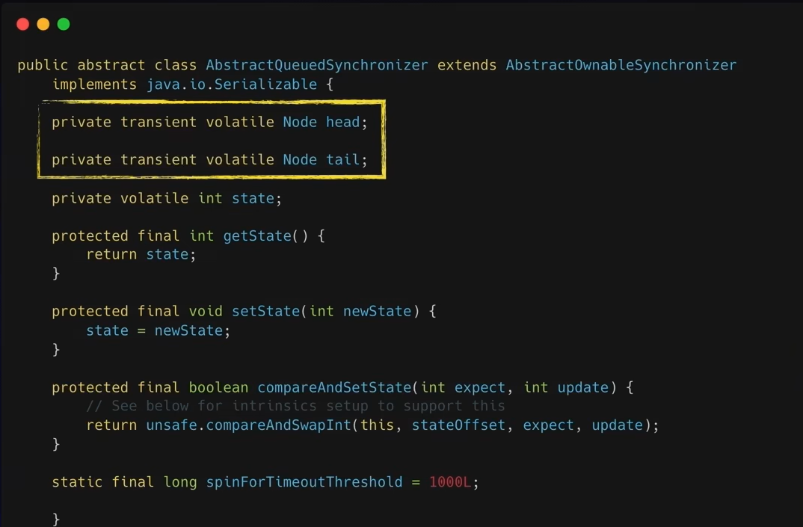

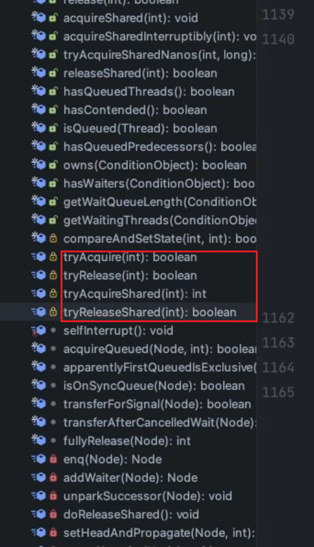

### 前置知识

> 线程创建方式

1. 继承Thread类
2. 实现Runnable接口
3. 实现callable接口

> LockSupport的使用

park()、unpark()

AQS实现线程的阻塞与唤醒主要依靠的是LockSupport

> ReetrantLock的简单使用

obj.lock()  、 obj.unlock()

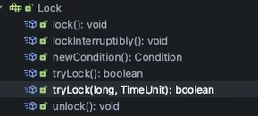

实现：sync.lock()

sync静态内部类继承AQS，其中lock方法还是抽象方法

下面有两个实现类：FairSync 、NonFairSync(默认 )


> 模板方法设计模式


### 核心组成

> state：管理同步状态 `volatile int state`，其含义取决于子类的实现

例：`ReentrantLock`（可重入的）

```java
swicth (state){
    case 0 : 代表当前的共享资源没有被加锁;
    case 1 : 代表当前的共享资源已被一个线程加锁;
    case >1 : 代表当前的共享资源，被同一个线程多次加锁     
}
```

三个相关方法

`final int getState`、`final void setState`、`final boolean compareAndSetState`

> Node结点

```java
// AQS中    
static final class Node {
        /** Marker to indicate a node is waiting in shared mode */
        static final Node SHARED = new Node();
        /** Marker to indicate a node is waiting in exclusive mode */
        static final Node EXCLUSIVE = null;

        //取消状态
        static final int CANCELLED =  1;
        
        //下一个结点需要唤醒
        static final int SIGNAL    = -1;
        
        
        static final int CONDITION = -2;
        
        
        static final int PROPAGATE = -3;

        // 初始状态0
        volatile int waitStatus;

      
        volatile Node prev;

        
        volatile Node next;

        
        volatile Thread thread;

        // 条件队列 -> 指向下一个结点
        // 同步队列 -> 判断是共享锁还是排他锁
        Node nextWaiter;

        
        final boolean isShared() {
            return nextWaiter == SHARED;
        }

        
        final Node predecessor() throws NullPointerException {
            Node p = prev;
            if (p == null)
                throw new NullPointerException();
            else
                return p;
        }

        Node() {    // Used to establish initial head or SHARED marker
        }

        Node(Thread thread, Node mode) {     // Used by addWaiter
            this.nextWaiter = mode;
            this.thread = thread;
        }

        Node(Thread thread, int waitStatus) { // Used by Condition
            this.waitStatus = waitStatus;
            this.thread = thread;
        }
    }

```


SHARED 共享的

EXCLUSTIVE 排他的

多个Node组成双向链表，依赖存放当前没有获取锁的线程，`同步队列Sync Queue`

### 流程

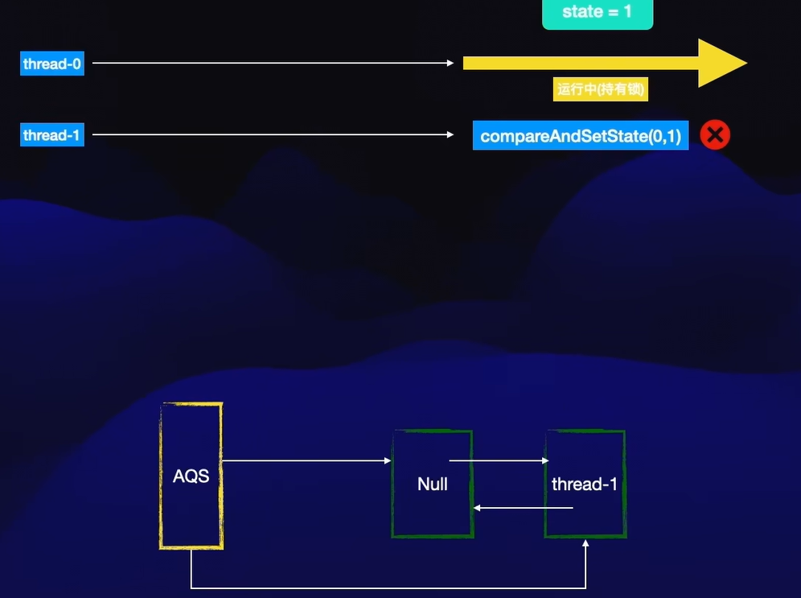

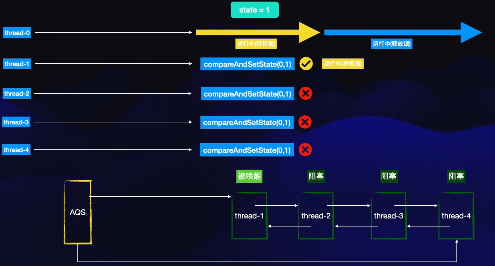


默认是非公平锁的实现lock，0代表无锁，1代表加锁

获取锁成功，则设置占有AQS资源的线程为当前线程

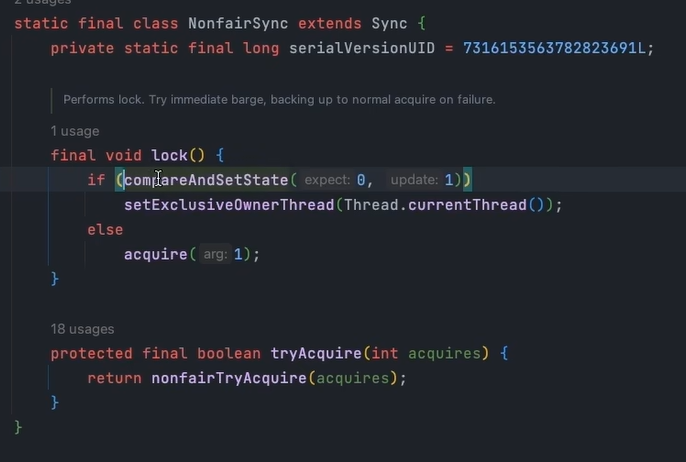


获取当前线程和state

如果**没有锁**，则通过cas加锁，并设置持有线程

如果**有锁**且为**资源持有者**，可重入锁

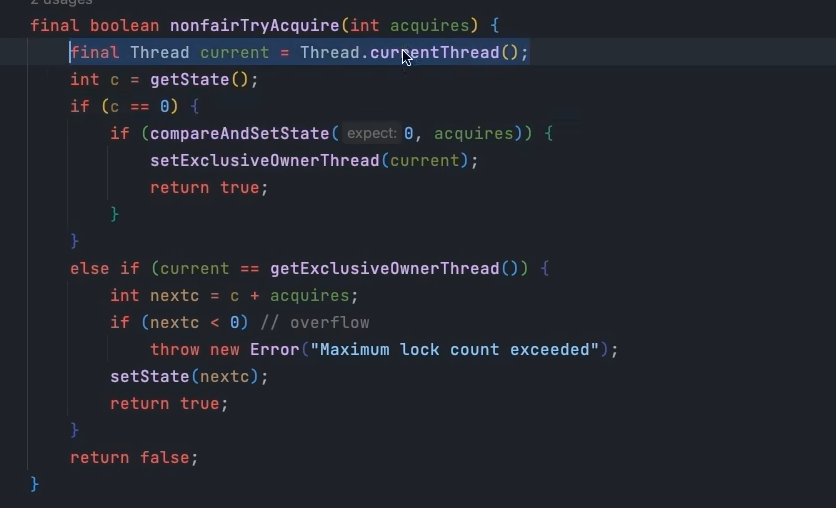

tryAcquire失败

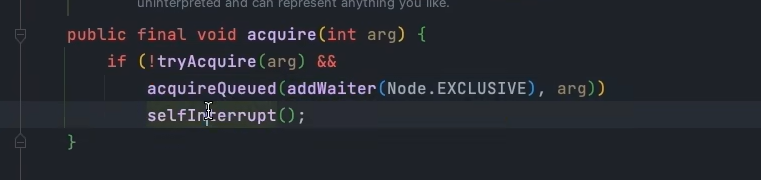

使用**自旋+cas**加入队列

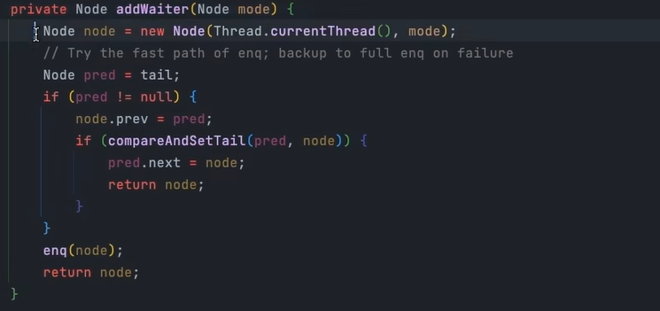


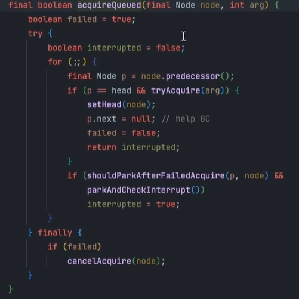

你去中的两个方法的名字一个叫park after field acquire翻译过来的意思就是获取所失败以后是否应该阻塞另外一个叫park and checking interrupt它的意思呢就是阻塞并检查中断两个方法是并且的关系也就是说第一个方法执行返回为处时才会执行第二个方法由于这个方法比较多在一个换的片里展示不太美观所以我们再次回


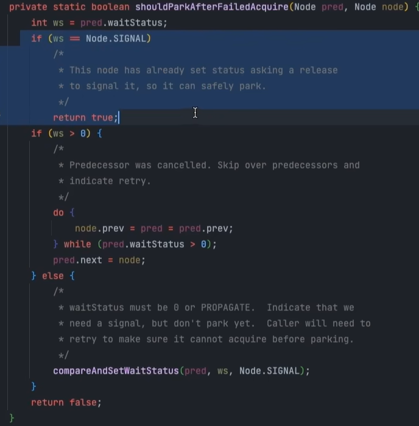

compareAndSetWaitStatus 设置前驱结点的状态为SIGNAL
