# leetcode

## 模板

### 前缀和：

- 连续的子数组的和

### 单调栈

```java
class Solution {
    public int[] maxSlidingWindow(int[] nums, int k) {
        int n = nums.length;
        //最终答案总的数量
        int []ans = new int[n-k+1];
        Deque<Integer>deque = new ArrayDeque<>();
        for (int i = 0; i < n; i++) {
            //入(保持单调性[单调递减])
            while (!deque.isEmpty()&&nums[deque.getLast()]<nums[i]){
                deque.removeLast();
            }
            deque.addLast(i);
            //出(i和deque里面的第一个元素的差距大于k个)
            if(i-deque.getFirst()>=k){
                deque.removeFirst();
            }
            //记录答案(保证这个索引是合法的（前面k个还尚未构成完整的队列）)
            //也就是窗口没满
            if(i >= k-1){
                ans[i-k+1] = nums[deque.getFirst()];
            }
        }
        return ans;
    }
}
```

### 滑动窗口

1. 有负数不能滑窗

### 链表

1. 相交链表
   1. next == null  时 A=B
2. [环形链表 II](https://leetcode.cn/problems/linked-list-cycle-ii/)
   1. slow + fast
   2.  slow == fast 时，slow和head启动 
   3. 

### 数组
> 反转数组  

```java
private void reverse(int[] nums, int i, int j) {  
    while (i < j) {  
        int temp = nums[i];  
        nums[i] = nums[j];  
        nums[j] = temp;  
        i++;  
        j--;  
    }  
}
``````


### 回溯

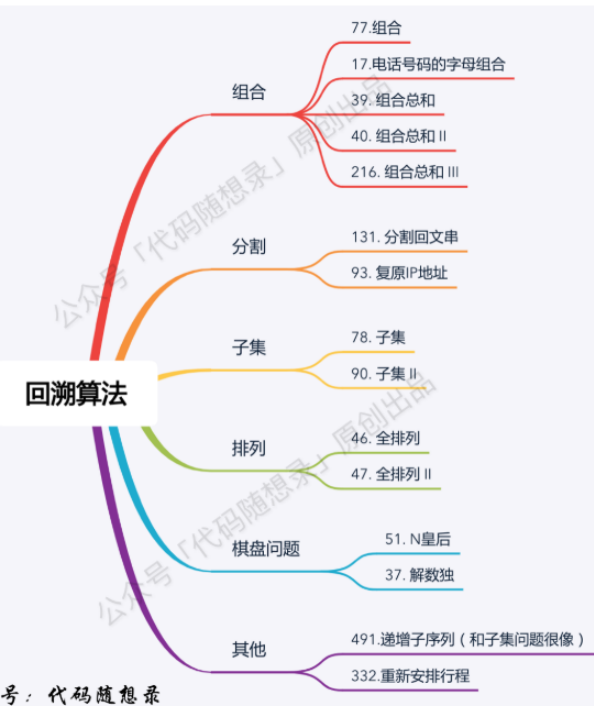

#### 其他

给的数据有重复，则先排序，额外用一个boolean数组used


#### 组合

#### 分隔

#### 子集

> 子集 |

```java
class Solution {
    List<List<Integer>> result = new ArrayList<>();

    public List<List<Integer>> subsets(int[] nums) {
        int n = nums.length;
        dfs(nums, n, 0, new ArrayList<>());
        return result;
    }

    public void dfs(int[] nums, int n, int index, List<Integer> path) {
        result.add(new ArrayList<>(path));
        if (index > n) {
            return;
        }
        for (int i = index; i < n; i++) {
            path.add(nums[i]);
            dfs(nums, n, i + 1, path);
            path.remove(path.size() - 1);
        }
    }
}
```

#### 排列

> 全排列

```java
class Solution {

    public List<List<Integer>> ans = new ArrayList<>();

    public List<Integer> pre = new ArrayList<>();

  

    public List<List<Integer>> permute(int[] nums) {

        dfs(nums, nums.length);

        return ans;

    }

  

    public void dfs(int[] nums, int len) {

        if (pre.size() == len) {

            ans.add(new ArrayList(pre));

            return;

        }

  

        for (int i = 0; i < len; i++) {

            if (!pre.contains(nums[i])) {

                pre.add(nums[i]);

                dfs(nums, len);

                pre.remove(pre.size() - 1);

            }

        }

    }

}```


#### 棋盘问题


## 哈希

### [1. 两数之和 - 力扣（LeetCode）](https://leetcode.cn/problems/two-sum/description/?envType=study-plan-v2&envId=top-100-liked)

> 题目

**示例 1：**

```apl
输入：nums = [2,7,11,15], target = 9
输出：[0,1]
解释：因为 nums[0] + nums[1] == 9 ，返回 [0, 1] 。
```

> 解答

 ```java
 class Solution {
     public int[] twoSum(int[] nums, int target) {
         // [2,7,11,15]
         Map<Integer, Integer> map = new HashMap();
         for (int i = 0; i < nums.length; i++) {
             // yes
             int dif = target - nums[i];
             if (map.containsKey(dif)) {
                 return new int[] { map.get(dif), i };
             }
             // no
             map.put(nums[i], i);
         }
         return new int[] { -1, -1 };
     }
 }
 ```

### [49. 字母异位词分组 - 力扣（LeetCode）](https://leetcode.cn/problems/group-anagrams/description/?envType=study-plan-v2&envId=top-100-liked)

> 题目

```apl
示例 1:

输入: strs = ["eat", "tea", "tan", "ate", "nat", "bat"]
输出: [["bat"],["nat","tan"],["ate","eat","tea"]]
```

> 解答

```java
class Solution {
    public List<List<String>> groupAnagrams(String[] strs) {
        Map<String, List<String>> map = new HashMap<>();
        for (int i = 0; i < strs.length; i++) {
            char[] array = strs[i].toCharArray();
            Arrays.sort(array);
            String key = new String(array);
            List<String> data = map.getOrDefault(key, new ArrayList<>());
            data.add(strs[i]);
            map.put(key, data);
        }
        return new ArrayList<>(map.values());
    }
}
```

### [128. 最长连续序列 - 力扣（LeetCode）](https://leetcode.cn/problems/longest-consecutive-sequence/description/?envType=study-plan-v2&envId=top-100-liked)

> 题目

```apl
给定一个未排序的整数数组 nums ，找出数字连续的最长序列（不要求序列元素在原数组中连续）的长度。

请你设计并实现时间复杂度为 O(n) 的算法解决此问题。

---
示例 1：

输入：nums = [100,4,200,1,3,2]
输出：4
解释：最长数字连续序列是 [1, 2, 3, 4]。它的长度为 4。

---
示例 2：
	
输入：nums = [0,3,7,2,5,8,4,6,0,1]
输出：9
```

> 解答

```java
class Solution {
    public int longestConsecutive(int[] nums) {
        if (nums.length == 0) {
            return 0;
        }
        Arrays.sort(nums);
        // [1,2,3,4,100,200]
        int max = 1;
        int tmp = 1;
        for (int i = 1; i < nums.length; i++) {
            // 连续
            if (nums[i] == nums[i - 1] + 1) {
                tmp++;
            } else if (nums[i] == nums[i - 1]) {
                continue;
            } else {
                // 非连续
                max = Math.max(max, tmp);
                tmp = 1;
            }
        }
        return Math.max(max, tmp);
    }
}
```

## 双指针

### [283. 移动零 - 力扣（LeetCode）](https://leetcode.cn/problems/move-zeroes/description/?envType=study-plan-v2&envId=top-100-liked)

> 题目

```apl
给定一个数组 nums，编写一个函数将所有 0 移动到数组的末尾，同时保持非零元素的相对顺序。

请注意 ，必须在不复制数组的情况下原地对数组进行操作。

 

示例 1:

输入: nums = [0,1,0,3,12]
输出: [1,3,12,0,0]
```

> 解答

```java
class Solution {
    public void moveZeroes(int[] nums) {
        int count = 0;
        for (int i = 0; i < nums.length; i++) {
            if (nums[i] != 0) {
                nums[count++] = nums[i];
            }
        }
        for (int i = count; i < nums.length; i++) {
            nums[i] = 0;
        }
    }
}
```

### [11. 盛最多水的容器 - 力扣（LeetCode）](https://leetcode.cn/problems/container-with-most-water/?envType=study-plan-v2&envId=top-100-liked)

> 题目


> 解答

```java
class Solution {
    public int maxArea(int[] height) {
        int left = 0;
        int right = height.length - 1;
        int max = 0;
        while (left < right) {
            max = Math.max(
                    max,
                    (right - left) * Math.min(height[left], height[right]));
            if (height[left] < height[right]) {
                left++;
            } else {
                right--;
            }

        }
        return max;
    }
}
```

### [15. 三数之和 - 力扣（LeetCode）](https://leetcode.cn/problems/3sum/description/?envType=study-plan-v2&envId=top-100-liked)


## 滑动窗口

### 🧡[3. 无重复字符的最长子串 - 力扣（LeetCode）](https://leetcode.cn/problems/longest-substring-without-repeating-characters/?envType=study-plan-v2&envId=top-100-liked)

```java
public int lengthOfLongestSubstring(String s) {
        if (s.length() == 0) {
            return 0;
        }
        Map<Character, Integer> map = new HashMap<>();
        int left = 0;
        int max = 1;
        int right;
        for (right = 0; right < s.length(); right++) {
            char key = s.charAt(right);
            if (map.containsKey(key)) {
                max = Math.max(max, right - left);
                left = Math.max(left, map.get(key) + 1);
                map.remove(key);
            }
            map.put(key, right);
        }
        return Math.max(max, right - left);
    }
```

> 


```java
public int lengthOfLongestSubstring(String s) {
    //滑动窗口
    char[] ss = s.toCharArray();
    //去重
    Set<Character> set = new HashSet<>();
    //结果
    int res = 0;
    //每一轮右端点都扩一个。
    for (int left = 0, right = 0; right < s.length(); right++) {
        //right指向的元素，也是当前要考虑的元素
        char ch = ss[right];
        //set中有ch，则缩短左边界，同时从set集合出元素
        while (set.contains(ch)) {
            set.remove(ss[left]);
            left++;
        }
        //别忘。将当前元素加入。
        set.add(ss[right]);
        //计算当前不重复子串的长度。
        res = Math.max(res, right - left + 1);
    }
    return res;
}
```


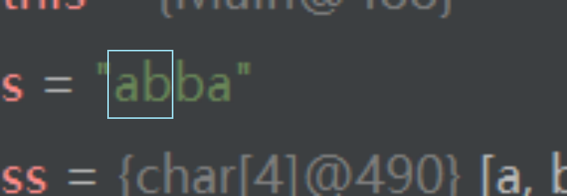


### [438. 找到字符串中所有字母异位词 - 力扣（LeetCode）](https://leetcode.cn/problems/find-all-anagrams-in-a-string/description/?envType=study-plan-v2&envId=top-100-liked)


## 数组

### [53. 最大子数组和 - 力扣（LeetCode）](https://leetcode.cn/problems/maximum-subarray/description/?envType=study-plan-v2&envId=top-100-liked)

```java
class Solution {
    public int maxSubArray(int[] nums) {
        int ans = nums[0];
        int sum = 0;
        for(int num: nums) {
            if(sum > 0) {
                sum += num;
            } else {
                sum = num;
            }
            ans = Math.max(ans, sum);
        }
        return ans;
    }
}

```


## 智力题

> 找单数

1. XOR 运算满足交换律和结合律：a⊕b⊕a = (a⊕a)⊕b = 0⊕b = b

> 找多数

```java
class Solution {
    public int majorityElement(int[] nums) {
        int res = nums[0];
        int count = 0;
        for (int n : nums) {
            if (res == n) {
                count++;
            } else {
                count--;
                if (count <= 0) {
                    res = n;
                    count = 1;
                }
            }
        }
        return res;
    }
}
```


# 链表

## [ 206. 反转链表](https://leetcode.cn/problems/reverse-linked-list)

```java
class Solution {
    public ListNode reverseList(ListNode head) {
        ListNode pre=null;
        ListNode cur=head;
        while(cur!=null){
            ListNode next=cur.next;
            cur.next=pre;
            pre=cur;
            cur=next;
        }
        return pre;
    }
}
```

## [92.反转链表 II](https://leetcode.cn/problems/reverse-linked-list-ii)

> 题目

给你单链表的头指针 `head` 和两个整数 `left` 和 `right` ，其中 `left <= right` 。请你反转从位置 `left` 到位置 `right` 的链表节点，返回 **反转后的链表** 。

**示例 1：**


```
输入：head = [1,2,3,4,5], left = 2, right = 4
输出：[1,4,3,2,5]
```

> 解


```java
class Solution {
    public ListNode reverseBetween(ListNode head, int left, int right) {
        ListNode p0=new ListNode();
        ListNode dummy=p0;
        p0.next=head;
        for(int i=0;i<left-1;i++){
            p0=p0.next;
        }
        ListNode cur=p0.next;
        ListNode pre=null;
        ListNode next=null;
        while(left<=right){
            next=cur.next;
            cur.next=pre;
            pre=cur;
            cur=next;
            left++;
        }
        p0.next.next=cur;
        p0.next=pre;
        return dummy.next;
    }
}
```

## [25. K 个一组翻转链表](https://leetcode.cn/problems/reverse-nodes-in-k-group)


```java
class Solution {
    public ListNode reverseKGroup(ListNode head, int k) {
        int n = 0;
        ListNode cur=head;
        while(cur!=null){
             ++n; // 统计节点个数
             cur=cur.next;
        }
        ListNode dummy = new ListNode(0, head);
        ListNode p0 = dummy;
        ListNode pre = null;
        cur = head;
        ListNode nxt=null;
        while(k<=n){
            n-=k;
            for(int i=0;i<k;i++){
                nxt=cur.next;
                cur.next=pre;
                pre=cur;
                cur=nxt;
            }
            nxt=p0.next;
            p0.next.next=cur;
            p0.next=pre;
            p0=nxt;
        }
        return dummy.next;
    }
}

```

## [21. 合并两个有序链表](https://leetcode.cn/problems/merge-two-sorted-lists)

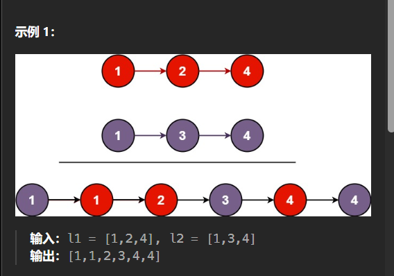

```java
class Solution {
    public ListNode mergeTwoLists(ListNode l1, ListNode l2) {
        if (l1 == null) {
            return l2;
        }
        else if (l2 == null) {
            return l1;
        }
        else if (l1.val < l2.val) {
            l1.next = mergeTwoLists(l1.next, l2);
            return l1;
        }
        else {
            l2.next = mergeTwoLists(l1, l2.next);
            return l2;
        }

    }
}
```

## [141. 环形链表](https://leetcode.cn/problems/linked-list-cycle)


==快慢指针==

```java
class Solution {
    public boolean hasCycle(ListNode head) {
        ListNode slow = head, fast = head; // 乌龟和兔子同时从起点出发
        while (fast != null && fast.next != null) {
            slow = slow.next; // 乌龟走一步
            fast = fast.next.next; // 兔子走两步
            if (fast == slow) // 兔子追上乌龟（套圈），说明有环
                return true;
        }
        return false; // 访问到了链表末尾，无环
    }
}
```

## [ 160. 相交链表](https://leetcode.cn/problems/intersection-of-two-linked-lists)


```java
public class Solution {
    public ListNode getIntersectionNode(ListNode headA, ListNode headB) {
     ListNode A = headA, B = headB;
     while (A != B) {
        A = A != null ? A.next : headB;
        B = B != null ? B.next : headA;
     }
     return A;
    }
}
```

## [142. 环形链表 II](https://leetcode.cn/problems/linked-list-cycle-ii)

> 题目

给定一个链表的头节点 `head` ，返回链表开始入环的第一个节点。 _如果链表无环，则返回 `null`。_


```java
public class Solution {
    public ListNode detectCycle(ListNode head) {
        ListNode slow = head, fast = head;
        while (fast != null && fast.next != null) {
            slow = slow.next;
            fast = fast.next.next;
            if (fast == slow){
                while(slow!=head){
                    slow=slow.next;
                    head=head.next;
                    }
                return head;
                }
        }
        return null;
    }
}
```

## [19. 删除链表的倒数第 N 个节点](https://leetcode.cn/problems/remove-nth-node-from-end-of-list)

给你一个链表，删除链表的倒数第 `n` 个结点，并且返回链表的头结点。

**示例 1：**


```c
class Solution {
    public ListNode removeNthFromEnd(ListNode head, int n) {
        ListNode slow=new ListNode(-1,head);
        ListNode dummy=slow;
        ListNode fast=slow;
        for(int i=0;i<n;i++){
            fast=fast.next;
        }
        while(fast.next!=null){
            fast=fast.next;
            slow=slow.next;
        }
        if(n==1){
            slow.next=null;
        }else{
            slow.next=fast;
        }
        return dummy.next;
    }
}
```


## [83. 删除排序链表中的重复元素](https://leetcode.cn/problems/remove-duplicates-from-sorted-list)

> 题目

给定一个已排序的链表的头 `head` ， _删除所有重复的元素，使每个元素只出现一次_ 。返回 _已排序的链表_ 。

输入的链表已排序

**示例 1：**


```
输入：head = [1,1,2]
输出：[1,2]
```

> 解

```java
class Solution {
    public ListNode deleteDuplicates(ListNode head) {
        if (head == null)
            return null;
        ListNode cur = head;
        while (cur.next != null)
            if (cur.next.val == cur.val)
                cur.next = cur.next.next;
            else
                cur = cur.next;
        return head;
    }
}
```

## [82. 删除排序链表中的重复元素 II](https://leetcode.cn/problems/remove-duplicates-from-sorted-list-ii)

> 题目

给定一个已排序的链表的头 `head` ， _删除原始链表中所有重复数字的节点，只留下不同的数字_ 。返回 _已排序的链表_ 。

输入的链表已排序

**示例 1：**


```
输入：head = [1,2,3,3,4,4,5]
输出：[1,2,5]
```

> 解

```java
class Solution {
    public ListNode deleteDuplicates(ListNode head) {
        ListNode dummy = new ListNode(0, head), cur = dummy;
        while (cur.next != null && cur.next.next != null) {
            int val = cur.next.val;
            if (cur.next.next.val == val)
                while (cur.next != null && cur.next.val == val)
                    cur.next = cur.next.next;
            else
                cur = cur.next;
        }
        return dummy.next;
    }
}
```

# 数组

## [167. 两数之和 II - 输入有序数组](https://leetcode.cn/problems/two-sum-ii-input-array-is-sorted)

> 题目

```
输入：numbers = [2,3,4], target = 6
输出：[1,3]
解释：2 与 4 之和等于目标数 6 。因此 index1 = 1, index2 = 3 。返回 [1, 3] 。
```

> 解

==双向双指针==

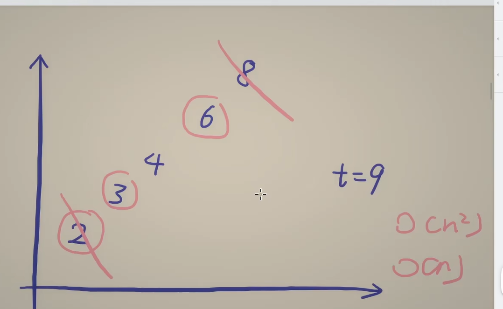

```java
class Solution {
    public int[] twoSum(int[] numbers, int target) {
        int left = 0, right = numbers.length - 1;
        while (true) {
            int s = numbers[left] + numbers[right];
            if (s == target) {
                return new int[]{left + 1, right + 1};
                // 题目要求下标从 1 开始
            }
            if (s > target) {
                right--;
            } else {
                left++;
            }
        }
    }
}
```

## [15. 三数之和](https://leetcode.cn/problems/3sum)

> 题目

```
输入：nums = [-1,0,1,2,-1,-4]
输出：[[-1,-1,2],[-1,0,1]]
解释：
nums[0] + nums[1] + nums[2] = (-1) + 0 + 1 = 0 。
nums[1] + nums[2] + nums[4] = 0 + 1 + (-1) = 0 。
nums[0] + nums[3] + nums[4] = (-1) + 2 + (-1) = 0 。
不同的三元组是 [-1,0,1] 和 [-1,-1,2] 。
注意，输出的顺序和三元组的顺序并不重要。
```

> 解

==双向双指针==

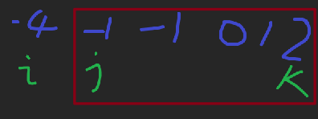

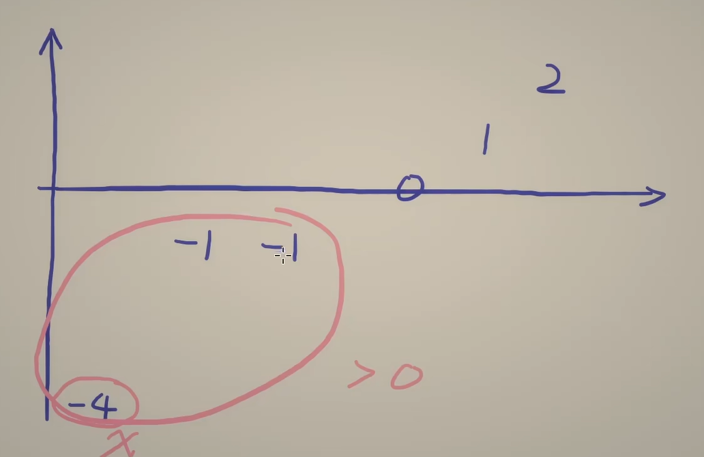

```java
class Solution {
    public List<List<Integer>> threeSum(int[] nums) {
        Arrays.sort(nums);
        List<List<Integer>> list = new ArrayList();
        for(int i=0;i<nums.length-2;i++){
            int x = nums[i];
            if(i>0 && x==nums[i-1]){
                continue;
            }
            int j=i+1;
            int k=nums.length-1;

            while(j<k){
                //当前的三数之和
                int s = x +nums[j]+nums[k];

                if(s>0){
                    //右边界-1
                    k-=1;
                }else if (s<0){
                    j+=1;
                }else{
                    List temp=new ArrayList();
                    temp.add(x);
                    temp.add(nums[j]);
                    temp.add(nums[k]);

                    list.add(temp);
                    //相同数字的情况
                    j+=1;
                    while(j<k && nums[j]==nums[j-1]) j+=1;
                    k-=1;
                    while(j<k && nums[k]==nums[k+1]) k-=1;
                }
            }
        }
        return list;
    }
}
```

## [209. 长度最小的子数组](https://leetcode.cn/problems/minimum-size-subarray-sum)

> 题目

给定一个含有 `n` 个正整数的数组和一个正整数 `target` **。**

找出该数组中满足其总和大于等于 `target` 的长度最小的 **连续**

**子数组**

`[numsl, numsl+1, ..., numsr-1, numsr]` ，并返回其长度**。**如果不存在符合条件的子数组，返回 `0` 。

**示例 1：**

```
输入：target = 7, nums = [2,3,1,2,4,3]
输出：2
解释：子数组 [4,3] 是该条件下的长度最小的子数组。
```

**示例 2：**

```
输入：target = 4, nums = [1,4,4]
输出：1
```

**示例 3：**

```
输入：target = 11, nums = [1,1,1,1,1,1,1,1]
输出：0
```

> 解

==滑动窗口== : 前提都是正数

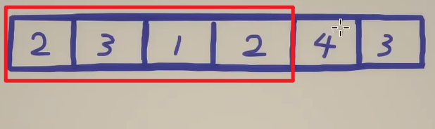

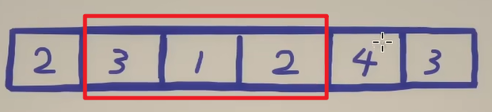

```java
class Solution {
    public int minSubArrayLen(int target, int[] nums) {
        int n = nums.length;
        int ans = n + 1;
        int sum = 0; // 子数组元素和
        int left = 0; // 子数组左端点
        for (int right = 0; right < n; right++) { // 枚举子数组右端点
            sum += nums[right];
            while (sum >= target) { // 满足要求
                ans = Math.min(ans, right - left + 1);
                sum -= nums[left++]; // 左端点右移
            }
        }
        return ans <= n ? ans : 0;
    }
}
```

## [713. 乘积小于 K 的子数组](https://leetcode.cn/problems/subarray-product-less-than-k)

> 题目

给你一个整数数组 `nums` 和一个整数 `k` ，请你返回子数组内所有元素的乘积严格小于 `k` 的连续子数组的数目。

**示例 1：**

```
输入：nums = [10,5,2,6], k = 100
输出：8
解释：8 个乘积小于 100 的子数组分别为：[10]、[5]、[2],、[6]、[10,5]、[5,2]、[2,6]、[5,2,6]。
需要注意的是 [10,5,2] 并不是乘积小于 100 的子数组。
```

> 解

```java
class Solution {
    public int numSubarrayProductLessThanK(int[] nums, int k) {
        if(k==0){
            return 0;
        }
        int sum=1;
        int count=0;
        int left=0;

        for(int right=0;right<nums.length;right++){
            sum*=nums[right];
            while(left<=right && sum>=k){
                sum/=nums[left++];
            }
            count+=right-left+1;
        }
        return count;
    }
}
```

## [11.盛最多水的容器](https://leetcode.cn/problems/container-with-most-water/)

给定一个长度为 `n` 的整数数组 `height` 。有 `n` 条垂线，第 `i` 条线的两个端点是 `(i, 0)` 和 `(i, height[i])` 。

找出其中的两条线，使得它们与 `x` 轴共同构成的容器可以容纳最多的水。

返回容器可以储存的最大水量。

**说明：**你不能倾斜容器。

**示例 1：**


```
输入：[1,8,6,2,5,4,8,3,7]
输出：49
解释：图中垂直线代表输入数组 [1,8,6,2,5,4,8,3,7]。在此情况下，容器能够容纳水（表示为蓝色部分）的最大值为 49。
```

**示例 2：**

```
输入：height = [1,1]
输出：1
```

## [42. 接雨水 - 力扣（LeetCode）](https://leetcode.cn/problems/trapping-rain-water/description/)

给定 `n` 个非负整数表示每个宽度为 `1` 的柱子的高度图，计算按此排列的柱子，下雨之后能接多少雨水。

**示例 1：**


```
输入：height = [0,1,0,2,1,0,1,3,2,1,2,1]
输出：6
解释：上面是由数组 [0,1,0,2,1,0,1,3,2,1,2,1] 表示的高度图，在这种情况下，可以接 6 个单位的雨水（蓝色部分表示雨水）。
```

# 字符串

## [ 3. 无重复字符的最长子串](https://leetcode.cn/problems/longest-substring-without-repeating-characters)

> 题目

给定一个字符串 `s` ，请你找出其中不含有重复字符的 **最长子串**的长度。

**示例 1:**

```
输入: s = "abcabcbb"
输出: 3
解释: 因为无重复字符的最长子串是 "abc"，所以其长度为 3。
```

**示例 2:**

```
输入: s = "bbbbb"
输出: 1
解释: 因为无重复字符的最长子串是 "b"，所以其长度为 1。
```

> 解

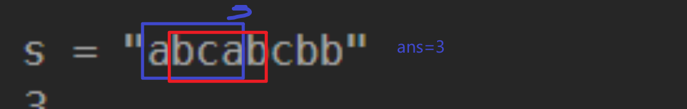

```java
class Solution {
    public int lengthOfLongestSubstring(String s) {
        HashMap<Character, Integer> hash = new HashMap<>();
        int ans = 0, left = 0;
        int i;
        for (i = 0; i < s.length(); ++i) {
            char cur = s.charAt(i);
            if (hash.containsKey(cur)) {
                ans = Math.max(ans, i - left);
                left = Math.max(left, hash.get(cur) + 1);
            }
            hash.put(cur, i);
        }
        return Math.max(ans, i - left);
    }
}
```

# 二分查找

## [34. 在排序数组中查找元素的第一个和最后的位置](https://leetcode.cn/problems/find-first-and-last-position-of-element-in-sorted-array)

> 题目

给你一个按照非递减顺序排列的整数数组 `nums`，和一个目标值 `target`。请你找出给定目标值在数组中的开始位置和结束位置。

如果数组中不存在目标值 `target`，返回 `[-1, -1]`。

你必须设计并实现时间复杂度为 `O(log n)` 的算法解决此问题。

**示例 1：**

```
输入：nums = [5,7,7,8,8,10], target = 8
输出：[3,4]
```

**示例 2：**

```
输入：nums = [5,7,7,8,8,10], target = 6
输出：[-1,-1]
```

> 解

```java
class Solution {

    //可以通过这个方法找到target的左边界
    public int binarySearch(int[] nums,int target){
        int left=0;
        int right=nums.length-1;

        while(left<=right){
            int mid=left+(right-left)/2;
            if(nums[mid]<target){
                left++;
            }else{
                right--;
            }
        }
        return left;
    }

    public int[] searchRange(int[] nums, int target) {
        int start=binarySearch(nums,target);
        // target太大了找不到超出右边界 or 找不到
        if(start == nums.length || nums[start]!=target ){
            return new int[]{-1,-1};
        }
        int end=binarySearch(nums,target+1)-1;
        return new int[]{start,end};
    }
}
```

## [162. 寻找峰值](https://leetcode.cn/problems/find-peak-element)

> 题目

峰值元素是指其值严格大于左右相邻值的元素。

**示例 1：**

```
输入：nums = [1,2,3,1]
输出：2
解释：3 是峰值元素，你的函数应该返回其索引 2。
```

**示例 2：**

```
输入：nums = [1,2,1,3,5,6,4]
输出：1 或 5
解释：你的函数可以返回索引 1，其峰值元素为 2；
     或者返回索引 5， 其峰值元素为 6。
```

> 解

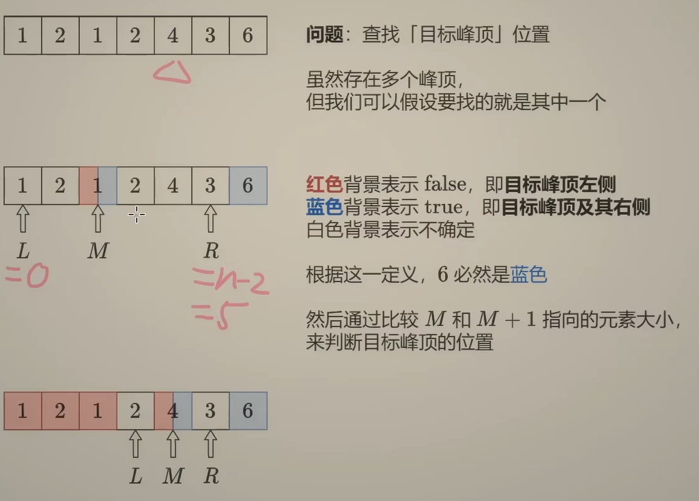

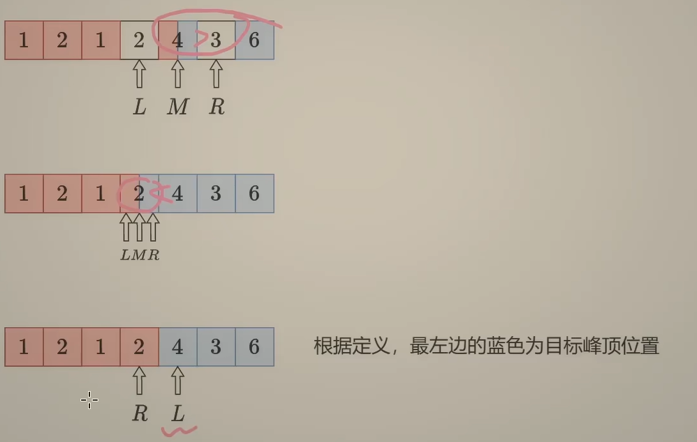

```java
class Solution {
    public int findPeakElement(int[] nums) {
        int left=0;
        int right=nums.length-2;
        while(left<=right){
            int mid=left+(right-left)/2;
            if(nums[mid]<nums[mid+1]){
                left=mid+1;
            }else{
                right=mid-1;
            }
        }
        return left;
    }
}
```

## [153. 寻找旋转排序数组中的最小值](https://leetcode.cn/problems/find-minimum-in-rotated-sorted-array)

> 题目

已知一个长度为 `n` 的数组，预先按照升序排列，经由 `1` 到 `n` 次 **旋转** 后，得到输入数组。例如，原数组 `nums = [0,1,2,4,5,6,7]` 在变化后可能得到：

- 若旋转 `4` 次，则可以得到 `[4,5,6,7,0,1,2]`
- 若旋转 `7` 次，则可以得到 `[0,1,2,4,5,6,7]`

注意，数组 `[a[0], a[1], a[2], ..., a[n-1]]` **旋转一次** 的结果为数组 `[a[n-1], a[0], a[1], a[2], ..., a[n-2]]` 。

给你一个元素值 **互不相同** 的数组 `nums` ，它原来是一个升序排列的数组，并按上述情形进行了多次旋转。请你找出并返回数组中的 **最小元素** 。

你必须设计一个时间复杂度为 `O(log n)` 的算法解决此问题。

**示例 1：**

```
输入：nums = [3,4,5,1,2]
输出：1
解释：原数组为 [1,2,3,4,5] ，旋转 3 次得到输入数组。
```

> 解

最右边数要么是最小值，要么在最小值右侧

[0，n-2]


```java
class Solution {
    public int findMin(int[] nums) {
        int left=0;
        int right=nums.length-2;
        int n = nums.length-1;
        while( left<=right ){
            int mid=left+(right-left)/2;
            if(nums[mid]<nums[n]){
                right=mid-1;
            }else{
                left=mid+1;
            }
        }
        return nums[left];
    }
}
```

# 二叉树

## [104. 二叉树的最大深度](https://leetcode.cn/problems/maximum-depth-of-binary-tree)

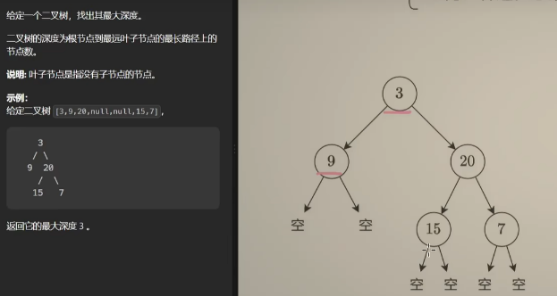

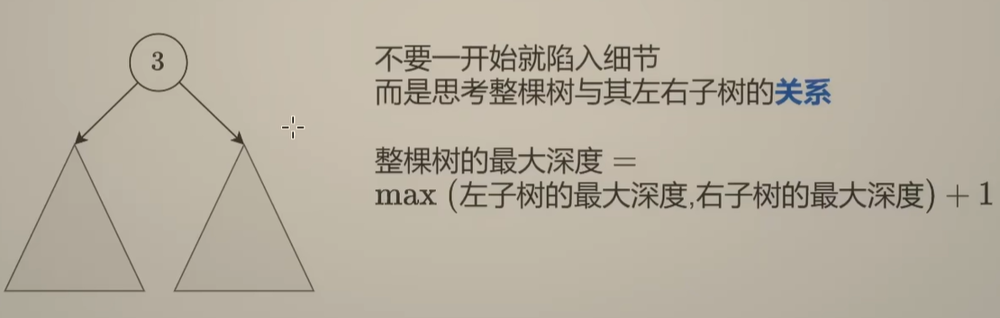

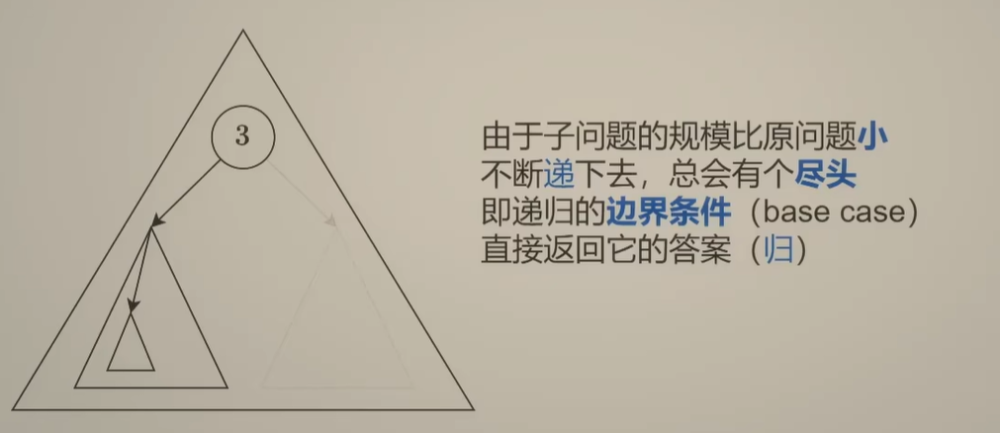

```java
class Solution {
    public int maxDepth(TreeNode root) {
        if(root==null){
            return 0;
        }
        return Math.max(maxDepth(root.left),maxDepth(root.right))+1;
    }
}
```

```java
class Solution {
    public int ans=0;

    public int maxDepth(TreeNode root) {
        test(root,0);
        return ans;
    }

    public void test(TreeNode root,int cnt) {
        if(root==null){
            return;
        }
        cnt+=1;
        ans=Math.max(ans,cnt);
        test(root.left,cnt);
        test(root.right,cnt);
    }

}
```

## [129. 求根到叶子节点数字之和](https://leetcode.cn/problems/sum-root-to-leaf-numbers)

> 题目


```
输入：root = [1,2,3]
输出：25
解释：
从根到叶子节点路径 1->2 代表数字 12
从根到叶子节点路径 1->3 代表数字 13
因此，数字总和 = 12 + 13 = 25
```

> 解

```java
class Solution {
    public int sumNumbers(TreeNode root) {
        if (root == null) {
            return 0;
        }
        int sum = 0;
        Queue<TreeNode> nodeQueue = new LinkedList<TreeNode>();
        Queue<Integer> numQueue = new LinkedList<Integer>();
        nodeQueue.offer(root);
        numQueue.offer(root.val);
        while (!nodeQueue.isEmpty()) {
            TreeNode node = nodeQueue.poll();
            int num = numQueue.poll();
            TreeNode left = node.left, right = node.right;
            if (left == null && right == null) {
                sum += num;
            } else {
                if (left != null) {
                    nodeQueue.offer(left);
                    numQueue.offer(num * 10 + left.val);
                }
                if (right != null) {
                    nodeQueue.offer(right);
                    numQueue.offer(num * 10 + right.val);
                }
            }
        }
        return sum;
    }
}
```

```java
class Solution {
    int sum=0;
    public int sumNumbers(TreeNode root) {
        test(root,root.val);
        return sum;
    }
    public void test(TreeNode root,int val){
        if(root.left==null && root.right==null){
            sum+=val;
        }
        if(root.left!=null) test(root.left,val*10+root.left.val);
        if(root.right!=null) test(root.right,val*10+root.right.val);
    }
}
```

# 回溯

# 动态规划

## 基础入门-01 背包

> 题目

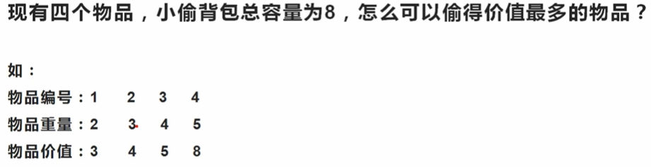

> 解
