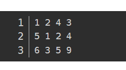
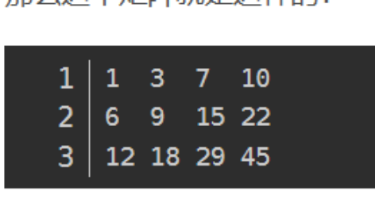

# 笔记

[【图解算法】Hello 算法 (hello-algo.com)](https://www.hello-algo.com/)


## 动态规划5部曲

1. 确定dp[i]的含义
2. 递推公式
3. dp数如何初始化
4. 遍历顺序
5. 怎么打印dp数组


## 基础题目

### 不同路径

> 题目描述

[62. 不同路径 - 力扣（LeetCode）](https://leetcode.cn/problems/unique-paths/submissions/562707001/)

给一个m x n 的棋盘，左上是起始位置，右下是最终位置，每次移动只能向下或者向右，求有多少种路径

> 思路

1. dp [i] [j]表示到当前位置有多少种路径
2. 递推公式 dp [i] [j] = dp [i-1] [j] + dp [i] [j-1]
3. dp数组初始化 dp [m] [n] ，dp [i] [0] = 1，dp [0] [j] =1
4. 双层循序遍历

> 题解

```java
class Solution {
    public int uniquePaths(int m, int n) {
        // m 行 n列
        int[][] dp = new int[m][n];
        for(int i = 0; i < m;i++){
            if(i==0){
                Arrays.fill(dp[0],1);
                continue;
            }
            for(int j = 0; j < n ; j++ ){
                if(j==0){
                    dp[i][j]=1;
                }else{
                    dp[i][j] = dp[i-1][j] + dp[i][j-1];
                }
            }
        }
        return dp[m-1][n-1];
    }
}
```

### 不同路径 || （加了障碍物）

> 题目

[63. 不同路径 II - 力扣（LeetCode）](https://leetcode.cn/problems/unique-paths-ii/)

现在考虑网格中有障碍物。那么从左上角到右下角将会有多少条不同的路径？

网格中的障碍物和空位置分别用 `1` 和 `0` 来表示。

> 思路

1. dp [i] [j]表示到当前位置有多少种路径
2. 递推公式 dp [i] [j] = dp [i-1] [j] + dp [i] [j-1]，如果是障碍物直接跳过
3. dp数组初始化 dp [m+1] [n+1] ，dp [0]  = 0，dp [*] [0] =0，dp[1] [1] =1 
4. 双层循序遍历

### 整数拆分

> 题目

给定一个正整数 `n` ，将其拆分为 `k` 个 **正整数** 的和（ `k >= 2` ），并使这些整数的乘积最大化。返回 *你可以获得的最大乘积* 。

**示例 2:**

```
输入: n = 10
输出: 36
解释: 10 = 3 + 3 + 4, 3 × 3 × 4 = 36。
```

> 思路


> 题解

```js
const integerBreak = (n) => {
  const dp = new Array(n + 1);
  dp[1] = 1;  
  dp[2] = 1; 
  for (let i = 3; i <= n; i++) {
    dp[i] = 0;
    // 对于数字 i，它可以分为两份：j 和 i-j，j 的范围是 1 到 i-j
    for (let j = 1; j <= i - j; j++) {
      // 对于 i-j 这部分可以拆或不拆，不拆就是 i-j，拆就是 dp[i-j]
      dp[i] = Math.max(dp[i], j * (i - j), j * dp[i - j]);
    }
  }
  return dp[n];
};
```

### 不同的二叉搜索树

> 题目

[96. 不同的二叉搜索树 - 力扣（LeetCode）](https://leetcode.cn/problems/unique-binary-search-trees/description/)

给你一个整数 `n` ，求恰由 `n` 个节点组成且节点值从 `1` 到 `n` 互不相同的 **二叉搜索树** 有多少种？返回满足题意的二叉搜索树的种数。

**示例 1：**


```
输入：n = 3
输出：5
```

> 题解

```java
class Solution {
    public int numTrees(int n) {
        int[] dp = new int[n+1];
        dp[0] = 1;
        dp[1] = 1;
        for(int i = 2; i<=n ; i++){
            for(int j = 1;j<=i;j++){
                dp[i]+=dp[j-1]*dp[i-j];      
            }
        }
        return dp[n];
    }
}
```

## 01背包

###  01背包模板

```java
    //dp模板 0-1背包 二维数组
    public int common(int capacity, int[] weight, int[] value) {
        // 行
        int row = weight.length;
        // 列
        int col = capacity;

        int[][] dp = new int[row + 1][col + 1];
        
        // 行
        for (int i = 1; i <= row; i++) {
            for (int j = 1; j <= col; j++) {
                if (j < weight[i - 1]) {
                    dp[i][j] = dp[i - 1][j];
                } else {
                    dp[i][j] = Math.max(dp[i - 1][j], dp[i - 1][j - weight[i - 1]] + value[i - 1]);
                }
            }
        }
        return dp[row][col];
    }

    //dp模板 0-1背包 一维数组
    public int commonOnly(int capacity, int[] weight, int[] value) {
        int[] dp = new int[capacity + 1];
        // 先遍历物品，再遍历背包(倒序)
        for (int i = 1; i <= value.length; i++) {
            for (int j = capacity; j >= weight[i - 1]; j--) {
                dp[j] = Math.max(dp[j], dp[j - weight[i - 1]] + value[i - 1]);
            }
        }
        return dp[capacity];
    }
```

### 习题

> [416. 分割等和子集 - 力扣（LeetCode）](https://leetcode.cn/problems/partition-equal-subset-sum/description/)

01背包 , cap = sum / 2;

> 

dp[j]表示容量为j的背包，可以背的最大重量


## 完全背包

### 完全背包模板

```java
//dp模板 完全背包
public int dubbo(int capacity, int[] weight, int[] value) {
    int[] dp = new int[capacity + 1];
    for (int i = 1; i <= value.length; i++) {
        // 01背包是从后往前，完全背包是从前往后
        for (int j = weight[i - 1]; j <= capacity; j++) {
            dp[j] = Math.max(dp[j], dp[j - weight[i - 1]] + value[i - 1]);
        }
    }
    return dp[capacity];
}
```

### 装满背包有多少种方法【完全背包，组合】

**示例 1：**

```apl
输入：amount = 5, coins = [1, 2, 5]
输出：4
解释：有四种方式可以凑成总金额：
5=5
5=2+2+1
5=2+1+1+1
5=1+1+1+1+1
```

```java
public int change(int amount, int[] coins) {
    int[] f = new int[amount + 1];
    f[0] = 1;
    // 遍历物品
    for (int x : coins) {
        //遍历容量
        for (int c = x; c <= amount; c++) {
            f[c] += f[c - x];
        }
    }
    return f[amount];
}
```
### 装满背包有多少种方法【排列】


```java
public int combinationSum4(int[] nums, int target) {
    int[] f = new int[target + 1];
    f[0] = 1;
    for (int i = 1; i <= target; i++) {
        for (int x : nums) {
            if (x <= i) {
                f[i] += f[i - x];
            }
        }
    }
    return f[target];
}
```

### 装满背包的最少个数【组合】

```java
public int coinChange(int[] coins, int amount) {
    int[] dp = new int[amount + 1];
    Arrays.fill(dp, Integer.MAX_VALUE - 1);
    dp[0] = 0;
    for (int x : coins) {
        for (int j = x; j <= amount; j++) {
            dp[j] = Math.min(dp[j], dp[j - x] + 1);
        }
    }
    if (dp[amount] == Integer.MAX_VALUE - 1) {
        return -1;
    }
    return dp[amount];
}
```

### 字典

[139. 单词拆分 - 力扣（LeetCode）](https://leetcode.cn/problems/word-break/description/)

```python
s = "leetcode", wordDict = ["leet", "code"]
```

```java
class Solution {
    public boolean wordBreak(String s, List<String> wordDict) {
        int n = s.length();

        // 将单词放进哈希表方便判断
        HashSet<String> set = new HashSet<>();
        set.addAll(wordDict);

        // 统计每个单词长度
        List<Integer> lens = new ArrayList<>();
        for (String str : wordDict) {
            lens.add(str.length());
        }
        Collections.sort(lens);

        boolean[] f = new boolean[n + 1];
        f[0] = true;
        
        // 从最小长度开始判断
        int minL = lens.get(0);
        for (int i = minL; i <= n; i ++) {
            if (f[i]) continue;
            for (int len : lens) {
                if (i - len >= 0) {
                    f[i] |= f[i - len] 
                        && (set.contains(s.substring(i - len, i)));
                }
            }
        }
        return f[n];
    }
}
```

## 子序列

### 最长递增子序列

```apl
输入：nums = [10,9,2,5,3,7,101,18]
输出：4
解释：最长递增子序列是 [2,3,7,101]，因此长度为 4 。
```


```java
class Solution {
    public int lengthOfLIS(int[] nums) {
        int[] dp = new int[nums.length];
        Arrays.fill(dp, 1); 
        //初始化，每个点的最长递增子序列初始都为1
        int ans = 0;
        for(int i = 0; i < nums.length; i++) {
            for(int j = 0; j < i; j++) 
                if(nums[j] < nums[i]){   
                    //如果当前点的值大于前面的点，更新dp[i]
                    dp[i] = Math.max(dp[j] + 1, dp[i]);
                }
            ans = Math.max(dp[i], ans); //每次记录最大值
        }
        return ans;
    }
}
```

### 最长重复子数组

```apl
输入：nums1 = [1,2,3,2,1], nums2 = [3,2,1,4,7]
输出：3
解释：长度最长的公共子数组是 [3,2,1] 
```

```java
class Solution {
    public int findLength(int[] A, int[] B) {
        int n = A.length;
        int m = B.length;
        int[][] dp = new int[n + 1][m + 1]; 
        // dp[i][j]表示A的前i项与B的前j项的最长重复子数组长度
        int ans = 0;
        for (int i = 1; i <= n; i++) {
            for (int j = 1; j <= m; j++) {
                if (A[i - 1] == B[j - 1]) {
                    dp[i][j] = dp[i - 1][j - 1] + 1;
                    ans = Math.max(ans,dp[i][j]);
                }
            }
        }
        return ans;
    }
}
```

### 最长公共子序列

```java
class Solution {
    public int longestCommonSubsequence(String text1, String text2) {
        char[] s = text1.toCharArray();
        char[] t = text2.toCharArray();
        int n = s.length;
        int m = t.length;
        int[][] dp = new int[n + 1][m + 1];
        for (int i = 1; i <= n; i++) {
            for (int j = 1; j <= m; j++) {
                dp[i][j] =
                    s[i-1] == t[j-1] ? dp[i-1][j-1] + 1 :
                            Math.max(dp[i-1][j], dp[i][j-1]);
            }
        }
        return dp[n][m];
    }
}
```


## 前缀和

### 二维前缀和





```java
public static int[][] sum(int[][] map) {
    int row = map.length;
    int col = map[0].length;
    
    int[][] dp = new int[row + 1][col + 1];

    for (int i = 1; i <= row; i++) {
        for (int j = 1; j <= col; j++) {
            dp[i][j] = dp[i - 1][j] + dp[i][j - 1] - dp[i - 1][j - 1] + map[i-1][j-1];
        }
    }
    return dp;
}
```

