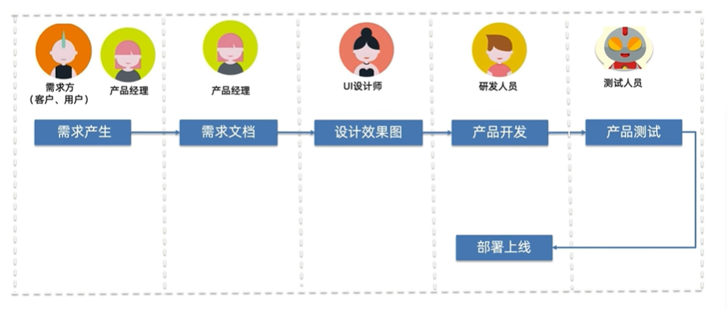
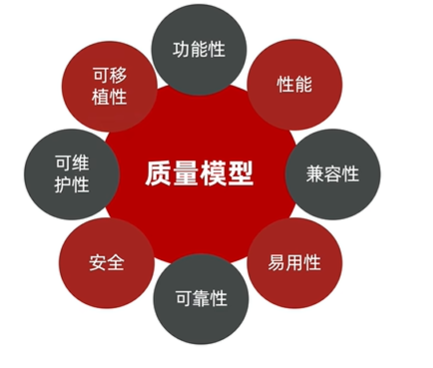
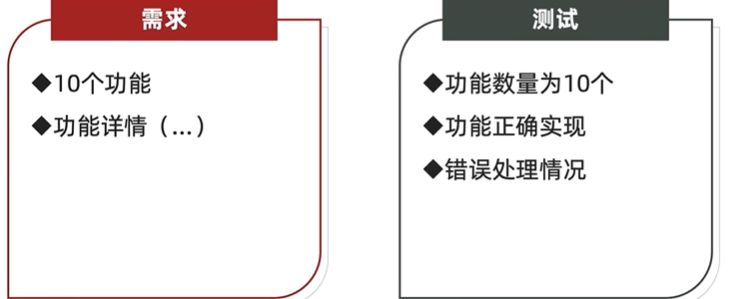
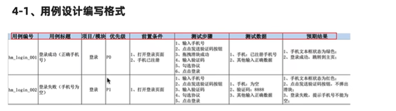
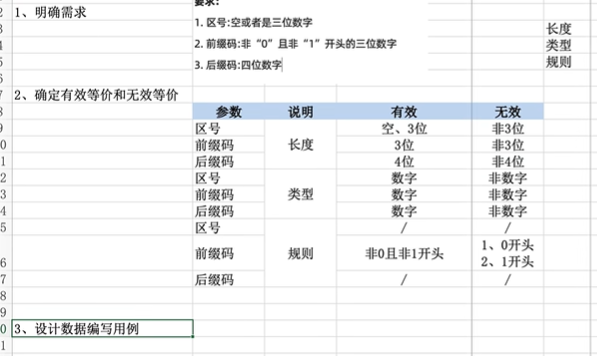

# 测试

## 软件测试目的

1. 为了发现程序中的缺陷，保证软件质量
2. 满足用户需要

## 开发流程

## 测试流程

1. **需求分析阶段**：测试人员需要评审需求文档了解需求，参与讨论，关注错误、矛盾、遗漏的地方；整理测试需求，从测试的角度进行需求、场景分类，可以整理测试用例提纲
2. **设计&准备阶段**：根据开发人员的文档设计测试用例以及测试方案，与开发沟通细节
3. **测试阶段（执行测试阶段）**：搭建测试环境，执行冒烟测试，然后进入正式测试，发现问题后提交bug，然后bug被修复后进行回归测试，管理缺陷，分析报告‘

## 测试分类

### 按测试阶段划分

> 单元测试

针对某一特定代码段或者逻辑的测试，一般由开发人员完成

> 接口测试 / 集成测试

requests、axios

根据swagger接口文档，使用postman、代码等 ，针对某个代码块或者单一功能进行测试 

> 系统测试

针对整个系统的业务逻辑进行相对应的测试

> 验收测试

主要分为内测，公测，使用不同的人群来发掘项目缺陷

### 按代码可见度划分

1. 黑盒测试（系统测试）
2. 灰盒测试（接口测试）
3. 白盒测试

### 测试技能

> 功能测试

功能测试主要验证程序的功能是否满足需求

> 自动化测试

使用代码或工具代替手工，对项目进行测试

> 性能测试

Jmeter

## 质量模型

> 功能性

>性能

> 兼容性

1. 浏览器
2. 操作系统
3. 手机
   1. 分辨率
   2. 品牌
   3. 系统
   4. 网络
   5. 其他

> 安全

1. 传输加密
2. 存储加密

## 测试用例

### 概念

为测试项目而设计的执行文档

> 文档要素

1. 用例编号：项目+模块+测试
2. 用例标题
3. 项目/模块
4. 优先级
5. 前置条件
6. 测试步骤
7. 测试数据
8. 预期结果

> 案例

| 用例编号     | 用例标题             | 项目 | 优先级 | 前置条件               | 测试步骤     | 测试数据             | 预期结果           |
| ------------ | -------------------- | ---- | ------ | ---------------------- | ------------ | -------------------- | ------------------ |
| QQ_login_001 | 登录失败（账号为空） | 登录 |        | 打开登录页面、网络正常 | 输入账号密码 | 账号：空、密码：原始 | 登录失败，账号为空 |
| QQ_login_002 |                      | 登录 |        |                        |              |                      |                    |
| QQ_login_003 |                      | 登录 |        |                        |              |                      |                    |
| QQ_login_004 |                      | 登录 |        |                        |              |                      |                    |

### 设计方法

> 等价类划分

- **概念**：将输入数据划分为若干个等价类，每个等价类中的数据在程序中的处理方式相同。只需从每个等价类中选取一个代表性数据作为测试数据即可
- **适用范围**：针对输入功能的组件，针对单个输入域
- **例子**：对于一个年龄输入框，有效年龄范围为0-150，可以将输入数据划分为三个等价类：小于0的无效等价类，0-150的有效等价类，大于150的无效等价类。测试用例只需分别从这三个等价类中各选取一个数据进行测试即可

- **优缺点**：
    - 优点：减少了用例，设计步骤简单，保证了较高覆盖度
    - 缺点：只关注分类的情况，忽略逻辑和特殊情况（要结合边界值分析法）

> 边界值分析

- 概念：在输入数据或输出结果的边界处选择测试数据，以便发现边界处的错误

- 生活中的**例子**：

    一个关于边界值的生活实例是微波炉加热食物。假设微波炉的加热时间范围是1到60秒，我们可以使用边界值分析来测试微波炉的加热功能。

    - 最小值：我们可以将微波炉的加热时间设为1秒，然后观察食物是否被加热。
    - 最小值附近的值：我们可以将微波炉的加热时间设为2秒，然后观察食物是否被加热。
    - 最大值附近的值：我们可以将微波炉的加热时间设为59秒，然后观察食物是否被加热。
    - 最大值：我们可以将微波炉的加热时间设为60秒，然后观察食物是否被加热。

    通过这些测试，我们可以验证微波炉的加热功能是否正常工作。

> 流程分析法（场景法）

- 概念：
    - 流程：用户为了完成或者达成一定的业务目的，需要进行一系列的操作过程
    - 基本流：顺利完成业务
    - 备选流：使用过程出现了其他的选择，使得用户需要处理完这些选择重新回到基本流
    - 异常流：使用过程中因为系统故障导致需要处理这些故障的流程
- 使用步骤：
    1. 分析需求，画出业务流程图
    2. 根据流程图来编写用例，一个分支一个用例
- 优缺点：
    - 优点：快速覆盖用户使用场景，确认用户操作流程是否通畅（冒烟测试主要采用场景法测试）
    - 缺点：忽略了大量异常输入或者无效类，因此会导致缺陷遗漏

> 错误猜测法（就是靠自己的经验）

> 正交实验法

- 概念：探究多因素多水品的一种试验法，使用正交表
- 适用范围：
    - 配置测试：调整不同的配置单元以及配置项，使得系统获得最优服务效果
    - 兼容测试
    - 功能测试：多个输入框，每个输入框有不同数的值
- 适用条件：均匀分布和整齐可比
- 使用步骤：
    1. 确定因素：比如登录功能要求用户名、密码、验证码，这就是因素
    2. 确定因素水平：就是因素的取值，密码的取值是正确或者错误
    3. 选择合适的正交表

> 状态迁移法

- 概念：根据事物在不同状态下进行转换，从而使用状态转换事件来设计测试用例的方法

    状态机指的是在某些事件推动下，事物的状态会发生变化，但是总的状态数量是**有限**的
- 适用范围：被测对象状态多，而且状态之间相互转换的关系比较多
- 使用步骤：
    1. 确定被测对象的状态，以及触发状态发生变化的事件
    2. 绘制状态迁移图，一个分支一个用例
- 优缺点：
    - 优点：针对被测对象状态比较多且转换过程复杂的情况，保证测试用例设计的完整性
    - 缺点：不关注业务细节和输入

> 总结：

- 等价类、边界值针对输入域，这两个方法一起用，是横向覆盖
- 流程分析法针对业务流程或算法。我们测试最终的对象算法，尤其是功能测试中，是纵向覆盖
- 正交实验法：针对均匀分散、整齐可比的测试对象
- 状态迁移法：被测对象状态比较多，且互相之间的迁移比较复杂
- 错误猜测法：根据测试工程师的经验来使用。

## 测试左移和测试右移？

**测试左移**是指将测试活动向**开发阶段之前**移动，目的是更早地发现问题和预防问题。

**测试右移**是指将测试活动向**发布之后**移动，主要关注产品性能及可用性监控，以及新功能的测试

